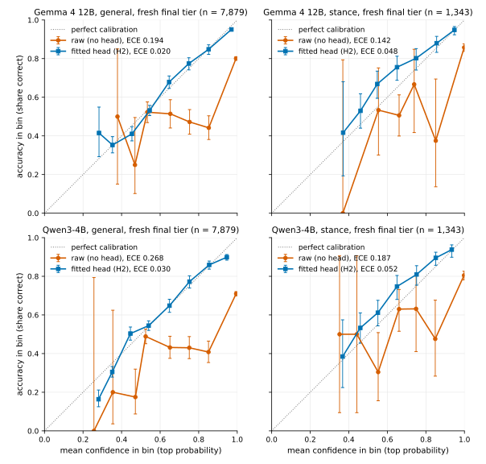
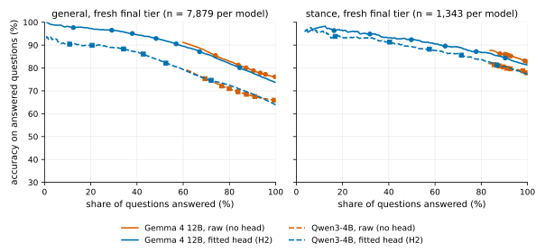

# Calibration

## What calibrated means

A probability is *calibrated* if, among all the answers given with probability about p, a
fraction of about p is correct. If judgly gives 1,000 answers at 0.8, about 800 should be right.

Calibration is not accuracy. A model that is right 60% of the time can be perfectly
calibrated: it says 0.6 when it is unsure, 0.95 when it is sure, and is right that often. What
calibration buys you is knowing *which* answers to trust. Raw probabilities from chat-tuned
models are usually overconfident. On the packs' fresh final tier (task families no head saw),
the raw letter probabilities had expected calibration errors (ECE) of 0.194 [0.186, 0.204]
(Gemma 4 12B) and 0.268 [0.259, 0.279] (Qwen3-4B) on general questions (n = 7,879), and the
fitted heads brought them to 0.020 [0.015, 0.031] and 0.030 [0.025, 0.040], while lowering
accuracy a little (0.760 to 0.737 and 0.656 to 0.639). On stance (Check-COVID, n = 1,343) they
brought ECE from 0.142 to 0.048 [0.034, 0.072] and from 0.187 to 0.052 [0.034, 0.077], around the
0.05 bar. Averaged over the eight general families instead of pooled, head ECE was 0.051 and
0.077; see [methods.md](methods.md#paired-differences-and-per-family-averages)
([results below](#results-of-the-two-options), [model cards](model-cards/gemma4-12b-q8.md)).

These are the numbers of the H2 heads released in 0.1.0. The packs now also ship a second
calibration option, one temperature per question type, and use it by default where a
pre-registered comparison on untouched data confirmed it (Qwen3-4B general and stance, Gemma 4
12B stance); Gemma 4 12B general keeps H2. [calibration-options.md](calibration-options.md) has
both options on every tier and how each number came to be.

## The numbers reported

- **Accuracy**: how often the top answer is correct.
- **Log loss**: the average of -log(probability given to the correct answer). Lower is better.
  It rewards being right *and* knowing when you are not, and it is the primary outcome of the
  evaluation because it is a proper scoring rule (Gneiting and Raftery 2007): it is minimised
  only by honest probabilities.
- **ECE (expected calibration error)**: sort answers into 10 equal-width bins by their top
  probability (0.0-0.1, ..., 0.9-1.0); in each bin, take the gap between mean confidence and
  observed accuracy; average the gaps weighted by bin size. 0 is perfect. ECE depends on the
  binning and is noisy on small samples, so it is always reported with an interval.
- **Reliability table**: the per-bin confidence and accuracy behind the ECE. The most direct
  picture of calibration.
- **Selective accuracy at t**: accept only answers whose top probability is above t (strictly
  greater); report the accuracy of those and the share of items answered. For example "0.88 /
  34% at 0.8" (Qwen3-4B, general, fresh final tier) means that 34% of items had a top
  probability above 0.8, and 88% of those were right.
- **Intervals**: 95% bootstrap intervals from 1,000 resamples of the items (or of groups of
  related items, such as claims on one abstract, where a tier records them). Comparisons between
  two heads or models are paired: the same items are resampled for both, which gives much
  tighter intervals on the difference. ECE intervals lean upward when the true ECE is near 0,
  because ECE cannot be negative.

## The heads

A head turns the model's scores for the answer letters into probabilities. judgly has three
levels:

| head | what it fits | parameters | needs labels |
|---|---|---|---|
| H0 | nothing: the raw letter probabilities, averaged over option orders | 0 | no |
| H1 | a temperature, a bias per letter and, only with the content-free pass (off in the built-in packs), how much of the content-free scores to subtract, per question type | 28 per type | a few hundred |
| H2 | H1 plus a small correction to each letter's output row of the model | 28 + 26 x hidden size per type | thousands |
| temperature | one temperature per question type, applied to the probabilities after they are averaged over the option orders | 1 per type | about 50 to 100 per type helped on average in an exploratory sub-study; more to check it |

H1 is contextual calibration (Zhao et al. 2021) with the amount of correction learned rather
than fixed, plus temperature scaling (Guo et al. 2017). H2 lets the correction depend on the
model's hidden state at the answer position. The built-in packs run without the content-free
pass, so their heads use no contextual-calibration term. Both are fitted by minimising log loss with
L-BFGS; H2's corrections are penalised towards zero, with the penalty chosen on validation
data. [methods.md](methods.md#the-heads) has the equations.

The packs ship two options per format, both fitted on the same public data (general and
stance): an H2 head (for score questions it is H1, fitted with every level weighted equally,
[methods.md](methods.md#the-heads)) and the per-type temperature. `Engine.load(pack)` uses the
pack's default per format; `calibration="h2"`, `"temperature"` or `"raw"` chooses one for every
format ([calibration-options.md](calibration-options.md)). The temperature never changes which
answer is on top, so its top-answer accuracy is the raw readout's; H2 can change it, for better
or worse.
Both are fitted on some task families and evaluated on others, so the published calibration
describes tasks they have not seen. Your task is also one they have not seen: check it.

## Results of the two options

judgly's own numbers for its two calibration options; the comparison with other systems is in
the [README](../README.md#comparison-with-dedicated-decision-models). The H2 tables and the two
figures below are the 0.1.0 results: they show H2, which is now the default only for Gemma 4 12B
general questions.

### H2 on the fresh final tier (the 0.1.0 results)

These are the numbers of one run per pack on an Apple M3 Max, scored on the **fresh final
tier**: eight general task families and one stance family (Check-COVID) that no head was fitted
on, chosen and frozen before any head was scored on them, and not used to choose the model or its
settings. They come from the committed snapshot in
[results/](results/) (calibration records,
per-item dumps and checksums); `make figures` checks every plotted number against it. Brackets are
95% percentile bootstrap intervals (1,000 resamples) of groups of related items (items that share a
claim, a table, a template or a query are resampled together); n is the number of questions. ECE
(expected calibration error) is the average gap between confidence and accuracy over ten bins; 0 is
perfect. The stance head's bar is a final-tier ECE below 0.05.

**These tables compare raw with H2**, the head released in 0.1.0 ("head" in the tables). H2 is
the default only for Gemma 4 12B general questions. Qwen3-4B (general and stance) and Gemma 4 12B
stance use the per-type temperature by default; its numbers on the same tier are under
[The two options on the confirm and final tiers](#the-two-options-on-the-confirm-and-final-tiers) below.

| pack | format (fresh final tier) | n | condition | accuracy | log loss | ECE |
|---|---|---|---|---|---|---|
| gemma4-12b-q8 | general (8 families) | 7,879 (6,803 groups) | raw | 0.760 [0.751, 0.770] | 1.553 [1.478, 1.636] | 0.194 [0.186, 0.204] |
| | | | head | 0.737 [0.726, 0.746] | 0.631 [0.613, 0.651] | **0.020** [0.015, 0.031] |
| gemma4-12b-q8 | stance (Check-COVID) | 1,343 (315 groups) | raw | 0.827 [0.806, 0.848] | 1.603 [1.370, 1.855] | 0.142 [0.123, 0.162] |
| | | | head | 0.812 [0.790, 0.836] | 0.509 [0.472, 0.550] | 0.048 [0.034, 0.072] (bar 0.05 met, narrowly) |
| qwen3-4b-q8 | general (8 families) | 7,879 (6,803 groups) | raw | 0.656 [0.644, 0.667] | 3.474 [3.330, 3.639] | 0.268 [0.259, 0.279] |
| | | | head | 0.639 [0.628, 0.650] | 0.797 [0.779, 0.815] | **0.030** [0.025, 0.040] |
| qwen3-4b-q8 | stance (Check-COVID) | 1,343 (315 groups) | raw | 0.778 [0.755, 0.801] | 3.185 [2.812, 3.589] | 0.187 [0.167, 0.212] |
| | | | head | 0.773 [0.749, 0.795] | 0.594 [0.562, 0.628] | 0.052 [0.034, 0.077] (bar 0.05 missed, narrowly) |

"raw" is the letter probabilities averaged over option orders (score questions are read once,
levels in their natural order), with no head; "head" is H2, the fitted head released in 0.1.0 (the packs now also ship the
per-type temperature, below). The
general families are social bias (BBQ), grammar (BLiMP), figurative language (Fig-QA), indirect
answers (Circa), ethics (ETHICS deontology and justice), tables (TabFact), search relevance (ESCI)
and sentence difficulty (CEFR-SP).

In short: the H2 heads cut the pooled ECE about ninefold on general questions (0.194 to 0.020 and
0.268 to 0.030) and about threefold on stance (0.142 to 0.048 and 0.187 to 0.052) and lowered log
loss, at some cost in accuracy on these fresh families. Paired over the same items, head minus raw
accuracy was -0.023 [-0.031, -0.016] (Gemma 4 12B) and -0.017 [-0.024, -0.011] (Qwen3-4B) on
general questions, and -0.015 [-0.030, -0.001] (Gemma 4 12B) and -0.005 [-0.024, 0.013]
(Qwen3-4B, within noise) on stance (`docs/tools/final_tier_stats.py`; items resampled within families, not by group). The
pooled ECE also hides differences between families: averaged over the eight general families,
head ECE was 0.051 [0.049, 0.063] (Gemma 4 12B) and 0.077 [0.071, 0.088] (Qwen3-4B), with single
families up to 0.114 [0.089, 0.142] (ethics, Qwen3-4B). ECE is never negative, so its percentile
intervals lean upward when the true value is near 0.

**Families seen during development (secondary).** An earlier held-out tier is scored as
*final-seen*. Its families were read while judgly was developed, so these numbers are
not a held-out result and are shown only for comparison; items are resampled as if independent.

| pack | format (final-seen tier) | n | condition | accuracy | ECE |
|---|---|---|---|---|---|
| gemma4-12b-q8 | general (15 tasks, 9 families) | 10,300 | raw | 0.714 [0.705, 0.723] | 0.180 [0.172, 0.189] |
| | | | head | 0.713 [0.703, 0.722] | 0.026 [0.021, 0.034] |
| gemma4-12b-q8 | stance (HealthVer) | 2,100 | raw | 0.632 [0.610, 0.652] | 0.320 [0.302, 0.342] |
| | | | head | 0.626 [0.605, 0.647] | 0.067 [0.051, 0.089] |
| qwen3-4b-q8 | general (15 tasks, 9 families) | 10,300 | raw | 0.649 [0.640, 0.658] | 0.231 [0.223, 0.240] |
| | | | head | 0.654 [0.645, 0.663] | 0.019 [0.016, 0.030] |
| qwen3-4b-q8 | stance (HealthVer) | 2,100 | raw | 0.571 [0.548, 0.592] | 0.354 [0.333, 0.377] |
| | | | head | 0.548 [0.527, 0.570] | 0.100 [0.084, 0.122] |

**External benchmarks.** Two public benchmarks for typed decisions, scored against their own
gold (evaluation only; no head saw them):

| pack | benchmark | items (cases) | condition | accuracy | Brier | ECE |
|---|---|---|---|---|---|---|
| gemma4-12b-q8 | typed-decisions | 2,000 (400) | raw | 0.702 [0.680, 0.723] | 0.359 [0.342, 0.378] | 0.251 [0.232, 0.274] |
| | | | head | 0.700 [0.677, 0.721] | 0.117 [0.109, 0.125] | 0.028 [0.019, 0.049] |
| gemma4-12b-q8 | JevBench, public items | 231 (195) | raw | 0.835 [0.784, 0.884] | 0.274 [0.193, 0.363] | 0.133 [0.093, 0.185] |
| | | | head | 0.840 [0.789, 0.890] | 0.207 [0.159, 0.256] | 0.054 [0.043, 0.106] |
| qwen3-4b-q8 | typed-decisions | 2,000 (400) | raw | 0.576 [0.549, 0.600] | 0.482 [0.457, 0.507] | 0.356 [0.334, 0.380] |
| | | | head | 0.591 [0.567, 0.614] | 0.200 [0.184, 0.217] | 0.126 [0.111, 0.147] |
| qwen3-4b-q8 | JevBench, public items | 231 (195) | raw | 0.693 [0.626, 0.751] | 0.495 [0.393, 0.607] | 0.251 [0.199, 0.314] |
| | | | head | 0.671 [0.605, 0.733] | 0.361 [0.307, 0.419] | 0.070 [0.049, 0.127] |

typed-decisions' gold is the averaged output of a teacher model, so its accuracy measures
agreement with that teacher. Brier here averages over all 2,000 decisions, score questions
included. The JevBench official scores also include sealed items, so the public-item number here
is not comparable with the JevBench leaderboard. Other systems' figures on these benchmarks are
in [the README](../README.md#comparison-with-dedicated-decision-models) and [methods.md](methods.md#related-work).

<p align="center"></p>

**Figure: reliability on the fresh final tier, raw and with H2** (`assets/results/reliability.svg`).
H2 is the 0.1.0 default; it is still the default for Gemma 4 12B general questions, while the
other three defaults are now the temperature. *What it shows:* for each pack and format,
answers are grouped into ten bins by their top probability; each point is a bin's mean confidence
(x) against the share of its answers that were right (y), with 95% Wilson intervals, raw and with
the H2 head. *How to read it:* on the dotted diagonal, confidence equals accuracy; points below it
are overconfident. *What it says:* raw answers sit far below the diagonal at high confidence (ECE
0.142 to 0.268); with the heads the points lie close to it (general ECE 0.020 and 0.030, n = 7,879
each; stance 0.048 and 0.052, n = 1,343 each).

<p align="center"></p>

**Figure: answering only when confident, raw and with H2** (`assets/results/selective.svg`; H2 as
above). *What it shows:* accuracy on the questions answered
(y) against the share answered (x), as the threshold on the top probability rises; markers are
the thresholds 0.5, 0.6, 0.7, 0.8, 0.9, 0.95 and 0.99; curves stop where fewer than 50
questions are left. *How to read it:* moving left trades coverage for accuracy. *What it
says:* with the Gemma 4 12B general H2 head, answering only above 0.9 kept 38% of the 7,879
questions at 0.95 accuracy, against 0.737 for all of them; on stance, above 0.9 kept 32% of 1,343
at 0.95. The Qwen3-4B general H2 head is less trustworthy at the top: above 0.95 it kept 11% at
0.90 accuracy. The raw curves cannot go far left, because without a head many answers get a top
probability above 0.999.

Per-family numbers, the flagged, final-seen, test and dev tiers, selective accuracy tables and the
determinism checks are in the model cards: [Gemma 4 12B](model-cards/gemma4-12b-q8.md) and
[Qwen3-4B](model-cards/qwen3-4b-q8.md). How the tiers were built and which bars were met
is in [methods.md](methods.md#results); `docs/tools/final_tier_stats.py` recomputes
the per-family averages and paired differences above from the snapshot.

### The two options on the confirm and final tiers

Each pack now ships a second calibration option next to H2: one temperature per question type,
applied to the probabilities after they are averaged over the option orders, fitted on the same
train items as H2 (6,300 general and 14,783 stance items). It never changes which answer is on top, so its top-answer accuracy is the raw accuracy. The
idea came from exploratory analyses of the 0.1.0 readouts, which read the final tier again, so
the two options were compared on a new tier that nothing had read: five general families never
used before (2,500 items) and ClimateCheck for stance (1,780 items), read once, with criteria
fixed in advance (paired temperature minus H2, 95% interval: accuracy above -0.01, Brier score
below +0.01, ECE below +0.02). The temperature met them in three of four cases:

| pack | format (confirm tier) | accuracy T / H2 | ECE T / H2 | Brier T / H2 | verdict | default |
|---|---|---|---|---|---|---|
| gemma4-12b-q8 | general (2,500) | 0.509 / 0.509 | 0.087 / 0.051 | 0.579 / 0.562 | not confirmed | H2 |
| gemma4-12b-q8 | stance (1,780) | 0.655 / 0.629 | 0.052 / 0.078 | 0.476 / 0.490 | confirmed | temperature |
| qwen3-4b-q8 | general (2,500) | 0.484 / 0.463 | 0.047 / 0.076 | 0.597 / 0.624 | confirmed | temperature |
| qwen3-4b-q8 | stance (1,780) | 0.568 / 0.526 | 0.106 / 0.183 | 0.581 / 0.612 | confirmed | temperature |

`Engine.load(pack)` uses the default shown; `calibration="h2"`, `"temperature"` or `"raw"`
chooses for every format. A confirmed case means "not worse than H2 beyond these margins on this
tier", not better everywhere: the confirm tier has a single stance source, Qwen3-4B's general
accuracy gain comes mostly from one of its five families, on the stance final tier (Check-COVID)
H2 was the better calibrated of the two in both packs by ECE and log loss (Brier favoured the
temperature for Gemma 4 12B), and for Qwen3-4B general H2 had the lower ECE on the dev, final,
final-seen and bench tiers. For Gemma 4 12B general, which keeps H2, H2 was better calibrated
than the temperature on the confirm tier.

The tables above are for H2. With the defaults that use the temperature, the numbers on
the fresh final tier, and on typed-decisions for Qwen3-4B, are:

| pack | format | tier | n | accuracy | log loss or Brier | ECE |
|---|---|---|---|---|---|---|
| gemma4-12b-q8 | stance | final (Check-COVID) | 1,343 (315 groups) | 0.827 [0.807, 0.848] | log loss 0.536 [0.504, 0.571] | 0.087 [0.068, 0.108] (bar 0.05 missed) |
| qwen3-4b-q8 | general | final (8 families) | 7,879 (6,803 groups) | 0.656 [0.646, 0.668] | log loss 0.783 [0.765, 0.802] | 0.034 [0.027, 0.042] |
| qwen3-4b-q8 | stance | final (Check-COVID) | 1,343 (315 groups) | 0.778 [0.754, 0.802] | log loss 0.650 [0.617, 0.682] | 0.093 [0.068, 0.116] (bar 0.05 missed) |
| qwen3-4b-q8 | general | typed-decisions (bench) | 2,000 (400 cases) | 0.576 [0.552, 0.600] | Brier 0.210 [0.194, 0.226] | 0.137 [0.123, 0.158] |

Both options on every tier, the paired intervals and how each number came to be are in
[calibration-options.md](calibration-options.md).

The weak spots (where the heads cost accuracy, bars that were missed, and families that stay
poorly calibrated) are collected under
[Limitations](../README.md#limitations) in the README, with the full
numbers in [methods.md](methods.md#negative-and-null-results).

## Check calibration on your own data

This is the step that matters most. Label a few hundred real cases from your workflow, in the
JSONL form below, and run [own_calibration.py](../examples/own_calibration.py):

```json
{"id": "t-001", "state": "My parcel has not arrived.", "instructions": "Which team should handle this?", "options": {"delivery": "Deliveries", "billing": "Payments"}, "label": "delivery"}
```

```bash
uv run python examples/own_calibration.py my_cases.jsonl --out predictions.tsv
```

It prints accuracy, log loss and ECE with bootstrap intervals, the reliability table, and
optionally one line per item. How many cases you need depends on the precision you want: a bin
with 100 items and 90% observed accuracy has a 95% interval of about 83% to 94%. A few hundred
cases give a usable picture; 40 do not.

If the reliability table is close to the diagonal, use the probabilities as they are. If not,
fit a head of your own (below), or at least choose thresholds on your data
([thresholds.py](../examples/thresholds.py)).

## Choosing a threshold

A common use is to answer automatically when the model is confident and send the rest to a
person. [thresholds.py](../examples/thresholds.py) tabulates, for a labelled set, the share
answered and the accuracy at each threshold, and picks the lowest threshold whose accuracy
meets a target with the lower end of its 95% Wilson interval. Choose the threshold on one set of
cases and check it on another.

## Fitting a head on your own data

With a source checkout and the command-line tools
([installation.md](installation.md#build-from-source)), you can fit an H1 head or a per-type
temperature on your own labelled cases. H1 needs a few hundred cases: calibration curves flatten
after a few hundred labelled items. A temperature has one number per question type. In an
exploratory analysis of held-out families, a temperature fitted on 50 to 100 of a family's own
items had, averaged over families, a lower log loss than the shipped one in 7 or 8 of the 8
pack, format and tier rows; per family it helped in 22 to 25 of the 36 family cases and not in
the other 11 to 14
([calibration-options.md](calibration-options.md#what-the-results-do-and-do-not-show)). This was
not confirmed, so check it on cases you held back.

1. Write your cases as JSONL with the fields `id`, `task`, `family`, `split`, `type`, `state`,
   `instructions`, `options` and `label`. Split them yourself into `train`, `validation` and
   `test` (for example 60/20/20, grouped so that near-duplicates stay together).
   [examples/data/support_tickets.jsonl](../examples/data/support_tickets.jsonl) shows the form.
2. Extract features with the pack's model, template and engine settings (the built-in packs use
   at most four rotations; score questions are read once, in their natural order, whatever the
   settings):

   ```bash
   build/cli/s1-features --model /models/gemma-4-12B-it-Q8_0.gguf \
       --template src/judgly/packs/gemma4-12b-q8/template.tpl \
       --examples my_cases.jsonl --out my_cases.feat --rotations --max-rotations 4
   ```

3. Fit H1 and evaluate it on your test split, against the raw probabilities:

   ```bash
   build/cli/s1-train --features my_cases.feat --head h1 --out my-h1.bin --rotations --max-rotations 4
   build/cli/s1-eval --features my_cases.feat --split test --rotations
   build/cli/s1-eval --features my_cases.feat --split test --rotations --head my-h1.bin
   ```

   For a temperature instead, use `--head temperature --out my-temperature.bin` (it takes neither
   `--limit-train` nor `--probe`) and pass that file to `s1-eval --head` in the same way.

   `s1-train` takes the same engine settings as `s1-features`, checks the features against them,
   and records them in `my-h1.bin.json`; the engine refuses the head under other settings. Its
   log and the sidecar say, per question type, whether the head was fitted or fell back to the
   identity because it was input-independent or no better than raw on validation.

4. Use it for your questions, and keep the pack's heads for everything else:

   ```python
   from judgly import Choice, Engine, Pack

   heads = {**Pack.find("gemma4-12b-q8").heads(), "tickets": "my-h1.bin"}
   engine = Engine.load("gemma4-12b-q8", heads=heads)
   engine.decide(state, {"team": Choice(format="tickets", instructions=..., options=...)})
   ```

A head is only valid for the model file, template and engine settings it was fitted under.
The head file records the SHA-256 of the model and of the template, and the engine refuses a head fitted with a different one.
