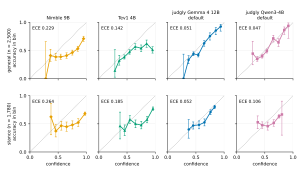

# Methods

This page describes what judgly does and how it is evaluated, in the style of a methods
section. None of the parts is new. The contribution, if there is one, is putting them together
in a small, deterministic engine and reporting the result, including the parts that did not
work. The results are in [Results](#results), from the committed snapshot in
[results/](results/).

## Contents

- [Question and approach](#question-and-approach)
- [The engine](#the-engine)
- [The heads](#the-heads)
- [Engine self-tests](#engine-self-tests)
- [Data and tiers](#data-and-tiers)
- [Leakage and contamination checks](#leakage-and-contamination-checks)
- [Evaluation](#evaluation)
- [Bars](#bars)
- [Results](#results)
- [The calibration comparison](#the-calibration-comparison)
- [Comparison with dedicated decision models](#comparison-with-dedicated-decision-models)
- [Negative and null results](#negative-and-null-results)
- [What the evaluation can and cannot show](#what-the-evaluation-can-and-cannot-show)
- [Related work](#related-work)
- [References](#references)

## Question and approach

Can a frozen open-weight language model, read at a single position and with no text
generated, give calibrated probabilities for typed decisions on kinds of task that the
calibration step has never seen?

The approach follows the design of Jev, TypeSafe's commercial decision model, as described in
its launch post: typed questions with a fixed set of answers, each question isolated from the
others and branched from one reading of the text, and probabilities trained to be calibrated
rather than decisive. judgly reimplements that interface on an open model. The calibration step
is a small head on top of the frozen model, not a trained model.

## The engine

**Prompt.** A request has a *state* (the text) and a set of questions. A model-specific
template wraps the state as a user turn after a short system instruction ("You are a decision
function ..."). Each question follows as its own suffix: the instruction, the options as
lettered lines (A, B, C, ...), and the start of the model's turn ending in `Answer:`.

**Branching.** The state is processed once as sequence 0 of llama.cpp's cache. Each question
suffix, and each option order of it, is a separate sequence that copies the state's cache
entries and is processed in one batched call. A branch attends to the state and to itself,
never to another branch. Large question lists are processed in groups.

**Readout.** At the last position of each branch the engine reads the model's final hidden
vector h and computes the logits of the K answer letters from the model's own output rows
(`dot(w[k], h)`, with Gemma's final logit soft-cap applied). A softmax over those K letters
only gives the raw answer distribution. The mass the model puts on the letters within the full
vocabulary is reported as `slot_mass`. Reading answer-letter probabilities of multiple-choice
questions, and asking whether they are calibrated, follows Kadavath et al. (2022).

**Rotation averaging.** A question with K options is asked in several cyclic rotations of the
options. With all K rotations every option appears once in every letter slot, so any fixed
preference for a position or a letter contributes equally to every option and cancels. The
release packs cap this at four evenly spaced rotations (`max_rotations: 4`, see
[Release settings](#release-settings)): for questions with four or fewer options that is all of
them, but with more than four options no option visits every slot, and some position bias can
remain. The distributions are mapped back from slots to option keys and averaged. Yes/no
questions are always asked in both orders. Score questions are never rotated: their levels keep
their natural order (level 1 in slot A, level 2 in slot B, ...), because an ordinal scale shifted
cyclically across the letter slots (A = 3, B = 4, ...) is read against its own order, and a
head's per-slot bias could then not correct the model's preference for some levels (see
[score heads](#the-heads)). The range of the top option's probability across rotations is
reported as `rotation_spread`. Language models are known to prefer some option positions or
letters, and averaging over option orders is a known remedy (Zheng et al. 2024; Pezeshkpour
and Hruschka 2024).

**Content-free pass (off in the release packs).** The engine can also ask each question
against the state "N/A"; the resulting letter logits (zc) measure the model's preference among
the options before it sees any evidence (contextual calibration, Zhao et al. 2021), and a head
can learn how much of them to subtract. The release packs do not use it (`content_free: false`,
see [Release settings](#release-settings)); their heads use z alone.

**Determinism.** For a fixed model file, template, heads, engine settings, build and hardware,
the same request gives the same probabilities. Asking the same question within different
sets of sibling questions moved its probabilities by at most 0.0002 (Gemma 4 12B) and 0.0014
(Qwen3-4B) in the release self-tests (T5,
[selftest.txt](results/gemma4-12b-q8/selftest.txt),
[selftest.txt](results/qwen3-4b-q8/selftest.txt)). Batch shape can change floating-point summation
order, which is why the self-tests compare batched against solo results.

The engine is C code on top of llama.cpp (pinned commit) and is exposed through a four-function
JSON C API (`csrc/judgly.h`) and a Python package that calls it through ctypes.

## The heads

Per rotation, the letter logits z (and zc) go through a head, then a softmax over the K
letters, then the slot-to-key mapping; the rotations are then averaged. The head is fitted per
question type (choice, yes/no, score) and per format.

- **H0**: no fitted parameters. u[k] = z[k] (optionally minus zc[k]).
- **H1**: u[k] = a z[k] - c zc[k] + b[k], with a = exp(theta) > 0 a learned inverse
  temperature, c the learned share of the content-free logits to subtract, and b one bias per
  letter slot. 28 parameters per type.
- **H2**: u[k] = a dot(w[k] + d[k], h) - c zc[k] + b[k]. The model's letter rows w[k] stay
  fixed. The corrections d[k] (26 x hidden size per type) start at zero, so an untrained H2 is
  H1, and are penalised with lambda * sum(d^2).
- **Per-type temperature** (the second calibration option, added after 0.1.0): not a head on
  each rotation. Each rotation is read as H0, the rotations are averaged, and then
  p_T[k] = softmax_k(log(max(p[k], 1e-12)) / T), with one T per question type, fitted by
  minimising the mean log loss of the train items (each item once, unweighted) and rounded to
  three decimals. It keeps the ranking of the raw readout.
  [calibration-options.md](calibration-options.md) describes its fit, the analyses that led to
  it, its pre-registered confirmation against H2 and its results.

The loss is the mean cross-entropy (log loss) of the correct option. H1 is fitted by full-batch
L-BFGS. H2 is fitted from the H1 solution for each lambda in a short grid, with early stopping
on validation log loss; the lambda with the lowest validation log loss is kept. The test split
is not used for any choice.

**Score heads.** A level means something different in every score question (level 1 is "not
toxic" in one, "one star" in another), so a score head must not learn how often each level was
the answer in the fit data: its per-level biases would carry that frequency into every score
question. Score items are therefore weighted in the fit, in training and in validation, so that
every level carries the same total weight (w = n / (L n_level)). The score fit data are few
(1,051 training items: Civil Comments toxicity scores, most of them at level 1, HelpSteer2
helpfulness ratings and generated tasks), and the weights raise the rare
levels to the weight of the common ones, which the hidden-size-wide corrections of H2 overfit;
score heads are therefore H1 (temperature and per-level bias) in every H2 head file. Choice and
yes/no items need no weights, because their options are rotated through the letter slots. The analytic gradients are checked against numerical ones (self-test
T7, relative error below 1e-4; ported to the Python test suite as `tests/test_head_gradient.py`).

Features for fitting are extracted by the same engine code, with the same template, rotations
and content-free setting that the served engine uses, and a round-trip test (T8) checks that
probabilities from cached features equal those from the live engine. The trainer checks the
feature file against the declared engine settings (every item read in as many orders as the
engine reads it) and records the settings in the head's sidecar (`h2.bin.json`); the engine
refuses a head under other settings.

**Guardrails of the fit.** The temperature 1/a is held within [0.05, 100]: a fit that drives it
beyond a bound is refitted with it fixed there. A very large temperature means the head has all
but discarded the letter logits (a near 0), and because H2's corrections enter as a dot(d[k], h),
their gradients vanish with a as well; H2 therefore starts from the H1 solution with its
temperature capped at 20. After the fit, a question type falls back to the identity head (H0,
the raw readout) when its head is input-independent on the validation records (the largest
standard deviation of any option's probability across them below 0.001) or when its validation
log loss is not below the raw readout's; the sidecar and the calibration record state the
fallback and its reason. `scripts/check_heads.py` fails the pack build for a head that breaks
any of these without a recorded fallback.

## Engine self-tests

`s1-selftest` runs before every pipeline run (the *gate*). A pack is not built if a check fails,
unless the failure is explicitly accepted and recorded in the run's `selftest.txt`.

| test | checks | tolerance |
|---|---|---|
| T1 prompt integrity | detokenised prompt equals the intended text; a state containing special markers cannot forge a turn | exact |
| T2 rows against logits | the letter readout from the output rows equals llama.cpp's own logits, soft-cap included | 0.05 logit |
| T3 branch against recompute | branching from the cached state equals processing prefix and suffix from scratch | 0.02 probability |
| T4 packed against single | many examples per batch equals one per batch | 0.02 |
| T5 isolation | a question's answer does not change with its sibling questions | 0.01 |
| T6 independent reference | against a 32-bit CPU reference (or CPU against Metal for large models) | 0.05 |
| T7 gradient check | analytic against numerical head gradients | 1e-4 relative |
| T8 head round trip | cached features plus head equal the live engine | 0.02 |
| T9 rotation bookkeeping | slot-to-key mapping under rotation; probabilities sum to 1 | exact; 1e-5 |
| T10 sliding-window cache | branch results with and without the full sliding-window cache (Gemma) | 0.02 |

In the release self-tests, Gemma 4 12B at 8 bits passed with T3 0.0084 and T4 0.0106, and
Qwen3-4B with T3 0.0086 and T4 0.0065 ([selftest.txt](results/gemma4-12b-q8/selftest.txt),
[selftest.txt](results/qwen3-4b-q8/selftest.txt)). The pipeline runs the gate without the T6
reference file.

## Data and tiers

All data sources, their pinned revisions, licences and citations are listed in
[reproduce.md](reproduce.md#data-sources), generated from `data/registry.yaml`; the licence
evidence for each, and the candidates that are not used and why, are in
[licences.md](licences.md).

**Licence policy.** A head is fitted only on sources whose dataset card, at the pinned
revision, names a permissive licence (CC0, CC-BY, MIT, Apache-2.0, BSD), and on judgly's own
generated tasks. The stance head may also use share-alike sources, and is then released under
CC-BY-SA-4.0. Everything else (non-commercial, custom, "other", unknown, or no licence on the
card) is used for evaluation only. Where a card is wrong or incomplete, the registry records
how the source is treated and quotes the primary evidence: FEVER's card lists GPL-3.0 (the
licence of the code repository that published the evidence text) beside CC-BY-SA-3.0, and the
FEVER licence page gives CC-BY-SA-3.0 for the data (reading GPL-3.0 as the code's licence is an
inference, so only FEVER's SUPPORTS and REFUTES claims with its own gold evidence are fitted,
not the NOT ENOUGH INFO claims, whose evidence the release adds by retrieval); SciNLI's card
says Apache-2.0, and its authors release it under CC-BY-SA-4.0, so it is treated as share-alike.
Model-written data follow one rule: model-written text with human labels may be fitted (WANLI);
model-written labels never are (UltraFeedback and Prometheus are not used; typed-decisions and
JevBench are evaluation only). `scripts/verify_licences.py`
re-reads every card at its pinned revision and every quoted primary source, and checks the
registry against them. No dataset text is committed: the tiers are rebuilt from the pinned
sources and only their SHA-256 are committed.

**Families and tiers.** The unit of hold-out is the *family*, a kind of decision (for example
sentiment or topic classification), not the dataset, because two datasets of the same kind are
not independent tests. Each family belongs to exactly one tier, per format:

| tier | general format | stance format | used for |
|---|---|---|---|
| fit | knowledge, reading, moderation, preference, emotion, intent, generated, helpfulness (HelpSteer2), contracts (LEDGAR) | NLI (MNLI, SNLI, WANLI), claims (VitaminC, FEVER), scientific (SciNLI) | fitting (70/15/15 train, validation, test) |
| dev | sentiment, inference, similarity, paraphrase, word sense, commonsense | ANLI, Climate-FEVER, COVID-Fact | a held-out check during development (for stance, a dev ECE above 0.08 marks a head as doubtful) |
| final | social bias (BBQ), grammar (BLiMP), figurative language (Fig-QA), indirect answers (Circa), ethics (ETHICS deontology and justice), tables (TabFact), search relevance (ESCI), sentence difficulty (CEFR-SP) | COVID news claims (Check-COVID) | the reported numbers: fresh families, never used before this tier was frozen, read once after the heads are fitted |
| final-flagged | politeness (Stanford Politeness) | health questions (HealthFC) | fresh families read with final, but each with a recorded caveat: reported beside the final numbers, never pooled into them, judging no bar |
| final-seen | topic, biomedical, legal, maths, finance, truthfulness, MMLU-Pro, ratings, yes/no reading | HealthVer | a secondary evaluation, reported separately: an earlier held-out tier whose families were read during development |
| bench | typed-decisions, JevBench public items | none | external benchmarks, evaluation only, also scored as each defines |
| confirm | kinship (CLUTRR), code outcome (CodeMMLU execution prediction), spatial (SpartQA yes/no), argument quality (IBM ArgQ 30k), humour (Humicroedit) | ClimateCheck | the pre-registered comparison of the two calibration options: families never used before, built after every other tier and cleaned against all of them, read once by each model ([calibration-options.md](calibration-options.md#the-pre-registered-confirmation)) |
| reserved | none | SciFact | nothing; kept unseen for later work (ClimateCheck was reserved in 0.1.0 and became the stance confirm tier after its overlap with Climate-FEVER and every other tier was removed) |

Tier sizes: general 9,000 fit (6,300 train, 1,350 validation, 1,350 test), 4,500 dev (250 per
task), 7,879 final (1,000 per task, 1,005 for BLiMP, 500 each for the two ETHICS subsets, 874
for CEFR-SP; 6,803 resampling groups), 1,000 final-flagged (Stanford Politeness), 10,300
final-seen and 2,231 bench items (all 2,000 typed-decisions test decisions and all 231
JevBench public items), and, added after 0.1.0, 2,500 confirm items (500 per family); stance 21,000 fit (4,500 each from MNLI and VitaminC, 4,000 from FEVER,
SUPPORTS and REFUTES only, 3,000 each from SNLI and WANLI, 2,000 from SciNLI), 2,100 dev, 1,343
final (Check-COVID, on 315 abstracts), 749 final-flagged (HealthFC), 2,100 final-seen and, added after 0.1.0, 1,780 confirm items (ClimateCheck, 70 linked groups). The fit tier is split by a hash of the
passage, or of a recorded group (the evidence page for FEVER and VitaminC, the prompt for
HelpSteer2), so items that share one stay in one split. Some sources are sampled evenly: by
label (the stance fit sources other than MNLI and VitaminC, HelpSteer2, Circa, ESCI, CEFR-SP,
Stanford Politeness), by paradigm (BLiMP, 15 pairs each) or by category and context (BBQ, one
item per template); ESCI keeps one product per query.

**The fresh final tier.** It was chosen before any head was scored on it, from datasets that no
experiment in this project had used, and it is frozen by its SHA-256 in `data/tiers.sha256`.
Every item carries a resampling group. Its families are unlike every fit family (no
MMLU-style knowledge, Wikipedia-sentence NLI, contracts, preference or rating, sentiment, topic,
biomedical questions, commonsense, reading or moderation). The QUICK pipeline does not score
the fresh tiers; one QUICK smoke run (Qwen3-4B, a throwaway head fitted on a few hundred items)
did score 173 items drawn from them (80 general, 93 stance) and printed their pooled accuracy
and ECE, and the tiers were not changed because of it. The stance final tier is health
claims, on claims and abstracts that no other tier holds. Check-COVID items show the sentences of the abstract that were
annotated as the claim's evidence, not the whole abstract (a not-enough-info item repeats a
supported or refuted claim with another sentence of the same abstract). "Untouched" means
untouched by this project: most of these datasets are years old and may be in the model's
pretraining data.

**The final-flagged tier.** Fresh families built and read like the final tier, but with a caveat
recorded in the registry (`caveat`), so their numbers are reported in a table of their own and
never pooled into the final numbers or the bars. Stanford Politeness asks for a 1-to-3 civility
rating of online requests, a close relative of the fit family moderation (Civil Comments'
1-to-5 toxicity rating); ETHICS commonsense was left out for the same reason. HealthFC claims
are yes/no questions (740 of 749), used verbatim ("supports" means the evidence answers yes),
with the English evidence sentences (never the explanation field); but those sentences are the
fact-checkers' own summary and often state the verdict ("we could not find any meaningful
scientific evidence", headings such as "Not checked"), so the no-bearing label can often be read
off the wording, the flaw for which PubHealth was not used.

**The final-seen tier.** An earlier held-out tier, built from its sources alone
and scored in every run, in its own table, as a secondary evaluation of families seen during
development. Two of its families are relatives of fit families: legal (CaseHOLD) of contracts
(LEDGAR), and ratings (Yelp) of helpfulness (HelpSteer2).

**The bench tier.** Two external benchmarks for typed decisions, evaluation only
([related work](#related-work)). typed-decisions: the 400 test cases (2,000 decisions) of
`LocalLLaMA/typed-decisions`, with each question's per-option descriptions kept (as options for
choice questions, written into the instructions for yes/no and score questions, which have no
description field in judgly), score levels shifted from 0-based to 1-based, and the teacher's
soft gold distribution kept with each item; its train split is never used. JevBench: the public
items of v1.4.2 (original 72, easy 48, hard 111), mapped the same way; the longest have states of
about 15,000 characters, and `s1-features` splits its blocks of examples so that each fits one
context of 32,768 tokens. Each benchmark
is scored as well against its own gold (see [Evaluation](#evaluation)).

**Generated tasks.** A part of the fit tier is generated by `scripts/prep_tiers.py` from a
fixed seed: arithmetic, dates, units, counting, ordering, parity and similar. These are free of
contamination by construction, and they give the fit tier bool and score items with a known
answer.

**Determinism of the data.** The tier builder is seeded, and a second build is byte-identical.
The SHA-256 of every tier file is committed (`data/tiers.sha256`) and checked by
`make verify-data`. The manifest records every item dropped and why.

## Leakage and contamination checks

The head must never see an item, or a near copy of it, that it is later scored on. Tiers are
built in the order reserved, final-seen, dev, final, final-flagged, bench, fit, and an item is dropped from a
later tier when it matches an earlier one:

- **exactly**: its normalised claim, passage, state or question equals one in an earlier tier.
  A passage embedded in a question (MMLU's "This question refers to the following
  information", then a passage, then the question) is compared on its own too, so that two
  items asking different questions about the same passage match;
- **by a shared sentence** (final, final-flagged and fit tiers): a passage shares a sentence of
  at least 60 normalised characters with an earlier tier, so that the same abstract under
  another title, or a quoted passage, is caught. A sentence that begins with a short
  "Title: " prefix (FEVER puts the page title before each page's evidence) is compared without
  it too, and Penn Treebank tokens of tokenised Wikipedia text (-LRB- and the like) are removed
  in normalisation;
- **by a shared passage** (final, final-flagged and fit tiers): a text shares at least five
  distinct word 8-grams with one text of the earlier tiers, not counting 8-grams found in more
  than three of their distinct texts (boilerplate such as "severe acute respiratory syndrome
  coronavirus 2"), so that a reworded or re-segmented copy of a passage is caught (a preprint
  and its published abstract, a Wikipedia paragraph and FEVER's sentences of it);
- **as a near duplicate** (final, final-flagged and fit tiers): a text's set of normalised words has a Jaccard
  similarity of at least 0.6 with a text of an earlier tier (both of at least six distinct
  words; candidates from MinHash banding, then the exact Jaccard).

final-seen and dev are built with the exact check only; the bench tier drops nothing for overlap (a benchmark is scored as published). The confirm tier, added after 0.1.0, is built after all of them and dropped against every other tier with all four checks (its passage check counting boilerplate 8-grams too); for stance also against the texts of every evaluation source as a whole ([below](#the-pre-registered-confirmation)). Check-COVID items are checked with their whole
abstract, not only the sentences shown, so that every claim on an abstract that HealthVer or
COVID-Fact also uses is left out. FEVER claims whose evidence page is also an evidence article of
Climate-FEVER (dev) are left out (7,606 of the SUPPORTS and REFUTES claims). Exact duplicates
within a tier are dropped. In the current build this excluded, for example, 440 MMLU fit items
whose question or passage also appears in MMLU-Pro (final-seen) and 168 more that share a
sentence or a passage with it (or with MedQA) or nearly duplicate it; 158 Check-COVID claims (72
on an abstract also in HealthVer or COVID-Fact, 26 sharing a sentence and 59 a passage with
them, the latter including COVID boilerplate beyond the three-text cut, 1 near duplicate); 4
FEVER claims whose Wikipedia evidence ANLI (dev) quotes; one HealthFC question (vitamin C and
COVID-19, a near duplicate of a HealthVer claim); and 4 COVID-Fact items overlapping HealthVer or
SciFact.

`scripts/check_contamination.py` then recomputes everything from the tier files alone and fails
if it finds a reserved item in any tier; a final-seen item in fit or dev; a fit item in dev; a
fresh final or final-flagged item that equals, shares a sentence or a passage with or nearly
duplicates a fit, dev, final-seen or reserved text (final-flagged also a final text); a fit item
that shares a sentence or a passage with or nearly duplicates a dev, final-seen or reserved
text; a bench item that matches the fit tier in any of these ways; a family in two tiers; a
source used in a tier its licence does not allow; or duplicate ids. It also reports, without
failing, bench items matching other evaluation tiers, the fresh tiers of each format against
the fit tier of the other format, and dev and final-seen items that overlap a reserved source
(in the current build 8 dev items share a sentence, 52 texts a passage and 17 are near
duplicates, nearly all Climate-FEVER against ClimateCheck; Climate-FEVER is a dev-tier source,
so ClimateCheck had to drop them before it could become an evaluation tier, which it did when it
became the stance confirm tier, [below](#the-pre-registered-confirmation)). The test suite plants each kind of
leak and checks that the checker catches it. The checker runs at the start of every pipeline
run, and its output is saved with the results.

Known limits of the check: texts shorter than 24 normalised characters are not compared
exactly, and texts of fewer than six distinct words not as near duplicates; a near duplicate is
a lexical match, so a paraphrase with other words is not found; formats are checked separately
for failures; and within the fit tier, texts shared between splits are reported, not failed
(in the current build: general 19 between train and test and 18 between train and validation,
stance 13 and 14).

## Evaluation

Each pack is evaluated per format on the fit tier's test split (in-distribution), dev, final
(fresh held-out families; the reported result), final-flagged (fresh families with a caveat,
reported beside final), final-seen (an earlier held-out tier, reported separately as seen
during development), confirm (the untouched tier of the pre-registered comparison of the two
calibration options) and, for the general format, bench. The QUICK pipeline does not score
final, final-flagged or confirm. Three conditions are scored on each: raw (H0 with the served
engine settings), H2 and the per-type temperature.

- **Metrics**: accuracy, log loss (primary), Brier score, ECE over 10 equal-width bins of the
  top probability, the reliability table, selective accuracy and share answered at thresholds
  0.5 to 0.99, per-family metrics, and for stance the confusion matrix.
- **Intervals**: every metric carries a 95% percentile bootstrap interval from 1,000 resamples
  (fixed seed): of items on test, dev and final-seen; of groups on final, final-flagged and
  bench, whose items carry a `group` (the Check-COVID abstract, which holds a claim, its
  negation and its not-enough-info variant; the TabFact table; the BBQ template; the Circa
  question; the ESCI query; the typed-decisions case), for accuracy, log loss, Brier score and
  ECE overall and per family. The tables give the number of groups next to the items. Percentile intervals for ECE lean upward when the true ECE is near
  0, because ECE cannot be negative. Comparisons between head and raw are paired: both
  conditions are resampled on the same items, and the difference is reported with its interval
  (see [Results](#paired-differences-and-per-family-averages)); an interval that includes zero is
  reported as within noise.
- **Per-item dumps**: every evaluation writes one line per item (id, correct option,
  probability of every option), so that any number can be recomputed and any two runs compared
  item by item. The stance confusion matrices are the exception: the dumps index options by
  their position in each item and do not name them, so the matrices come from `record.json`,
  which the calibration record builds with the tier files.
- **Calibration record**: `scripts/calibration_record.py` recomputes the metrics from the
  per-item dumps, stops if they disagree with the evaluator's, and writes `record.json` and
  `tables.md` with the sources and licences behind each head. final-seen has its own table,
  headed as a secondary evaluation of previously seen families.
- **Bench scoring**: besides the metrics above (against the argmax of each item's gold), each
  benchmark is scored against its own gold as it defines: accuracy (for JevBench score
  questions, the rounded expected level), the multi-class Brier score (the sum over options of
  the squared difference from the gold distribution: typed-decisions' soft teacher
  distribution, JevBench's expected label or its published gold probabilities), the KL
  divergence from the gold to the prediction, ECE (top label, 10 bins) and, for score
  questions, the mean absolute difference between predicted and gold expected level, with 95%
  intervals from resampling cases. typed-decisions' gold is a teacher model's output, so its
  numbers measure agreement with that teacher (its card gives a majority baseline of 0.520, a
  ceiling from its latent factors of 0.704 and the teacher's self-agreement of 0.735). The
  JevBench number covers the 231 public items only and is not comparable with the JevBench
  leaderboard, which also scores sealed items.

The limits of the final tier are in
[What the evaluation can and cannot show](#what-the-evaluation-can-and-cannot-show).

## Bars

The release packs are judged against these bars:

- **Engine**: every self-test within tolerance (above). A model that fails T3 or T4 is not
  shipped as a pack.
- **Contamination**: the checker exits 0 on the tiers used.
- **General head**: H2 must improve held-out (dev and final) log loss over raw. If it improved
  the in-distribution test split but not the held-out families, it would be learning
  task-specific features and would not be shipped as a general head.
- **Stance head**: final-tier ECE below 0.05, and dev-tier ECE not above 0.08.

The bars are judged on the fresh final tier; final-flagged, final-seen and bench numbers are
reported beside them and judge nothing.

<!-- RESULTS:BARS -->
Which bars the packs met is in [Results](#bars-met-and-missed): the engine, contamination and
general-head bars were met; the stance final-tier bar was met narrowly by Gemma 4 12B and missed
narrowly by Qwen3-4B, and **the stance dev bar was missed by both packs**.

## Results

All numbers in this section are from [results/](results/): the calibration records
(`record.json`), their tables (`tables.md`), the per-item dumps and the self-test output of the
runs, one run per pack on an Apple M3 Max. Brackets are 95% percentile bootstrap intervals (of
groups on final, final-flagged and bench, of items elsewhere; see [Evaluation](#evaluation)); n is
the number of questions. The model cards give the full tables:
[gemma4-12b-q8](model-cards/gemma4-12b-q8.md), [qwen3-4b-q8](model-cards/qwen3-4b-q8.md).

### Release settings

The packs, and the runs that fitted and scored them, use these settings (the `engine` block of
each `pack.json`; features for fitting are extracted with the same settings):

- **at most four cyclic option orders** per question, evenly spaced, averaged (all orders when
  a question has four options or fewer);
- **no content-free pass** (`content_free: false`); the heads use the letter logits z alone;
- **tier sizes**: general fit 9,000 items (6,300 train, 1,350 validation, 1,350 test), dev 4,500,
  final 7,879, final-flagged 1,000, final-seen 10,300 and bench 2,231 (2,000 typed-decisions and
  231 JevBench items); stance fit 21,000 (14,783 train, 3,072 validation, 3,145 test), dev 2,100,
  final 1,343, final-flagged 749 and final-seen 2,100. Calibration curves flatten after a few
  hundred labelled items, so a fit tier of a few thousand items is enough for heads of this size.

### Calibration options

The numbers in the rest of this section are those of the 0.1.0 release: raw against H2. The
per-type temperature, added later as a second option, is reported against both on every tier in
[calibration-options.md](calibration-options.md#both-options-on-every-tier); how it came about,
which tiers its analyses read, and its pre-registered confirmation are described
[below](#the-calibration-comparison). On the confirm tier, which no analysis had read, it met the
pre-registered criteria against H2 in three of four cases (Gemma 4 12B stance, Qwen3-4B general
and stance) and not for Gemma 4 12B general.

### Tiers and contamination

The tier design is described [above](#data-and-tiers). The general fresh final tier has 7,879
questions from 9 tasks in 8 families (social bias, grammar, figurative language, indirect
answers, ethics, tables, search relevance, sentence difficulty), in 6,803 resampling groups; the
stance fresh final tier has 1,343 Check-COVID pairs on 315 abstracts. The contamination checker
exited 0 on the tiers before the runs (a pipeline run stops otherwise).

### Headline: fresh final tier

| pack | format | n | accuracy raw → head | log loss raw → head | ECE raw → head |
|---|---|---|---|---|---|
| gemma4-12b-q8 | general | 7,879 | 0.760 [0.751, 0.770] → 0.737 [0.726, 0.746] | 1.553 [1.478, 1.636] → 0.631 [0.613, 0.651] | 0.194 [0.186, 0.204] → 0.020 [0.015, 0.031] |
| gemma4-12b-q8 | stance | 1,343 | 0.827 [0.806, 0.848] → 0.812 [0.790, 0.836] | 1.603 [1.370, 1.855] → 0.509 [0.472, 0.550] | 0.142 [0.123, 0.162] → 0.048 [0.034, 0.072] |
| qwen3-4b-q8 | general | 7,879 | 0.656 [0.644, 0.667] → 0.639 [0.628, 0.650] | 3.474 [3.330, 3.639] → 0.797 [0.779, 0.815] | 0.268 [0.259, 0.279] → 0.030 [0.025, 0.040] |
| qwen3-4b-q8 | stance | 1,343 | 0.778 [0.755, 0.801] → 0.773 [0.749, 0.795] | 3.185 [2.812, 3.589] → 0.594 [0.562, 0.628] | 0.187 [0.167, 0.212] → 0.052 [0.034, 0.077] |

The heads lower log loss and ECE a great deal in every case. They also lower accuracy: clearly
for the general heads, a little for the stance heads (below).

### Paired differences and per-family averages

Head minus raw on the same fresh final-tier items, with 95% paired bootstrap intervals (items
resampled within each family, not by group, 1,000 resamples; `docs/tools/final_tier_stats.py`
recomputes them from the snapshot):

| pack | format | accuracy | log loss | ECE |
|---|---|---|---|---|
| gemma4-12b-q8 | general | -0.023 [-0.031, -0.016] | -0.922 [-0.979, -0.865] | -0.174 [-0.182, -0.162] |
| gemma4-12b-q8 | stance | -0.015 [-0.030, -0.001] | -1.094 [-1.287, -0.909] | -0.094 [-0.123, -0.059] |
| qwen3-4b-q8 | general | -0.017 [-0.024, -0.011] | -2.672 [-2.795, -2.558] | -0.239 [-0.247, -0.223] |
| qwen3-4b-q8 | stance | -0.005 [-0.024, 0.013], within noise | -2.590 [-2.962, -2.238] | -0.134 [-0.171, -0.096] |

The pooled ECE of the general format mixes eight families, and errors in opposite directions
can cancel. The per-family average ECE is larger:

| pack | pooled ECE raw → head | per-family average ECE raw → head |
|---|---|---|
| gemma4-12b-q8 | 0.194 → 0.020 | 0.204 [0.197, 0.214] → 0.051 [0.049, 0.063] |
| qwen3-4b-q8 | 0.268 → 0.030 | 0.277 [0.269, 0.288] → 0.077 [0.071, 0.088] |

The stance final tier is one family, so its pooled and per-family ECE are the same.

### Final-flagged: fresh families with a caveat

Reported beside the final tier, never pooled into it, judging no bar ([the caveats](#data-and-tiers)):

| pack | family | n | accuracy raw → head | ECE raw → head |
|---|---|---|---|---|
| gemma4-12b-q8 | politeness (Stanford Politeness) | 1,000 | 0.519 [0.490, 0.549] → 0.512 [0.481, 0.544] | 0.423 [0.392, 0.452] → 0.106 [0.080, 0.138] |
| gemma4-12b-q8 | stance (HealthFC) | 749 | 0.750 [0.722, 0.782] → 0.634 [0.597, 0.668] | 0.201 [0.174, 0.229] → 0.123 [0.093, 0.158] |
| qwen3-4b-q8 | politeness (Stanford Politeness) | 1,000 | 0.492 [0.462, 0.523] → 0.487 [0.456, 0.519] | 0.442 [0.409, 0.472] → 0.046 [0.030, 0.080] |
| qwen3-4b-q8 | stance (HealthFC) | 749 | 0.718 [0.684, 0.752] → 0.541 [0.506, 0.575] | 0.227 [0.196, 0.260] → 0.150 [0.130, 0.192] |

### Final-seen: families seen during development (secondary)

An earlier held-out tier whose families were read while judgly was developed. These
numbers are not a held-out result; they are reported for comparison only, and their intervals
resample items as if independent.

| pack | format | n | accuracy raw → head | ECE raw → head |
|---|---|---|---|---|
| gemma4-12b-q8 | general | 10,300 | 0.714 [0.705, 0.723] → 0.713 [0.703, 0.722] | 0.180 [0.172, 0.189] → 0.026 [0.021, 0.034] |
| gemma4-12b-q8 | stance (HealthVer) | 2,100 | 0.632 [0.610, 0.652] → 0.626 [0.605, 0.647] | 0.320 [0.302, 0.342] → 0.067 [0.051, 0.089] |
| qwen3-4b-q8 | general | 10,300 | 0.649 [0.640, 0.658] → 0.654 [0.645, 0.663] | 0.231 [0.223, 0.240] → 0.019 [0.016, 0.030] |
| qwen3-4b-q8 | stance (HealthVer) | 2,100 | 0.571 [0.548, 0.592] → 0.548 [0.527, 0.570] | 0.354 [0.333, 0.377] → 0.100 [0.084, 0.122] |

### Bench: external benchmarks

Each benchmark scored against its own gold ([Evaluation](#evaluation)); intervals resample cases.

| pack | benchmark | items (cases) | accuracy raw → head | Brier raw → head | ECE raw → head |
|---|---|---|---|---|---|
| gemma4-12b-q8 | typed-decisions | 2,000 (400) | 0.702 [0.680, 0.723] → 0.700 [0.677, 0.721] | 0.359 [0.342, 0.378] → 0.117 [0.109, 0.125] | 0.251 [0.232, 0.274] → 0.028 [0.019, 0.049] |
| gemma4-12b-q8 | JevBench, public items | 231 (195) | 0.835 [0.784, 0.884] → 0.840 [0.789, 0.890] | 0.274 [0.193, 0.363] → 0.207 [0.159, 0.256] | 0.133 [0.093, 0.185] → 0.054 [0.043, 0.106] |
| qwen3-4b-q8 | typed-decisions | 2,000 (400) | 0.576 [0.549, 0.600] → 0.591 [0.567, 0.614] | 0.482 [0.457, 0.507] → 0.200 [0.184, 0.217] | 0.356 [0.334, 0.380] → 0.126 [0.111, 0.147] |
| qwen3-4b-q8 | JevBench, public items | 231 (195) | 0.693 [0.626, 0.751] → 0.671 [0.605, 0.733] | 0.495 [0.393, 0.607] → 0.361 [0.307, 0.419] | 0.251 [0.199, 0.314] → 0.070 [0.049, 0.127] |

On typed-decisions, whose gold is a teacher model's output, Gemma 4 12B with its head is at 0.700
(raw 0.702) and Qwen3-4B at 0.591. The dataset card reports meraGPT Decider 1 at 0.768 and Jev
1.13.0 at 0.727 (Jev measured by the card's authors through TypeSafe's API), Laya's own model card
reports 0.766 for a checkpoint fine-tuned on the benchmark's train split, and open-alternative-jev
reports 0.737 (one option order) and 0.755 (two) with Qwen3.6-27B; judgly is below all of them.
At about 4B, open-alternative-jev's untrained Qwen3.5-4B reports 0.593 / 0.595 accuracy, ECE 0.118 /
0.062 (one / two orders) and Brier 0.164 (score questions left out), against judgly's Qwen3-4B
head at 0.591, ECE 0.126 and Brier 0.238 counted the same way: at that size judgly's head does
no better.
judgly's accuracy and ECE follow the same definitions as the third-party scorer from
Luni/laya-jev-benchmark, which open-alternative-jev uses (by open-alternative-jev's check, it
reproduces Laya's published numbers to within 0.003) (argmax against the card's `label`; top-label confidence in ten equal-width bins over all
2,000 decisions): applied to judgly's per-item dumps, those definitions give the same values. Brier does
not: judgly averages it over all 2,000 decisions, as the card's own rows appear to (its Uniform
row is reproduced exactly only that way), while that scorer leaves the 800 score questions out;
counted that way, the Gemma 4 12B head's Brier is 0.113 (raw 0.302) and the Qwen3-4B head's 0.238.
The card gives Jev ECE 0.144 without publishing its scorer, and notes that on this benchmark ECE
favours a baseline that ignores the input. The JevBench numbers cover the public items only and
are not comparable with the leaderboard ([related work](#related-work)).

### Bars: met and missed

| bar | gemma4-12b-q8 | qwen3-4b-q8 |
|---|---|---|
| engine: self-tests within tolerance (T6 not run) | met | met |
| contamination checker exits 0 | met | met |
| general head: lower held-out log loss than raw on dev and final | met (dev 1.687 → 0.654, final 1.553 → 0.631) | met (dev 3.287 → 0.636, final 3.474 → 0.797) |
| stance head: final ECE below 0.05 | met, narrowly (0.048 [0.034, 0.072]) | **missed**, narrowly (0.052 [0.034, 0.077]) |
| stance head: dev ECE not above 0.08 | **missed** (0.122 [0.106, 0.143]) | **missed** (0.209 [0.189, 0.232]) |

The Gemma 4 12B stance head meets the final bar on its point estimate only: the interval reaches
well above 0.05. Both stance heads ship, because they are far better calibrated than raw (ECE
0.142 → 0.048 and 0.187 → 0.052), and they are marked as having missed the dev bar in the README
and the model cards.

## The calibration comparison

After the 0.1.0 release a second calibration option, one temperature per question type, was
studied and compared with the released H2 heads. Everything in this section ran on the CPU from
the letter scores cached by the release runs, except that the confirm tier was built new and read
once by each model. The order in which things were done is part of what the numbers mean, so it
is stated here. The scripts, protocols and outputs are committed unchanged in
[results/calibration-study](results/calibration-study/README.md), each with a README; rerun from
the repository (`rerun.py`), all four reproduced their committed output byte for byte.
[calibration-options.md](calibration-options.md) has both options on every tier and how to choose
between them.

### The two options

- **H2** ([above](#the-heads)) acts on each option order's letter scores before the orders are
  averaged, and can change the top answer.
- **The per-type temperature** reads each order without a head, averages the orders into the raw
  readout p, then applies p_T[k] = softmax_k(log(max(p[k], 1e-12)) / T), with one T per question
  type (choice, yes/no, score). It keeps the raw readout's ranking, so its top-answer accuracy
  is the raw accuracy (a benchmark that scores score questions by the expected level, as
  JevBench does, can differ).

Both are fitted on the same items: the fit tier's train split (general 6,300 items: 4,156
choice, 1,093 yes/no, 1,051 score; stance 14,783 choice items). The temperature minimises the
mean log loss of the train items, each counted once and unweighted; the validation split
(general 1,350: 892, 232, 226; stance 3,072) is used only for the fallback verdict (no type with
training items fell back; stance yes/no and score have no items and are set to 1). The shipped values, rounded to three decimals, are those frozen before the confirmation:

| pack | format | choice | yes/no | score |
|---|---|---|---|---|
| gemma4-12b-q8 | general | 3.461 | 7.491 | 6.538 |
| gemma4-12b-q8 | stance | 7.151 | 1 (no items) | 1 (no items) |
| qwen3-4b-q8 | general | 6.846 | 13.36 | 24.22 |
| qwen3-4b-q8 | stance | 12.391 | 1 (no items) | 1 (no items) |

`temperatures.json` was written from exploratory analysis 2's fit (`tricks.py`, Nelder-Mead in
log T); analysis 1's L-BFGS fit of the same objective gives the same values to three decimals.
`s1-train --head temperature`
fits the same objective (bisection on its derivative, which is monotone in 1/T), and all eight of
its unrounded optima round to the same three decimals (`train-temperature.log` in each results
directory).

### Exploratory analyses

Three exploratory analyses came first, all on 2026-09-29 after the release:

| analysis | protocol | fitted on | chosen on | tiers read | finding |
|---|---|---|---|---|---|
| 0, temperature-only variants and pooling the two packs | none | the fit tier's test split | no choice; every variant reported | test, dev, final, final-seen | a temperature per type had a lower log loss than H2 in 7 of 12 cases; pooling gave no gain worth running two models |
| 1, T1, Ttype, TBtype against H2 | choice rule in the script's docstring before any result | train split | validation log loss | train, validation, dev, final, final-flagged, final-seen, bench | the rule chose H2 in all 4 cases; on held-out tiers Ttype matched or beat H2 in most comparisons |
| 2, refinements on top of Ttype, and an own-data temperature | `PROTOCOL.md`, frozen by SHA-256 at 09:09 | train split | dev log loss (ties within 0.002 to fewer parameters) | train, dev, final, final-flagged, final-seen, bench | no refinement beat Ttype reliably; averaged over families, a temperature fitted on a family's own items had a lower log loss from about 50 to 100 items (per family: in 22 to 25 of 36) |

**Analysis 0.** Weights of a log-linear pool (p proportional to the product of each source's
probabilities raised to its weight; one weight is a temperature) were fitted by Nelder-Mead on the
fit tier's test split (1,350 general, 3,145 stance items), which after this analysis is no longer
an unused in-distribution check for these variants. Compared by log loss on dev, final and
final-seen, the per-type temperature beat H2 in 7 of the 12 pack, format and tier cases. Pooling
Gemma 4 12B with Qwen3-4B was never more than 0.0022 more accurate than Gemma 4 12B alone (general
dev; less accurate in the other five format and tier cases); the best pooled variant's log loss
differed from the best Gemma-only variant's by at most 0.030, lower in four of six cases and
higher in two. That comparison is of the best of several variants after seeing the results, and
pooling needs both models at run time; it was not pursued.

**Analysis 1.** Fitted on the train split by L-BFGS: T1 (one temperature), Ttype (one per
question type) and TBtype (per type a temperature and a bias per option position). The rule fixed
in the docstring, lowest log loss on the validation split, chose H2 in all four pack and format
cases; validation is in-distribution, and H2's penalty strength had itself been chosen on it. On
the 18 held-out comparisons (dev, final, final-flagged, final-seen and bench, per pack and
format), Ttype's accuracy was at least H2's in 15, and its log loss, ECE and Brier score were
each lower in 11. In 6 of the 18 the 95% interval of the paired difference showed Ttype worse
than H2 on at least one of accuracy, ECE and Brier, among them the stance final tier
(Check-COVID) of both packs. TBtype was better than Ttype on train and validation (general) but
had a higher log loss in 13 of the 18 held-out comparisons.

**Analysis 2.** Four refinements, each fitted per question type on the train split and applied
to Ttype's output: a temperature that grows with the disagreement between option orders
(T = exp(alpha + beta d)), Platt scaling of the top probability, isotonic regression and 10-bin
histogram binning. The frozen rule chose Platt, Ttype, H2 and isotonic regression in the four
cases. Against Ttype over the 18 held-out comparisons, counting intervals of the paired log loss
difference wholly below or above zero: Platt better in 9, worse in 6; order disagreement better
in 2, worse in 5; isotonic better in 2, worse in 12; histogram better in 1, worse in 8. None was
taken further. Three bugs in the analysis script were found and fixed during this run; the
frozen protocol was not changed, and the committed script is the one that produced the committed
output.

**Own-data temperature (analysis 2's sub-study).** For each held-out family of dev and final,
items were split into halves A and B by a hash of their group; one temperature fitted on the first
n items of A was judged on B against the shipped per-type temperature. Mean log loss over
families was lower than the shipped temperature's in 6 of the 8 pack, format and tier rows at
n = 25, 7 of 8 at n = 50 and 8 of 8 at n = 100 (for example Gemma 4 12B general final: 0.628,
0.614, 0.592 against 0.597; Qwen3-4B general final: 0.779, 0.777, 0.771 against 0.788). Per
family it was more mixed: better in 22 of 36 families at n = 25 and at n = 50, and in 25 of 36
at n = 100 (Gemma 4 12B stance dev: lower mean, better in one of three families).
The full table is in the analysis README. This was exploratory and was not confirmed.

**The decision to confirm.** Taking the per-type temperature to a confirmation was a judgement
made after seeing these results, not the output of either pre-specified choice rule, and it was
not registered in advance: analysis 1's rule chose H2 in all four cases and analysis 2's chose
Ttype in one of four (1 of 8 pack and analysis decisions). The stated reasons were that it was
the simplest variant, keeps the raw ranking and was not reliably beaten on the held-out tiers;
Platt had a lower log loss than it in 9 of 18 comparisons. Because the choice departed from both
rules, it was tested on a new tier.

**How often each tier was read.** The fresh final tier and final-seen were read by the 0.1.0
release run and then by all three analyses; final-flagged and bench by the release run and by
analyses 1 and 2; dev during development, by all three analyses and by the confirmation
scorer's smoke test; the fit tier's test split by the release run and, for fitting, by analysis
0. The per-type temperature and the decision to
test it came from these analyses, so for the comparison of the two options none of these tiers
is untouched, and their numbers for the temperature are supporting evidence, not a held-out
result.

### The pre-registered confirmation

**Protocol.** `CONFIRM.md` states that it was written and frozen before any confirmation data
existed, with the
temperatures under test (`temperatures.json`, analysis 2's Ttype fit rounded to three decimals).
Amendment 1 was added after the tier was built and reviewed and before any model read it, and the
file was re-frozen at 10:38; the scorer `score_confirm.py` was frozen at 10:40 after a smoke test
on the 0.1.0 dev tier only. `CONFIRM.sha256` records the SHA-256 of the three files and these
two times (none for `temperatures.json`, whose file modification time is 09:30); the SHA-256 of
the protocol before the amendment was not kept, so the amendment's text is the record of what
changed. The claim, in the protocol's words: "On task families that nothing in judgly was
fitted, tuned or chosen on, the per-question-type temperature ("Ttype") is at least as good as
the head shipped in judgly 0.1.0 ("H2"): no loss of accuracy and no worse calibration", with
nothing refitted and the release engine settings (up to four option orders, no content-free
pass). The criteria below test this as non-inferiority within pre-set margins.

**Amendment 1.** (1) Stance intervals resample linked groups (claims joined by a shared abstract,
70 groups) because items sharing an abstract are not independent; the 175 claim groups are a
secondary analysis. (2) The tier review had flagged argument_quality and humour as possible
relatives of used rating families, and code_outcome as having a language shortcut (the verdict
goes with the programming language); the endpoints stay on all five families, and the result is
also reported with each of the three left out, without a criterion. (3) Nothing else changed.

**Data: the confirm tier.** Built after every other tier (judgly commits `ad8c91a` and `dbf1a9f`)
from sources never used in this project, with licences that allow evaluation
([licences.md](licences.md)), and frozen by SHA-256 in `data/tiers-confirm.sha256`:

| format | family | source | type | items | resampling groups |
|---|---|---|---|---|---|
| general | kinship | CLUTRR | choice (17 relations, hop counts 2 to 10 balanced) | 500 | 500 |
| general | code_outcome | CodeMMLU execution prediction (Project CodeNet programs) | choice (4 verdicts, 125 each) | 500 | 500 |
| general | spatial | SpartQA-YN | yes/no (250 each) | 500 | 500 |
| general | argument_quality | IBM Argument Quality 30k | score (3 levels) | 500 | 15 (topics) |
| general | humour | Humicroedit | score (3 levels) | 500 | 417 |
| stance | confirm_climate | ClimateCheck test split (reserved in 0.1.0) | choice (707 supports, 253 contradicts, 820 no bearing) | 1,780 | 70 (largest 837 items) |

`scripts/prep_tiers.py` builds the tier last and drops every item that matches any other tier
(fit, dev, final, final-flagged, final-seen, bench) as an exact text, a shared sentence, a shared
passage (8-gram shingles, boilerplate included) or a near duplicate; for stance it also checks
against the texts of every evaluation source as a whole (36,951 texts). The first build had 1,785
ClimateCheck items; the review dropped five that quote IPCC text also held by Climate-FEVER (a dev
source), and replaced one code_outcome item whose program was shorter than 20 characters, before
any model read the tier. `scripts/check_contamination.py` checks the same conditions at the start
of every pipeline run. The 0.1.0 tier files are byte-identical to `data/tiers.sha256`. Each model
then read the tier once (`s1-features`, 10:38 to 13:12 by the run log; the first per-item output
appeared at 11:31). Extraction began after Amendment 1 was re-frozen (10:38) and about two
minutes before the scorer was frozen (10:40). The frozen scorer produced the confirmatory result
from that readout once (13:13). The same readouts were later scored again, deterministically and
after the result, by `make calibrate` (the calibration records), `confirmation_check.py` and
`rerun.py`.

**Criteria**, per pack and format, on the paired difference temperature minus H2 over the same
items, 95% percentile interval from 1,000 bootstrap resamples of the groups (seed 20260929):
accuracy, lower bound above -0.01; Brier score, upper bound below +0.01; ECE, upper bound below
+0.02. A case is confirmed when all three hold. Only confirmed cases switch.

**Result: confirmed in 3 of 4 cases.** The scorer's values (`result-confirm.txt`; it rounds to four
decimals, then prints three):

| pack | format | items (groups) | accuracy T / H2 | ECE T / H2 | Brier T / H2 | log loss T / H2 | T - H2 accuracy | T - H2 ECE | T - H2 Brier | T - H2 log loss (no criterion) | verdict |
|---|---|---|---|---|---|---|---|---|---|---|---|
| gemma4-12b-q8 | general | 2,500 (1,932) | 0.509 / 0.509 | 0.087 / 0.051 | 0.579 / 0.562 | 0.959 / 0.933 | +0.000 [-0.014, +0.015] | +0.037 [+0.015, +0.048] | +0.017 [+0.010, +0.024] | +0.026 [+0.017, +0.037] | not confirmed |
| gemma4-12b-q8 | stance | 1,780 (70) | 0.655 / 0.629 | 0.052 / 0.078 | 0.476 / 0.490 | 0.823 / 0.812 | +0.026 [+0.011, +0.049] | -0.026 [-0.045, +0.007] | -0.014 [-0.044, -0.001] | +0.012 [-0.036, +0.033] | confirmed |
| qwen3-4b-q8 | general | 2,500 (1,932) | 0.484 / 0.463 | 0.047 / 0.076 | 0.597 / 0.624 | 1.009 / 1.041 | +0.022 [+0.008, +0.036] | -0.029 [-0.049, -0.014] | -0.027 [-0.035, -0.020] | -0.032 [-0.043, -0.023] | confirmed |
| qwen3-4b-q8 | stance | 1,780 (70) | 0.568 / 0.526 | 0.106 / 0.183 | 0.581 / 0.612 | 0.966 / 0.989 | +0.042 [+0.023, +0.090] | -0.078 [-0.097, -0.054] | -0.031 [-0.065, -0.018] | -0.023 [-0.070, -0.001] | confirmed |

For Gemma 4 12B general all three criteria were missed: equal accuracy, and H2 better
calibrated. The raw readout was far worse than either option in every case (ECE 0.300 to 0.406).

Per family (no criterion; paired intervals resample the family's own groups):

| pack | family | items (groups) | accuracy T / H2 | ECE T / H2 | Brier T / H2 | T - H2 accuracy | T - H2 ECE | T - H2 Brier |
|---|---|---|---|---|---|---|---|---|
| gemma4-12b-q8 | argument_quality | 500 (15) | 0.444 / 0.458 | 0.105 / 0.079 | 0.633 / 0.624 | -0.014 [-0.034, +0.007] | +0.026 [-0.019, +0.053] | +0.009 [+0.002, +0.018] |
| gemma4-12b-q8 | code_outcome | 500 (500) | 0.624 / 0.608 | 0.069 / 0.057 | 0.510 / 0.500 | +0.016 [-0.018, +0.050] | +0.012 [-0.041, +0.053] | +0.010 [-0.011, +0.031] |
| gemma4-12b-q8 | humour | 500 (417) | 0.404 / 0.374 | 0.123 / 0.132 | 0.668 / 0.671 | +0.030 [+0.008, +0.056] | -0.009 [-0.036, +0.015] | -0.003 [-0.012, +0.006] |
| gemma4-12b-q8 | kinship | 500 (500) | 0.538 / 0.526 | 0.061 / 0.031 | 0.586 / 0.566 | +0.012 [-0.012, +0.036] | +0.029 [-0.017, +0.061] | +0.020 [+0.009, +0.032] |
| gemma4-12b-q8 | spatial | 500 (500) | 0.536 / 0.580 | 0.144 / 0.081 | 0.499 / 0.452 | -0.044 [-0.088, -0.002] | +0.063 [+0.012, +0.109] | +0.047 [+0.025, +0.068] |
| gemma4-12b-q8 | confirm_climate | 1,780 (70) | 0.655 / 0.629 | 0.052 / 0.078 | 0.476 / 0.490 | +0.026 [+0.011, +0.049] | -0.026 [-0.045, +0.007] | -0.014 [-0.044, -0.001] |
| qwen3-4b-q8 | argument_quality | 500 (15) | 0.426 / 0.422 | 0.025 / 0.088 | 0.641 / 0.651 | +0.004 [-0.004, +0.011] | -0.064 [-0.072, -0.009] | -0.011 [-0.023, +0.001] |
| qwen3-4b-q8 | code_outcome | 500 (500) | 0.514 / 0.510 | 0.073 / 0.072 | 0.592 / 0.599 | +0.004 [-0.034, +0.044] | +0.002 [-0.056, +0.044] | -0.007 [-0.019, +0.005] |
| qwen3-4b-q8 | humour | 500 (417) | 0.368 / 0.374 | 0.110 / 0.178 | 0.679 / 0.712 | -0.006 [-0.014, +0.000] | -0.068 [-0.088, -0.058] | -0.033 [-0.043, -0.023] |
| qwen3-4b-q8 | kinship | 500 (500) | 0.502 / 0.520 | 0.078 / 0.058 | 0.602 / 0.598 | -0.018 [-0.038, +0.004] | +0.020 [-0.024, +0.056] | +0.004 [-0.007, +0.014] |
| qwen3-4b-q8 | spatial | 500 (500) | 0.612 / 0.488 | 0.055 / 0.154 | 0.471 / 0.559 | +0.124 [+0.076, +0.176] | -0.099 [-0.143, -0.043] | -0.088 [-0.119, -0.058] |
| qwen3-4b-q8 | confirm_climate | 1,780 (70) | 0.568 / 0.526 | 0.106 / 0.183 | 0.581 / 0.612 | +0.042 [+0.023, +0.090] | -0.078 [-0.097, -0.054] | -0.031 [-0.065, -0.018] |

These are the scorer's values (`result-confirm.json`, rounded to four decimals, printed to
three). The model cards' per-family tables round the calibration records' values once, so a few
differ by 0.001 (for example Qwen3-4B argument_quality H2 Brier 0.6515: 0.651 here, 0.652 in the
card).

The largest single difference is spatial (SpartQA yes/no), where H2 lowered Qwen3-4B's accuracy
from 0.612 to 0.488. The five families have 500 items each, so the overall accuracy difference is
the mean of the five: for Qwen3-4B, +0.022 overall, and -0.004 as the mean of the four families
other than spatial (post hoc arithmetic, no interval). spatial was not among the families the
amendment leaves out in turn, and the protocol specified no analysis without it.

Secondary analyses (Amendment 1, no criterion):

| pack | analysis | items (groups) | T - H2 accuracy | T - H2 ECE | T - H2 Brier | all three criteria |
|---|---|---|---|---|---|---|
| gemma4-12b-q8 | general, without argument_quality | 2,000 (1,917) | +0.004 [-0.012, +0.020] | +0.038 [+0.012, +0.051] | +0.018 [+0.011, +0.026] | not met |
| gemma4-12b-q8 | general, without humour | 2,000 (1,515) | -0.007 [-0.024, +0.008] | +0.038 [+0.008, +0.057] | +0.022 [+0.013, +0.030] | not met |
| gemma4-12b-q8 | general, without code_outcome | 2,000 (1,432) | -0.004 [-0.020, +0.010] | +0.032 [+0.011, +0.048] | +0.018 [+0.012, +0.026] | not met |
| gemma4-12b-q8 | stance, resampling the 175 claim groups | 1,780 (175) | +0.026 [+0.008, +0.045] | -0.026 [-0.048, -0.006] | -0.014 [-0.030, +0.001] | met |
| qwen3-4b-q8 | general, without argument_quality | 2,000 (1,917) | +0.026 [+0.010, +0.043] | -0.030 [-0.051, -0.008] | -0.031 [-0.041, -0.022] | met |
| qwen3-4b-q8 | general, without humour | 2,000 (1,515) | +0.029 [+0.011, +0.047] | -0.022 [-0.046, -0.004] | -0.026 [-0.035, -0.016] | met |
| qwen3-4b-q8 | general, without code_outcome | 2,000 (1,432) | +0.026 [+0.013, +0.041] | -0.042 [-0.058, -0.022] | -0.032 [-0.042, -0.024] | met |
| qwen3-4b-q8 | stance, resampling the 175 claim groups | 1,780 (175) | +0.042 [+0.023, +0.063] | -0.078 [-0.098, -0.053] | -0.031 [-0.050, -0.013] | met |

**Checks of the shipped option against the confirmation.** The shipped temperature files hold
exactly the values of `temperatures.json`; on the confirm and dev tiers the engine's per-item
temperature output equals the frozen scorer's applied to the raw dumps (largest difference
2.2e-16); every point value of `result-confirm.json` equals the calibration record's rounded to
four decimals; and every committed per-item dump (both packs, both formats, every tier, raw, H2
and temperature) is reproduced byte for byte by `s1-eval` from the committed code
(`docs/tools/confirmation_check.py`, [reproduce.md](reproduce.md)).

### What was decided

Per the protocol, only confirmed cases switch. Each pack ships both options per format, and the
default (`Engine.load(pack)`) is:

| pack | general | stance |
|---|---|---|
| gemma4-12b-q8 | H2 (not confirmed) | temperature (confirmed) |
| qwen3-4b-q8 | temperature (confirmed) | temperature (confirmed) |

`calibration="h2"`, `"temperature"` or `"raw"` chooses one for every format.

### Negative and null results of the comparison

- **Gemma 4 12B general was not confirmed, and H2 was better calibrated.** On the untouched
  general confirm tier, at equal accuracy (0.509), H2 was better calibrated than the temperature:
  ECE 0.051 against 0.087 in the scorer's output, Brier 0.562 against 0.579, with the paired
  intervals of ECE (+0.037 [+0.015, +0.048]), Brier (+0.017 [+0.010, +0.024]) and log loss
  (+0.026 [+0.017, +0.037]) all excluding zero. The protocol did not pre-specify a test in that
  direction.
- **For Qwen3-4B general, H2 was better calibrated on most earlier tiers.** H2 had the lower ECE
  on dev (0.055 against 0.068), final (0.030 against 0.034), final-seen (0.019 against 0.037),
  bench (0.114 against 0.128) and test (0.040 against 0.062); the temperature only on
  final-flagged (0.037 against 0.046). In analysis 1 the paired intervals showed the temperature
  worse on dev (ECE), final-seen (ECE, Brier) and bench (Brier). The switch rests on the confirm
  tier, whose accuracy gain comes mostly from spatial (below).
- **H2 was better calibrated on the stance final tier** (Check-COVID) in both packs (ECE 0.048
  and 0.052 against 0.087 and 0.093), although the temperature is now the stance default. On the
  stance confirm tier (ClimateCheck) the temperature was better in both. Stance calibration
  depends strongly on the kind of claims and evidence.
- **Neither exploratory choice rule chose the temperature.** Validation-split log loss
  (analysis 1) favoured H2 in all four cases; dev log loss (analysis 2) chose Ttype in one of
  four. The temperature was taken further by a post hoc judgement on held-out results, which is
  why it needed the confirmation.
- **No refinement beat the plain temperature reliably** (order disagreement, Platt scaling,
  isotonic regression, histogram binning; analysis 2), and **pooling the two packs** gave no gain
  worth running two models (analysis 0).
- **Position biases did not transfer** (TBtype, analysis 1).
- **The confirmation is small.** One stance source with 70 resampling groups (wide intervals),
  and five general families, one of which (spatial) carries the Qwen3-4B general accuracy gain:
  without it the mean accuracy difference of the other four is -0.004 (post hoc).
  A confirmed case means "not worse than H2 beyond the pre-set margins (accuracy -0.01, Brier
  +0.01, ECE +0.02) on this tier", not that the temperature is better.

## Comparison with dedicated decision models

A descriptive comparison of judgly with three decision models that Ollama serves, on the same
items of judgly's test tiers, scored by the same code. No criterion decides anything; every
number is reported here. The complete record (protocol, runner, scorer, the raw answers, results,
environment and model digests) is in
[results/external-comparison/](results/external-comparison/README.md), and
`make compare-score` rebuilds every result file from the committed answers, byte for byte.

### The systems

- **Nimble 9B** (`nimble:9b`, Ollama ID `aa4a79f08ae0`), by Bespoke Labs: a LoRA fine-tune of
  Qwen3.5-9B, served by Ollama as a merged Q8_0 GGUF with an 8,194-token context; weights under
  Apache-2.0 according to its model card.
- **Tev1 4B** (`tev1:4b`, `d18e9174f4db`) and, as a secondary system, **Tev1 0.8B**
  (`tev1:0.8b`, `c0099a86fcbd`), by Together AI: fine-tunes of Qwen3.5-4B and Qwen3.5-0.8B,
  Q8_0, with a 2,050-token context; code under MIT, the weights' licence described by its
  authors as being finalized.
- **judgly**, Gemma 4 12B and Qwen3-4B, each as raw, with H2, with the per-type temperature and as
  the pack default (Gemma 4 12B: H2 for general, temperature for stance; Qwen3-4B: temperature for
  both). judgly was not run again: its probabilities are the committed per-item dumps of its
  calibration records (`results/<pack>/<format>/items-<condition>-<tier>.tsv.gz`).

The external models were run as a user would run them: Ollama 0.35.0's `/v1/systemone`
endpoint, default tags and settings, one request per item, no sampling, and no calibration fitted
by us (their probabilities are a plain softmax at T = 1). The full manifests and GGUF layer
hashes are in [ENVIRONMENT.md](results/external-comparison/ENVIRONMENT.md).

### Protocol

The protocol ([PROTOCOL.md](results/external-comparison/PROTOCOL.md)), the runner and the scorer
were written on 2026-09-29 and frozen at 16:47 with their SHA-256 in `PROTOCOL.sha256`, before any
external model answered a test item (a smoke test before freezing used three dev items only).  The protocol was amended once before it was frozen, and only the amended text is kept. The amendment changed how items too long for Tev1's 2,050-token context are handled: the first version flagged them (by input tokens or an error) and reported results for all items and for the items that fit; a smoke test on three dev items then showed that Ollama refuses such prompts with an error instead of truncating them, so the amended version reports refused items as coverage, scores each model on the items it answered, and scores all models together on the items every model answered. The amendment was made before any external model answered a test item; no other part of the protocol changed. The protocol fixes the
systems, the items and their order, how each item becomes a request (a choice question with the
item's options in the tier file's order; a yes/no question as Ollama's `noul` type; a score
question with the levels as criteria and the scale's meaning in the instructions, as judgly gives
it), how answers are read back into probabilities, the metrics and the intervals, and it lists the
known handicaps of the external models (below) as stated, not corrected.

One decision was taken after freezing, at 16:54, while the `tev1:4b` run (started at 16:47) was
in progress and before any of its answers were looked at
([NOTES.md](results/external-comparison/NOTES.md)): Ollama 0.35.0's `/v1/systemone` builds a
`{"context", "schema"}` prompt (`decision/systemone.go`), while Tev1 was trained on
`{"state", "question", "options"}` (Tev1 model card). A second run of Tev1 with its native
prompt was considered and declined by the author: every model is tested only through the
systemone endpoint, and the mismatch is reported as a limitation of Tev1 as served by Ollama.

The runs (`chain.sh`, `run.log`), on an Apple M3 Max with 64 GB: `tev1:4b` from 16:47 to 18:29,
`tev1:0.8b` from 18:29 to 18:56 and `nimble:9b` from 18:56 to 21:57; scored at 21:58. The scorer
was run once per model, on the items that model answered, and once with all three models, on the
items every model answered (`final/result-<name>.json`, `final/score-<name>.txt`). Before that, at
20:56, while `nimble:9b` was still running, the frozen scorer (a byte-identical copy) was run once
on Nimble 9B's answers then available: general and stance confirm, and 7,424 of the 7,879 general
final items. Its output is kept as `interim/result-external.json`; nothing was changed after it.

### Items and how often each had been read

judgly's held-out test tiers, identical for every system (17,482 items): confirm (general 2,500
items in 1,932 groups; stance 1,780 in 70 linked groups), final (general 7,879 in 6,803 groups;
stance 1,343 in 315), bench (2,231 in 595 groups: typed-decisions 2,000 items in 400 cases, and
the 231 public JevBench items in 195 groups) and final-flagged (general 1,000; stance 749). The fit,
dev and final-seen tiers were not used.

judgly's calibration was fitted on the train split of the fit tier only (general 6,300 items,
stance 14,783; sources in [data/registry.yaml](../data/registry.yaml)); its language models are
frozen and never trained. Before this comparison, as in
[Calibration options](calibration-options.md): each judgly model read the **confirm** tier once,
for the pre-registered confirmation of the temperature, and each pack's default was then set from
that read by the pre-registered rule (the temperature where it was confirmed, H2 otherwise), so on
confirm the default rows are chosen by their own result and H2, fixed beforehand, is the untouched
comparator; **final** was read by the 0.1.0 release run
and by exploratory analyses 0, 1 and 2, which led to the temperature option; **bench** and
**final-flagged** by the release run and by analyses 1 and 2. This comparison rescored those
committed answers and changed nothing in judgly. The external models read every item once, here.

### Coverage

Nimble answered all 17,482 items. Both Tev1 models answered all but 36, the same 36 for both:
JevBench items whose prompt Ollama counted at 2,410 to 4,042 tokens, over Tev1's 2,050, which
Ollama refused with HTTP 400 ("input is never truncated"). No answered prompt exceeded a model's
context (`items_over_context` is 0 everywhere). Tev1's per-model results and the all-model results
therefore score general bench on 2,195 items (559 groups), JevBench on 195 (159 groups).

### Metrics and intervals

The frozen scorer ([score_external.py](results/external-comparison/score_external.py)) computes,
with the same code for every system and against each item's gold label: accuracy of the top
answer (first maximum), ECE (top-label confidence, ten equal-width bins, weighted by bin size),
the Brier score summed over the options against the one-hot label (0 to 2), and log loss with
probabilities floored at 1e-12. Choice probabilities are read by option key; yes/no as
(P(true), 1 - P(true)); score questions by level. Intervals are 95% percentiles of 1,000 bootstrap
resamples of the tier's groups (numpy `default_rng(20260929)`, one generator for all tiers in the
order above); paired differences resample both systems on the same draws. judgly's per-item
probabilities are in its own option order with its own gold index; the metrics do not depend on
the order.

These bench numbers use the gold label, not the benchmarks' own scoring in
[Bench: external benchmarks](#bench-external-benchmarks) (rounded expected level for JevBench
score questions, Brier against soft gold); so judgly Gemma 4 12B H2 has 0.844 JevBench accuracy
here and 0.840 there, and its typed-decisions Brier is 0.401 here and 0.117 there. The judgly
values here equal those of judgly's calibration records on the same items.

The record reports bench as one tier with point values per source (`by_source`). The intervals and
paired differences per source below were added afterwards by `scripts/make_compare_figures.py`
(`make compare-figures`), with the scorer's own bootstrap applied to each source on its own
(1,000 resamples of the source's groups, `default_rng(20260930)`), and are written to
[compare-by-source.json](assets/results/compare-by-source.json). Before writing anything, that
script rescores every item from the committed answers and dumps, replays the frozen scorer's
bootstrap, and checks that every point value, interval and paired difference of the four result
files is reproduced; they all are, exactly.

Each external model's rows below come from its own result file (the items it answered); judgly's
rows, and judgly Qwen3-4B minus judgly Gemma 4 12B, from Nimble's (every item). On confirm, final
and final-flagged the three files hold the same items, so judgly's point values are the same in
all of them; their intervals differ slightly (by at most 0.019, in log loss), because each scorer
run draws its own resamples.

### Results of the comparison

**confirm, general**: 2,500 items in 1,932 groups. Nothing was fitted on this tier, but judgly's
default rows on both confirm tiers are the options the pre-registered confirmation selected from
this same read; the H2 rows (the 0.1.0 default) were fixed before it. The paired differences are
against the defaults only; the record has none against H2.

| system | accuracy | ECE | Brier | log loss |
|---|---|---|---|---|
| Nimble 9B | 0.481 [0.461, 0.501] | 0.229 [0.210, 0.249] | 0.702 [0.674, 0.728] | 1.250 [1.199, 1.305] |
| Tev1 4B | 0.479 [0.456, 0.501] | 0.142 [0.121, 0.165] | 0.681 [0.658, 0.704] | 1.220 [1.175, 1.265] |
| Tev1 0.8B | 0.378 [0.356, 0.398] | 0.154 [0.136, 0.177] | 0.701 [0.685, 0.716] | 1.218 [1.187, 1.248] |
| judgly Gemma 4 12B, default | 0.509 [0.488, 0.530] | 0.051 [0.041, 0.072] | 0.562 [0.547, 0.578] | 0.933 [0.907, 0.957] |
| judgly Gemma 4 12B, raw | 0.509 [0.489, 0.531] | 0.373 [0.351, 0.393] | 0.834 [0.799, 0.868] | 2.238 [2.116, 2.366] |
| judgly Gemma 4 12B, H2 | 0.509 [0.488, 0.530] | 0.051 [0.041, 0.072] | 0.562 [0.547, 0.578] | 0.933 [0.907, 0.957] |
| judgly Gemma 4 12B, temperature | 0.509 [0.489, 0.531] | 0.087 [0.069, 0.106] | 0.579 [0.563, 0.595] | 0.959 [0.934, 0.983] |
| judgly Qwen3-4B, default | 0.484 [0.466, 0.506] | 0.047 [0.032, 0.068] | 0.597 [0.584, 0.611] | 1.009 [0.987, 1.031] |
| judgly Qwen3-4B, raw | 0.484 [0.466, 0.506] | 0.406 [0.382, 0.428] | 0.888 [0.846, 0.928] | 4.674 [4.294, 5.072] |
| judgly Qwen3-4B, H2 | 0.463 [0.442, 0.483] | 0.076 [0.062, 0.101] | 0.624 [0.609, 0.639] | 1.041 [1.016, 1.066] |
| judgly Qwen3-4B, temperature | 0.484 [0.466, 0.506] | 0.047 [0.032, 0.068] | 0.597 [0.584, 0.611] | 1.009 [0.987, 1.031] |

Paired differences (system minus judgly default, same items):

| system | minus | accuracy | ECE | Brier | log loss |
|---|---|---|---|---|---|
| Nimble 9B | Gemma default | -0.028 [-0.053, -0.005] | +0.178 [+0.151, +0.196] | +0.139 [+0.117, +0.162] | +0.318 [+0.276, +0.359] |
| Nimble 9B | Qwen default | -0.004 [-0.025, +0.016] | +0.182 [+0.159, +0.202] | +0.105 [+0.085, +0.126] | +0.242 [+0.198, +0.287] |
| Tev1 4B | Gemma default | -0.030 [-0.054, -0.006] | +0.092 [+0.062, +0.111] | +0.118 [+0.098, +0.139] | +0.288 [+0.249, +0.324] |
| Tev1 4B | Qwen default | -0.006 [-0.028, +0.019] | +0.095 [+0.066, +0.121] | +0.084 [+0.065, +0.104] | +0.212 [+0.174, +0.248] |
| Tev1 0.8B | Gemma default | -0.131 [-0.159, -0.103] | +0.104 [+0.074, +0.125] | +0.139 [+0.119, +0.158] | +0.286 [+0.251, +0.320] |
| Tev1 0.8B | Qwen default | -0.106 [-0.130, -0.083] | +0.107 [+0.080, +0.130] | +0.104 [+0.087, +0.121] | +0.210 [+0.177, +0.239] |
| judgly Qwen3-4B default | Gemma default | -0.025 [-0.052, -0.000] | -0.003 [-0.029, +0.018] | +0.034 [+0.021, +0.048] | +0.076 [+0.054, +0.099] |

**confirm, stance (ClimateCheck)**: 1,780 items in 70 groups.

| system | accuracy | ECE | Brier | log loss |
|---|---|---|---|---|
| Nimble 9B | 0.595 [0.553, 0.640] | 0.264 [0.211, 0.296] | 0.657 [0.588, 0.721] | 1.491 [1.323, 1.631] |
| Tev1 4B | 0.630 [0.603, 0.680] | 0.185 [0.152, 0.215] | 0.542 [0.477, 0.583] | 0.950 [0.828, 1.008] |
| Tev1 0.8B | 0.451 [0.380, 0.481] | 0.304 [0.279, 0.364] | 0.794 [0.752, 0.870] | 1.459 [1.369, 1.597] |
| judgly Gemma 4 12B, default | 0.655 [0.617, 0.698] | 0.052 [0.028, 0.079] | 0.476 [0.416, 0.511] | 0.823 [0.733, 0.873] |
| judgly Gemma 4 12B, raw | 0.655 [0.617, 0.698] | 0.300 [0.255, 0.333] | 0.630 [0.541, 0.688] | 3.223 [2.588, 3.514] |
| judgly Gemma 4 12B, H2 | 0.629 [0.590, 0.670] | 0.078 [0.046, 0.104] | 0.490 [0.446, 0.530] | 0.812 [0.741, 0.871] |
| judgly Gemma 4 12B, temperature | 0.655 [0.617, 0.698] | 0.052 [0.028, 0.079] | 0.476 [0.416, 0.511] | 0.823 [0.733, 0.873] |
| judgly Qwen3-4B, default | 0.568 [0.526, 0.607] | 0.106 [0.078, 0.151] | 0.581 [0.544, 0.630] | 0.966 [0.914, 1.035] |
| judgly Qwen3-4B, raw | 0.568 [0.526, 0.607] | 0.383 [0.346, 0.423] | 0.809 [0.735, 0.883] | 6.492 [5.785, 7.258] |
| judgly Qwen3-4B, H2 | 0.526 [0.460, 0.556] | 0.183 [0.152, 0.226] | 0.612 [0.579, 0.683] | 0.989 [0.939, 1.085] |
| judgly Qwen3-4B, temperature | 0.568 [0.526, 0.607] | 0.106 [0.078, 0.151] | 0.581 [0.544, 0.630] | 0.966 [0.914, 1.035] |

Paired differences (system minus judgly default, same items):

| system | minus | accuracy | ECE | Brier | log loss |
|---|---|---|---|---|---|
| Nimble 9B | Gemma default | -0.060 [-0.081, -0.044] | +0.212 [+0.166, +0.227] | +0.181 [+0.160, +0.224] | +0.668 [+0.578, +0.764] |
| Nimble 9B | Qwen default | +0.027 [+0.008, +0.060] | +0.158 [+0.104, +0.181] | +0.076 [+0.023, +0.103] | +0.525 [+0.385, +0.611] |
| Tev1 4B | Gemma default | -0.025 [-0.040, +0.001] | +0.133 [+0.105, +0.158] | +0.065 [+0.045, +0.090] | +0.127 [+0.071, +0.162] |
| Tev1 4B | Qwen default | +0.062 [+0.046, +0.101] | +0.079 [+0.039, +0.101] | -0.039 [-0.086, -0.019] | -0.016 [-0.119, +0.025] |
| Tev1 0.8B | Gemma default | -0.204 [-0.279, -0.173] | +0.252 [+0.224, +0.309] | +0.317 [+0.285, +0.398] | +0.636 [+0.581, +0.763] |
| Tev1 0.8B | Qwen default | -0.117 [-0.172, -0.096] | +0.198 [+0.178, +0.236] | +0.213 [+0.192, +0.260] | +0.493 [+0.429, +0.578] |
| judgly Qwen3-4B default | Gemma default | -0.087 [-0.126, -0.067] | +0.054 [+0.027, +0.099] | +0.105 [+0.083, +0.159] | +0.143 [+0.111, +0.224] |

**final, general (8 families)**: 7,879 items in 6,803 groups.

| system | accuracy | ECE | Brier | log loss |
|---|---|---|---|---|
| Nimble 9B | 0.674 [0.663, 0.684] | 0.129 [0.120, 0.139] | 0.450 [0.437, 0.463] | 0.876 [0.846, 0.907] |
| Tev1 4B | 0.657 [0.647, 0.668] | 0.052 [0.044, 0.061] | 0.431 [0.420, 0.441] | 0.785 [0.763, 0.806] |
| Tev1 0.8B | 0.504 [0.493, 0.516] | 0.086 [0.075, 0.096] | 0.588 [0.578, 0.597] | 1.005 [0.988, 1.021] |
| judgly Gemma 4 12B, default | 0.737 [0.727, 0.746] | 0.020 [0.015, 0.030] | 0.348 [0.338, 0.358] | 0.631 [0.613, 0.648] |
| judgly Gemma 4 12B, raw | 0.760 [0.751, 0.770] | 0.194 [0.185, 0.204] | 0.431 [0.415, 0.448] | 1.553 [1.483, 1.630] |
| judgly Gemma 4 12B, H2 | 0.737 [0.727, 0.746] | 0.020 [0.015, 0.030] | 0.348 [0.338, 0.358] | 0.631 [0.613, 0.648] |
| judgly Gemma 4 12B, temperature | 0.760 [0.751, 0.770] | 0.017 [0.015, 0.027] | 0.325 [0.315, 0.334] | 0.596 [0.579, 0.613] |
| judgly Qwen3-4B, default | 0.656 [0.645, 0.666] | 0.034 [0.025, 0.043] | 0.440 [0.430, 0.450] | 0.783 [0.767, 0.801] |
| judgly Qwen3-4B, raw | 0.656 [0.645, 0.666] | 0.268 [0.259, 0.279] | 0.602 [0.584, 0.621] | 3.469 [3.329, 3.626] |
| judgly Qwen3-4B, H2 | 0.639 [0.628, 0.648] | 0.029 [0.025, 0.041] | 0.450 [0.440, 0.460] | 0.797 [0.780, 0.815] |
| judgly Qwen3-4B, temperature | 0.656 [0.645, 0.666] | 0.034 [0.025, 0.043] | 0.440 [0.430, 0.450] | 0.783 [0.767, 0.801] |

Paired differences (system minus judgly default, same items):

| system | minus | accuracy | ECE | Brier | log loss |
|---|---|---|---|---|---|
| Nimble 9B | Gemma default | -0.063 [-0.074, -0.051] | +0.109 [+0.096, +0.118] | +0.102 [+0.090, +0.115] | +0.245 [+0.220, +0.272] |
| Nimble 9B | Qwen default | +0.018 [+0.007, +0.029] | +0.095 [+0.081, +0.107] | +0.010 [-0.001, +0.021] | +0.092 [+0.069, +0.118] |
| Tev1 4B | Gemma default | -0.080 [-0.091, -0.069] | +0.032 [+0.019, +0.041] | +0.083 [+0.073, +0.093] | +0.154 [+0.137, +0.173] |
| Tev1 4B | Qwen default | +0.001 [-0.009, +0.011] | +0.018 [+0.006, +0.030] | -0.009 [-0.017, -0.001] | +0.002 [-0.013, +0.016] |
| Tev1 0.8B | Gemma default | -0.233 [-0.246, -0.220] | +0.066 [+0.051, +0.076] | +0.240 [+0.229, +0.251] | +0.374 [+0.356, +0.395] |
| Tev1 0.8B | Qwen default | -0.152 [-0.165, -0.140] | +0.052 [+0.037, +0.065] | +0.148 [+0.137, +0.158] | +0.222 [+0.204, +0.237] |
| judgly Qwen3-4B default | Gemma default | -0.081 [-0.092, -0.070] | +0.014 [+0.000, +0.023] | +0.092 [+0.083, +0.102] | +0.153 [+0.137, +0.168] |

**final, stance (Check-COVID)**: 1,343 items in 315 groups.

| system | accuracy | ECE | Brier | log loss |
|---|---|---|---|---|
| Nimble 9B | 0.817 [0.796, 0.837] | 0.113 [0.096, 0.136] | 0.312 [0.279, 0.348] | 0.757 [0.670, 0.857] |
| Tev1 4B | 0.826 [0.804, 0.845] | 0.041 [0.032, 0.066] | 0.264 [0.238, 0.294] | 0.498 [0.447, 0.557] |
| Tev1 0.8B | 0.577 [0.557, 0.598] | 0.111 [0.090, 0.135] | 0.556 [0.534, 0.578] | 0.950 [0.911, 0.989] |
| judgly Gemma 4 12B, default | 0.827 [0.807, 0.848] | 0.087 [0.068, 0.107] | 0.280 [0.258, 0.304] | 0.536 [0.504, 0.573] |
| judgly Gemma 4 12B, raw | 0.827 [0.807, 0.848] | 0.142 [0.123, 0.164] | 0.310 [0.273, 0.350] | 1.603 [1.384, 1.863] |
| judgly Gemma 4 12B, H2 | 0.812 [0.792, 0.834] | 0.048 [0.034, 0.070] | 0.287 [0.264, 0.310] | 0.508 [0.472, 0.546] |
| judgly Gemma 4 12B, temperature | 0.827 [0.807, 0.848] | 0.087 [0.068, 0.107] | 0.280 [0.258, 0.304] | 0.536 [0.504, 0.573] |
| judgly Qwen3-4B, default | 0.778 [0.755, 0.799] | 0.093 [0.070, 0.115] | 0.357 [0.335, 0.380] | 0.650 [0.619, 0.681] |
| judgly Qwen3-4B, raw | 0.778 [0.755, 0.799] | 0.187 [0.168, 0.211] | 0.410 [0.370, 0.453] | 3.184 [2.797, 3.586] |
| judgly Qwen3-4B, H2 | 0.773 [0.751, 0.794] | 0.052 [0.035, 0.077] | 0.337 [0.316, 0.358] | 0.595 [0.563, 0.625] |
| judgly Qwen3-4B, temperature | 0.778 [0.755, 0.799] | 0.093 [0.070, 0.115] | 0.357 [0.335, 0.380] | 0.650 [0.619, 0.681] |

Paired differences (system minus judgly default, same items):

| system | minus | accuracy | ECE | Brier | log loss |
|---|---|---|---|---|---|
| Nimble 9B | Gemma default | -0.010 [-0.028, +0.006] | +0.026 [-0.006, +0.066] | +0.032 [+0.012, +0.054] | +0.221 [+0.154, +0.294] |
| Nimble 9B | Qwen default | +0.039 [+0.020, +0.057] | +0.020 [-0.015, +0.063] | -0.045 [-0.067, -0.020] | +0.107 [+0.037, +0.188] |
| Tev1 4B | Gemma default | -0.002 [-0.021, +0.017] | -0.045 [-0.069, -0.007] | -0.016 [-0.033, +0.002] | -0.038 [-0.074, -0.000] |
| Tev1 4B | Qwen default | +0.048 [+0.027, +0.069] | -0.051 [-0.078, -0.009] | -0.093 [-0.114, -0.072] | -0.151 [-0.191, -0.106] |
| Tev1 0.8B | Gemma default | -0.250 [-0.275, -0.226] | +0.024 [-0.008, +0.059] | +0.276 [+0.252, +0.301] | +0.414 [+0.370, +0.454] |
| Tev1 0.8B | Qwen default | -0.201 [-0.225, -0.173] | +0.018 [-0.015, +0.056] | +0.199 [+0.176, +0.221] | +0.301 [+0.263, +0.337] |
| judgly Qwen3-4B default | Gemma default | -0.049 [-0.069, -0.030] | +0.006 [-0.014, +0.025] | +0.077 [+0.062, +0.093] | +0.113 [+0.091, +0.136] |

**typed-decisions** (bench, one source): 2,000 items in 400 groups (cases). Intervals and paired differences from `compare-by-source.json` (seed 20260930); point values equal the record's `by_source`.

| system | accuracy | ECE | Brier | log loss |
|---|---|---|---|---|
| Nimble 9B | 0.702 [0.678, 0.726] | 0.052 [0.040, 0.077] | 0.415 [0.387, 0.445] | 0.748 [0.692, 0.804] |
| Tev1 4B | 0.613 [0.588, 0.638] | 0.038 [0.026, 0.063] | 0.485 [0.462, 0.510] | 0.840 [0.798, 0.882] |
| Tev1 0.8B | 0.434 [0.411, 0.456] | 0.186 [0.164, 0.209] | 0.674 [0.647, 0.703] | 1.189 [1.141, 1.243] |
| judgly Gemma 4 12B, default | 0.700 [0.678, 0.720] | 0.028 [0.020, 0.049] | 0.401 [0.380, 0.422] | 0.722 [0.688, 0.756] |
| judgly Gemma 4 12B, raw | 0.702 [0.680, 0.723] | 0.251 [0.231, 0.272] | 0.535 [0.495, 0.575] | 1.951 [1.761, 2.142] |
| judgly Gemma 4 12B, H2 | 0.700 [0.678, 0.720] | 0.028 [0.020, 0.049] | 0.401 [0.380, 0.422] | 0.722 [0.688, 0.756] |
| judgly Gemma 4 12B, temperature | 0.702 [0.680, 0.723] | 0.025 [0.016, 0.049] | 0.409 [0.385, 0.433] | 0.735 [0.699, 0.774] |
| judgly Qwen3-4B, default | 0.576 [0.549, 0.600] | 0.137 [0.122, 0.159] | 0.578 [0.558, 0.600] | 0.998 [0.966, 1.031] |
| judgly Qwen3-4B, raw | 0.576 [0.549, 0.600] | 0.356 [0.333, 0.381] | 0.760 [0.716, 0.804] | 4.563 [4.212, 4.922] |
| judgly Qwen3-4B, H2 | 0.591 [0.567, 0.613] | 0.126 [0.111, 0.148] | 0.569 [0.547, 0.592] | 0.998 [0.961, 1.037] |
| judgly Qwen3-4B, temperature | 0.576 [0.549, 0.600] | 0.137 [0.122, 0.159] | 0.578 [0.558, 0.600] | 0.998 [0.966, 1.031] |

Paired differences (system minus judgly default, same items):

| system | minus | accuracy | ECE | Brier | log loss |
|---|---|---|---|---|---|
| Nimble 9B | Gemma default | +0.003 [-0.021, +0.027] | +0.024 [-0.003, +0.051] | +0.014 [-0.008, +0.037] | +0.025 [-0.016, +0.067] |
| Nimble 9B | Qwen default | +0.127 [+0.100, +0.154] | -0.085 [-0.108, -0.055] | -0.163 [-0.192, -0.136] | -0.251 [-0.302, -0.203] |
| Tev1 4B | Gemma default | -0.086 [-0.110, -0.062] | +0.010 [-0.014, +0.035] | +0.085 [+0.067, +0.103] | +0.118 [+0.086, +0.150] |
| Tev1 4B | Qwen default | +0.037 [+0.014, +0.059] | -0.099 [-0.122, -0.071] | -0.093 [-0.111, -0.075] | -0.158 [-0.188, -0.126] |
| Tev1 0.8B | Gemma default | -0.265 [-0.293, -0.237] | +0.158 [+0.123, +0.181] | +0.273 [+0.245, +0.302] | +0.467 [+0.418, +0.519] |
| Tev1 0.8B | Qwen default | -0.141 [-0.166, -0.113] | +0.049 [+0.018, +0.073] | +0.096 [+0.074, +0.118] | +0.191 [+0.151, +0.232] |
| judgly Qwen3-4B default | Gemma default | -0.124 [-0.145, -0.102] | +0.109 [+0.084, +0.130] | +0.177 [+0.160, +0.197] | +0.276 [+0.248, +0.305] |

**JevBench, public items** (bench, one source): 231 items in 195 groups; Tev1 answered 195 items (159 groups). Intervals and paired differences from `compare-by-source.json` (seed 20260930); point values equal the record's `by_source`. The paired differences of Tev1 are on its 195 items.

| system | accuracy | ECE | Brier | log loss |
|---|---|---|---|---|
| Nimble 9B | 0.779 [0.722, 0.836] | 0.118 [0.078, 0.163] | 0.283 [0.215, 0.354] | 0.505 [0.380, 0.646] |
| Tev1 4B | 0.790 [0.729, 0.848] | 0.104 [0.068, 0.164] | 0.306 [0.227, 0.389] | 0.558 [0.414, 0.718] |
| Tev1 0.8B | 0.672 [0.595, 0.740] | 0.093 [0.065, 0.169] | 0.455 [0.371, 0.539] | 0.807 [0.665, 0.959] |
| judgly Gemma 4 12B, default | 0.844 [0.795, 0.887] | 0.067 [0.058, 0.117] | 0.221 [0.172, 0.272] | 0.412 [0.333, 0.500] |
| judgly Gemma 4 12B, raw | 0.836 [0.783, 0.880] | 0.133 [0.095, 0.180] | 0.284 [0.202, 0.372] | 0.886 [0.601, 1.222] |
| judgly Gemma 4 12B, H2 | 0.844 [0.795, 0.887] | 0.067 [0.058, 0.117] | 0.221 [0.172, 0.272] | 0.412 [0.333, 0.500] |
| judgly Gemma 4 12B, temperature | 0.836 [0.783, 0.880] | 0.068 [0.049, 0.109] | 0.217 [0.171, 0.269] | 0.412 [0.336, 0.495] |
| judgly Qwen3-4B, default | 0.693 [0.617, 0.752] | 0.084 [0.054, 0.142] | 0.384 [0.323, 0.451] | 0.663 [0.575, 0.761] |
| judgly Qwen3-4B, raw | 0.693 [0.617, 0.752] | 0.251 [0.197, 0.321] | 0.512 [0.410, 0.638] | 2.709 [1.951, 3.554] |
| judgly Qwen3-4B, H2 | 0.693 [0.625, 0.753] | 0.066 [0.045, 0.127] | 0.380 [0.324, 0.445] | 0.649 [0.560, 0.746] |
| judgly Qwen3-4B, temperature | 0.693 [0.617, 0.752] | 0.084 [0.054, 0.142] | 0.384 [0.323, 0.451] | 0.663 [0.575, 0.761] |
| judgly Gemma 4 12B, default, on Tev1's 195 items | 0.882 [0.836, 0.927] | 0.053 [0.046, 0.101] | 0.188 [0.132, 0.247] | 0.353 [0.263, 0.452] |
| judgly Qwen3-4B, default, on Tev1's 195 items | 0.759 [0.694, 0.822] | 0.092 [0.062, 0.159] | 0.333 [0.265, 0.402] | 0.576 [0.480, 0.671] |

Paired differences (system minus judgly default, same items):

| system | minus | accuracy | ECE | Brier | log loss |
|---|---|---|---|---|---|
| Nimble 9B | Gemma default | -0.065 [-0.114, -0.013] | +0.051 [-0.013, +0.090] | +0.062 [-0.003, +0.127] | +0.093 [-0.019, +0.209] |
| Nimble 9B | Qwen default | +0.087 [+0.029, +0.151] | +0.034 [-0.028, +0.072] | -0.101 [-0.161, -0.040] | -0.159 [-0.269, -0.044] |
| Tev1 4B | Gemma default | -0.092 [-0.153, -0.040] | +0.050 [-0.013, +0.094] | +0.118 [+0.048, +0.190] | +0.205 [+0.079, +0.346] |
| Tev1 4B | Qwen default | +0.031 [-0.032, +0.093] | +0.011 [-0.051, +0.058] | -0.027 [-0.086, +0.034] | -0.017 [-0.131, +0.108] |
| Tev1 0.8B | Gemma default | -0.210 [-0.289, -0.144] | +0.040 [-0.012, +0.102] | +0.266 [+0.181, +0.354] | +0.454 [+0.313, +0.598] |
| Tev1 0.8B | Qwen default | -0.087 [-0.159, -0.021] | +0.001 [-0.053, +0.067] | +0.121 [+0.053, +0.187] | +0.232 [+0.118, +0.342] |
| judgly Qwen3-4B default | Gemma default | -0.151 [-0.220, -0.092] | +0.016 [-0.039, +0.065] | +0.163 [+0.104, +0.226] | +0.252 [+0.164, +0.341] |

**final-flagged, general (politeness)**: 1,000 items in 1,000 groups.

| system | accuracy | ECE | Brier | log loss |
|---|---|---|---|---|
| Nimble 9B | 0.390 [0.359, 0.420] | 0.327 [0.299, 0.356] | 0.812 [0.773, 0.852] | 1.501 [1.424, 1.590] |
| Tev1 4B | 0.421 [0.391, 0.454] | 0.183 [0.152, 0.212] | 0.676 [0.648, 0.705] | 1.143 [1.095, 1.196] |
| Tev1 0.8B | 0.339 [0.312, 0.370] | 0.105 [0.078, 0.133] | 0.680 [0.669, 0.690] | 1.115 [1.100, 1.131] |
| judgly Gemma 4 12B, default | 0.512 [0.483, 0.541] | 0.106 [0.081, 0.137] | 0.621 [0.596, 0.647] | 1.054 [1.012, 1.102] |
| judgly Gemma 4 12B, raw | 0.519 [0.490, 0.549] | 0.423 [0.391, 0.452] | 0.889 [0.833, 0.943] | 3.373 [3.120, 3.640] |
| judgly Gemma 4 12B, H2 | 0.512 [0.483, 0.541] | 0.106 [0.081, 0.137] | 0.621 [0.596, 0.647] | 1.054 [1.012, 1.102] |
| judgly Gemma 4 12B, temperature | 0.519 [0.490, 0.549] | 0.104 [0.078, 0.136] | 0.603 [0.578, 0.628] | 1.006 [0.967, 1.047] |
| judgly Qwen3-4B, default | 0.492 [0.464, 0.522] | 0.037 [0.025, 0.068] | 0.617 [0.605, 0.631] | 1.025 [1.005, 1.047] |
| judgly Qwen3-4B, raw | 0.492 [0.464, 0.522] | 0.442 [0.412, 0.471] | 0.935 [0.881, 0.990] | 5.688 [5.209, 6.188] |
| judgly Qwen3-4B, H2 | 0.487 [0.458, 0.517] | 0.046 [0.033, 0.079] | 0.620 [0.602, 0.640] | 1.032 [1.001, 1.065] |
| judgly Qwen3-4B, temperature | 0.492 [0.464, 0.522] | 0.037 [0.025, 0.068] | 0.617 [0.605, 0.631] | 1.025 [1.005, 1.047] |

Paired differences (system minus judgly default, same items):

| system | minus | accuracy | ECE | Brier | log loss |
|---|---|---|---|---|---|
| Nimble 9B | Gemma default | -0.122 [-0.158, -0.091] | +0.221 [+0.184, +0.255] | +0.192 [+0.162, +0.223] | +0.447 [+0.393, +0.503] |
| Nimble 9B | Qwen default | -0.102 [-0.144, -0.060] | +0.290 [+0.248, +0.318] | +0.195 [+0.157, +0.233] | +0.477 [+0.407, +0.556] |
| Tev1 4B | Gemma default | -0.091 [-0.123, -0.059] | +0.077 [+0.040, +0.110] | +0.055 [+0.035, +0.077] | +0.088 [+0.058, +0.119] |
| Tev1 4B | Qwen default | -0.071 [-0.112, -0.029] | +0.146 [+0.100, +0.176] | +0.059 [+0.033, +0.085] | +0.118 [+0.075, +0.162] |
| Tev1 0.8B | Gemma default | -0.173 [-0.211, -0.138] | -0.001 [-0.038, +0.036] | +0.059 [+0.035, +0.084] | +0.061 [+0.017, +0.102] |
| Tev1 0.8B | Qwen default | -0.153 [-0.196, -0.112] | +0.068 [+0.028, +0.095] | +0.062 [+0.048, +0.077] | +0.091 [+0.070, +0.111] |
| judgly Qwen3-4B default | Gemma default | -0.020 [-0.057, +0.016] | -0.069 [-0.099, -0.025] | -0.004 [-0.025, +0.019] | -0.030 [-0.066, +0.006] |

**final-flagged, stance (HealthFC)**: 749 items in 749 groups.

| system | accuracy | ECE | Brier | log loss |
|---|---|---|---|---|
| Nimble 9B | 0.474 [0.441, 0.510] | 0.404 [0.371, 0.436] | 0.879 [0.819, 0.934] | 2.186 [2.009, 2.344] |
| Tev1 4B | 0.689 [0.657, 0.722] | 0.138 [0.108, 0.170] | 0.436 [0.393, 0.478] | 0.770 [0.686, 0.848] |
| Tev1 0.8B | 0.617 [0.582, 0.652] | 0.076 [0.048, 0.110] | 0.491 [0.458, 0.523] | 0.792 [0.742, 0.842] |
| judgly Gemma 4 12B, default | 0.750 [0.722, 0.782] | 0.069 [0.060, 0.105] | 0.369 [0.339, 0.398] | 0.670 [0.624, 0.711] |
| judgly Gemma 4 12B, raw | 0.750 [0.722, 0.782] | 0.201 [0.170, 0.230] | 0.441 [0.384, 0.492] | 1.978 [1.659, 2.256] |
| judgly Gemma 4 12B, H2 | 0.634 [0.600, 0.669] | 0.123 [0.094, 0.159] | 0.500 [0.467, 0.530] | 0.809 [0.760, 0.852] |
| judgly Gemma 4 12B, temperature | 0.750 [0.722, 0.782] | 0.069 [0.060, 0.105] | 0.369 [0.339, 0.398] | 0.670 [0.624, 0.711] |
| judgly Qwen3-4B, default | 0.718 [0.686, 0.752] | 0.052 [0.029, 0.086] | 0.410 [0.378, 0.440] | 0.705 [0.660, 0.746] |
| judgly Qwen3-4B, raw | 0.718 [0.686, 0.752] | 0.227 [0.195, 0.259] | 0.510 [0.450, 0.570] | 3.605 [3.102, 4.097] |
| judgly Qwen3-4B, H2 | 0.541 [0.507, 0.579] | 0.150 [0.124, 0.189] | 0.591 [0.553, 0.623] | 0.928 [0.872, 0.975] |
| judgly Qwen3-4B, temperature | 0.718 [0.686, 0.752] | 0.052 [0.029, 0.086] | 0.410 [0.378, 0.440] | 0.705 [0.660, 0.746] |

Paired differences (system minus judgly default, same items):

| system | minus | accuracy | ECE | Brier | log loss |
|---|---|---|---|---|---|
| Nimble 9B | Gemma default | -0.276 [-0.312, -0.240] | +0.335 [+0.279, +0.363] | +0.509 [+0.466, +0.553] | +1.516 [+1.375, +1.646] |
| Nimble 9B | Qwen default | -0.244 [-0.280, -0.210] | +0.352 [+0.295, +0.392] | +0.469 [+0.421, +0.516] | +1.481 [+1.324, +1.616] |
| Tev1 4B | Gemma default | -0.061 [-0.085, -0.037] | +0.069 [+0.011, +0.098] | +0.067 [+0.041, +0.092] | +0.099 [+0.047, +0.152] |
| Tev1 4B | Qwen default | -0.029 [-0.059, +0.000] | +0.086 [+0.034, +0.128] | +0.026 [-0.002, +0.056] | +0.064 [+0.005, +0.124] |
| Tev1 0.8B | Gemma default | -0.134 [-0.170, -0.099] | +0.007 [-0.045, +0.037] | +0.122 [+0.092, +0.153] | +0.121 [+0.078, +0.166] |
| Tev1 0.8B | Qwen default | -0.102 [-0.136, -0.067] | +0.024 [-0.028, +0.068] | +0.081 [+0.055, +0.107] | +0.086 [+0.048, +0.124] |
| judgly Qwen3-4B default | Gemma default | -0.032 [-0.060, -0.007] | -0.017 [-0.054, +0.008] | +0.041 [+0.019, +0.063] | +0.035 [+0.005, +0.068] |

**Reliability on the confirm tiers, as served.**

*What it shows:* for ten bins of the top probability, the mean confidence (x) against the share
of correct answers (y), with 95% Wilson intervals, on the general (2,500 items) and stance
(1,780) confirm tiers, for Nimble 9B and Tev1 4B as served and judgly's defaults. *How to read
it:* on the dotted diagonal, confidence equals accuracy; points below it are overconfident. On
stance the items come in 70 linked groups, so the Wilson intervals, which treat items as
independent, are too narrow. judgly's defaults are the ones selected from this same read (above);
with H2, the 0.1.0 default, ECE was 0.076 (Qwen3-4B) on general and 0.078 (Gemma 4 12B) and 0.183
(Qwen3-4B) on stance. *What it says:* Nimble 9B and Tev1 4B, as served, are overconfident on these
tiers (ECE 0.229 and 0.142 on general, 0.264 and 0.185 on stance). judgly's defaults lie closer to
the diagonal (0.051 and 0.047 on general, 0.052 and 0.106 on stance), but both are overconfident
on stance above 0.5 (Gemma 4 12B by 0.03 to 0.13 per bin, Qwen3-4B by 0.09 to 0.14), and Gemma 4
12B is overconfident on general questions in the 0.5 to 0.6 bin (by 0.12, 796 items). With the
same temperature as judgly fitted for them
([The same calibration for every system](#the-same-calibration-for-every-system)), Nimble 9B's and
Tev1 4B's ECE on these tiers was 0.059 and 0.065 (general) and 0.068 and 0.104 (stance); the
figure shows them as served.

### Per family

Accuracy / ECE of the top answer on the families of the general confirm and final tiers (point
values from the result files; the record gives no per-family intervals). The stance and flagged
tiers are one family each, and bench's two families are its two sources, above.

**general confirm** (accuracy / ECE)

| family | Nimble 9B | Tev1 4B | Tev1 0.8B | judgly Gemma default | judgly Qwen default |
|---|---|---|---|---|---|
| argument_quality | 0.422 / 0.245 | 0.380 / 0.243 | 0.344 / 0.207 | 0.458 / 0.079 | 0.426 / 0.025 |
| code_outcome | 0.514 / 0.224 | 0.434 / 0.372 | 0.324 / 0.234 | 0.608 / 0.057 | 0.514 / 0.073 |
| humour | 0.356 / 0.350 | 0.374 / 0.105 | 0.332 / 0.046 | 0.374 / 0.132 | 0.368 / 0.110 |
| kinship | 0.536 / 0.127 | 0.506 / 0.084 | 0.316 / 0.202 | 0.526 / 0.031 | 0.502 / 0.078 |
| spatial | 0.576 / 0.233 | 0.700 / 0.057 | 0.574 / 0.092 | 0.580 / 0.081 | 0.612 / 0.055 |

**general final** (accuracy / ECE)

| family | Nimble 9B | Tev1 4B | Tev1 0.8B | judgly Gemma default | judgly Qwen default |
|---|---|---|---|---|---|
| difficulty | 0.317 / 0.147 | 0.215 / 0.140 | 0.218 / 0.062 | 0.390 / 0.040 | 0.287 / 0.030 |
| ethics | 0.679 / 0.186 | 0.603 / 0.119 | 0.514 / 0.145 | 0.733 / 0.067 | 0.682 / 0.041 |
| figurative | 0.842 / 0.113 | 0.812 / 0.099 | 0.682 / 0.135 | 0.882 / 0.037 | 0.802 / 0.113 |
| grammar | 0.722 / 0.035 | 0.711 / 0.090 | 0.521 / 0.143 | 0.767 / 0.050 | 0.717 / 0.028 |
| pragmatics | 0.770 / 0.125 | 0.751 / 0.036 | 0.528 / 0.088 | 0.765 / 0.047 | 0.685 / 0.055 |
| relevance | 0.470 / 0.269 | 0.383 / 0.192 | 0.280 / 0.189 | 0.569 / 0.034 | 0.442 / 0.077 |
| social_bias | 0.723 / 0.121 | 0.938 / 0.071 | 0.683 / 0.063 | 0.927 / 0.073 | 0.866 / 0.031 |
| tables | 0.824 / 0.052 | 0.788 / 0.021 | 0.569 / 0.110 | 0.818 / 0.060 | 0.722 / 0.042 |

On the confirm tier, judgly's defaults had the lowest ECE in four of five families; in humour
Tev1 0.8B (0.046) and Tev1 4B (0.105) were better calibrated than both. Tev1 4B was the most
accurate on spatial (0.700) and, with Gemma 4 12B, on social bias in the final tier (0.938 and
0.927), and tied with judgly Gemma 4 12B for the top accuracy on humour (0.374); Nimble 9B was the
most accurate on kinship (0.536, against 0.526 for judgly Gemma 4 12B), pragmatics (0.770) and
tables (0.824), and after judgly
Qwen3-4B (0.028) the best calibrated on grammar (0.035); Tev1 4B had the lowest ECE on
pragmatics (0.036) and tables (0.021).

### The items every model answered

With all three models together (`result-all.json`), only bench changes: 2,195 of its 2,231 items
(559 groups), the 36 JevBench items Tev1 refused left out. On those items:

| system | accuracy | ECE | Brier | log loss |
|---|---|---|---|---|
| Nimble 9B | 0.711 [0.688, 0.733] | 0.056 [0.046, 0.079] | 0.401 [0.375, 0.427] | 0.720 [0.669, 0.772] |
| Tev1 4B | 0.629 [0.607, 0.654] | 0.042 [0.029, 0.063] | 0.470 [0.446, 0.491] | 0.815 [0.776, 0.854] |
| Tev1 0.8B | 0.456 [0.433, 0.479] | 0.178 [0.156, 0.198] | 0.655 [0.626, 0.680] | 1.155 [1.105, 1.201] |
| judgly Gemma 4 12B, default | 0.716 [0.696, 0.735] | 0.029 [0.020, 0.048] | 0.382 [0.364, 0.401] | 0.690 [0.659, 0.721] |
| judgly Qwen3-4B, default | 0.592 [0.570, 0.616] | 0.130 [0.116, 0.151] | 0.557 [0.535, 0.576] | 0.961 [0.927, 0.991] |

The other tiers hold the same items as the per-model files, and their point values are the same.
Leaving out the 36 long JevBench items moves Nimble 9B from 0.710 to 0.711 on bench and judgly
Gemma 4 12B from 0.715 to 0.716; on JevBench alone judgly Gemma 4 12B's default is at 0.844 on
all 231 items and 0.882 on Tev1's 195, so the long items were harder for judgly than the rest.

### Timings

Two kinds, and neither compares like with like.

**In the full run** (`latency_s` in the result files): the median (95th percentile) wall-clock time
of each answered request, one request at a time over HTTP to Ollama, in seconds:

| test set | Nimble 9B | Tev1 4B | Tev1 0.8B |
|---|---|---|---|
| general/confirm | 0.564 (1.138) | 0.298 (0.608) | 0.090 (0.135) |
| stance/confirm | 0.924 (1.441) | 0.561 (0.896) | 0.122 (0.176) |
| general/final | 0.485 (1.079) | 0.224 (0.820) | 0.084 (0.134) |
| stance/final | 0.449 (0.619) | 0.307 (0.421) | 0.085 (0.100) |
| general/bench | 0.808 (1.170) | 0.464 (0.662) | 0.107 (0.142) |
| general/final-flagged | 0.332 (0.431) | 0.216 (0.262) | 0.083 (0.096) |
| stance/final-flagged | 0.395 (0.506) | 0.332 (0.425) | 0.090 (0.104) |

judgly has no such figure in the record; its release runs were batched.

**Single requests** (`final/timing.json`, from `time_single.py`, 2026-09-30; not part of the
frozen protocol): 100 items (the first 50 of each confirm tier ordered by the SHA-256 of the item
id), one question per request, one request at a time, after one warm-up request per system that is
not counted (the warm-up item is the first of the 100 and was timed again), on the same machine.
judgly ran in-process through its Python API with the pack
default calibration and asked each question in up to four option orders; the Ollama models were
asked over HTTP through the frozen runner's request code and read each question once. None of the
100 requests was refused. The 95th percentile here is the 96th of the 100 sorted times, without
interpolation (`time_single.py`); in `latency_s` above it is numpy's interpolated percentile.

| system | median (s) | 95th percentile (s) | mean (s) |
|---|---|---|---|
| Nimble 9B | 0.533 | 1.039 | 0.599 |
| Tev1 4B | 0.289 | 0.567 | 0.321 |
| Tev1 0.8B | 0.078 | 0.153 | 0.087 |
| judgly Gemma 4 12B, default | 0.960 | 1.732 | 0.994 |
| judgly Qwen3-4B, default | 0.321 | 0.557 | 0.333 |

### The external models' training data and overlap

As documented by their providers (their model cards and repositories, as downloaded for this
comparison):

- **Tev1** is trained on the train splits of MultiNLI, BoolQ, Banking77, AG News and SST-5 and on
  synthetic policy, routing and research-classification data generated for the project; its
  data sources page states that no data was obtained from Jev and no JevBench items were used.
- **Nimble**: the checkpoint Ollama serves appears to be release v3-12026, whose training
  components include public banking77, multinli, boolq, ag_news, dbpedia and trec as well as local
  components that are not documented. Nimble's schema configuration lists a registered
  evaluation `jevbench-eval` (534 items; judgly uses the 231 public JevBench items) and marks its
  own `bespoke-eval` set as `reporting_only`; whether JevBench items informed training or model
  selection is not stated. (The frozen protocol read this as JevBench being registered as
  reporting only; that reading was wrong.)
- None of judgly's confirm, final or final-flagged sources is among either model's documented
  training data, and typed-decisions is not named in either. Whether Nimble's undocumented
  components overlap with any tier cannot be checked. The base models (Qwen3.5) may have seen any
  public text, as may judgly's own models ([What the evaluation can and cannot
  show](#what-the-evaluation-can-and-cannot-show)).

### Caveats

- **The tiers are ours.** judgly's test tiers were chosen and built by us, for judgly.
- **Calibration.** judgly's calibration was fitted by us on question types similar to those in
  the tiers; the external models were run as served, uncalibrated, and their providers do not
  present these probabilities as calibrated: Tev1's README says "Logprobs are model preferences,
  not calibrated confidence" and its model card that calibration has "not been comprehensively
  evaluated"; Nimble's model card says "This checkpoint has not had a separate temperature fit"
  (its scorer defaults to T = 1.0; Bespoke Labs' hosted serving of an earlier revision used a
  fitted temperature, 2.179). The frozen protocol fitted no temperature for them, so the ECE
  comparison above largely measures whether a calibration step was applied at all. The control
  [The same calibration for every system](#the-same-calibration-for-every-system), added
  afterwards, gives every system the same temperature step, fitted on the same sample of
  judgly's training split. Raw against served: without
  its calibration, judgly Qwen3-4B had the highest ECE of all systems on every tier except
  stance final-flagged (where Nimble 9B's was higher), and judgly Gemma 4 12B raw had a higher ECE
  than every external model everywhere except stance final-flagged (Nimble 9B higher) and stance
  confirm (Tev1 0.8B 0.304 against 0.300).
- **Option orders.** judgly averages each question over up to four option orders, a test-time
  ensemble known to improve both accuracy and calibration; the external models read each
  question once.
- **Model size.** judgly Gemma 4 12B has more parameters than any external model (9B, 4B, 0.8B);
  the like-for-like comparison by size is judgly Qwen3-4B against Tev1 4B.
- **Tev1's prompt format** differs from the one it was trained on (above), which may understate it.
- **Tev1's context**: 36 JevBench items were refused.
- **Training-data overlap** is as documented by the providers; undocumented components cannot be
  checked.
- **Timing** was measured differently in kind (in-process against HTTP, up to four option orders
  against one).

### The same calibration for every system

The comparison above scored the external models as served and judgly with its calibration step,
so its ECE differences largely measure whether a calibration step was applied at all (Caveats,
above). A control, added afterwards with its own frozen protocol, gives every system the same
step and scores all of them again on the same test items. The complete record is in
[results/external-comparison/calibrated/](results/external-comparison/calibrated/README.md);
`make compare-score` rebuilds its results from the committed files, byte for byte.

**The step.** Temperature scaling (Guo et al. 2017): the probabilities are divided in log space
by one temperature T per question type (p_T proportional to exp(log p / T), p floored at
1e-12), with T minimising the mean log loss of the training items of that type. judgly's
per-type temperature is this same method; it is not new. Here T is found by a bounded search
over log T in [-3, 4] (scipy's `minimize_scalar`, `bounded`), that is T between 0.050 and
exp(4) = 54.598; a type without training items keeps T = 1. A temperature never changes which
answer is on top, so accuracy is unchanged.

**The protocol and the order of events** (2026-09-30). The protocol, the sampler, the runner and
the scorer, and the sample's ids, were frozen with their SHA-256 (`calibrated/PROTOCOL.sha256`),
whose last line records the freeze at 09:24, before any external model answered a training item.
The runner asked `nimble:9b`, `tev1:4b` and `tev1:0.8b` the sample from 09:24 to 09:58
(`calibrated/run.log`), through the comparison's frozen request code (one request per item, same
tags and digests). The freeze time and the run times are the author's own records, to the minute,
and the freeze and the start of the run fall in the same minute; the frozen files were first
committed together with the answers and results (commit 9b96604), so git does not timestamp the
freeze independently. The hashes themselves verify. Before the frozen scorer was run, a
provisional, informal preview of Nimble 9B's calibrated numbers was computed with the same
functions; it is not part of the record, and the frozen files still match their hashes. The
frozen scorer was then run once, after the runs finished at 09:58.

**The training sample.** From judgly's fit tier, train split (the items judgly's calibration was
fitted on), the first 500 items of each question type by the SHA-256 of the item id: 1,500
general items (500 choice, 500 yes/no, 500 score) and 500 stance items. The score items are 461
Civil Comments toxicity ratings, 34 HelpSteer2 ratings and 5 generated; the yes/no items 485
Civil Comments, 11 generated and 4 StrategyQA; the choice items come from nine sources (HH-RLHF
214, LEDGAR 81, GoEmotions 67, Cosmos QA 57, MMLU 19, Banking77 18, QASC 16, generated 14,
CommonsenseQA 14); the stance items are SNLI 188, VitaminC 118, MultiNLI 112, FEVER 49 and
WANLI 33. MultiNLI and Banking77 are in both external models' documented training data.

**Refusals.** All three external models refused the same 49 general items with HTTP 400
(`state must not be empty`): choice questions with no text, only a question and its options
(MMLU 19, QASC 16, CommonsenseQA 14). Their general temperatures were fitted on the other 1,451
items (451 choice); their stance temperatures on all 500.

**judgly in the control.** No judgly model was run. judgly's rows are its default (as above),
its shipped temperature (fitted by judgly's trainer on the whole train split, T within
[0.05, 100]; in `result.json`) and its temperature **refitted on this same sample** with the same
code as the external models, from judgly's raw readout of the sampled training items
(`s1-eval --split train --rotations --dump-items` on its cached feature files; the rows used are
committed in `calibrated/judgly-train/`) and its committed per-item dumps of the test tiers.
judgly's refit uses all 1,500 general items. judgly's H2 head cannot be fitted for the external
models, which do not expose their internal state through Ollama.

**Fitted temperatures:**

| system | general choice | general yes/no | general score | stance |
|---|---|---|---|---|
| Nimble 9B | 2.116 | 1.487 | 12.905 | 2.650 |
| Tev1 4B | 1.884 | 1.075 | 54.598 (bound) | 1.559 |
| Tev1 0.8B | 1.359 | 54.598 (bound) | 54.598 (bound) | 1.606 |
| judgly Gemma 4 12B, refitted on the sample | 4.368 | 8.296 | 6.487 | 7.849 |
| judgly Qwen3-4B, refitted on the sample | 8.535 | 10.239 | 54.598 (bound) | 13.237 |
| judgly Gemma 4 12B, shipped | 3.461 | 7.491 | 6.538 | 7.151 |
| judgly Qwen3-4B, shipped | 6.846 | 13.360 | 24.220 | 12.391 |

Four temperatures stopped at the upper bound of the search; the log loss would have fallen
further with a larger T. At T = 54.6 the answers of that type are almost flat (Tev1 0.8B's mean
top probability was 0.503 on the final tier's yes/no questions and 0.335 on the three-level
politeness ratings), so a low ECE there means uninformative answers, not useful ones; their Brier
score and log loss stay near those of a uniform answer.

**Scoring.** The same test items as above, each external model on the items it answered (as in
its per-model result file), judgly on the same items. The metrics are the frozen comparison
scorer's functions; 95% percentile intervals from 1,000 bootstrap resamples of the tier's groups
(numpy `default_rng(20260929)`, one generator through the tiers and the three models in order),
and paired differences on the same resamples. judgly's rows below are those scored alongside
Nimble 9B (every item); their point values equal those in the comparison above, their intervals
differ slightly because the resamples differ. For typed-decisions and JevBench apart, and by
question type, the numbers come from `make compare-figures`, which fits the temperatures again
from the committed inputs, reproduces every number of `result.json` and then resamples each bench
source on its own (seed 20260930; `compare-by-source.json`) and splits the point values by type
(`compare-control-by-type.json`); these two splits are not in the frozen record.

**confirm, general**: 2,500 items.

| system | accuracy | ECE | Brier | log loss |
|---|---|---|---|---|
| Nimble 9B, as served | 0.481 [0.461, 0.501] | 0.229 [0.210, 0.249] | 0.702 [0.674, 0.728] | 1.250 [1.199, 1.305] |
| Nimble 9B, equal calibration | 0.481 [0.461, 0.501] | 0.059 [0.045, 0.082] | 0.607 [0.593, 0.620] | 1.014 [0.994, 1.033] |
| Tev1 4B, as served | 0.479 [0.455, 0.502] | 0.142 [0.121, 0.168] | 0.681 [0.657, 0.706] | 1.220 [1.170, 1.268] |
| Tev1 4B, equal calibration | 0.479 [0.455, 0.502] | 0.065 [0.049, 0.086] | 0.620 [0.607, 0.634] | 1.047 [1.025, 1.069] |
| Tev1 0.8B, as served | 0.378 [0.357, 0.396] | 0.154 [0.137, 0.173] | 0.701 [0.686, 0.717] | 1.218 [1.191, 1.247] |
| Tev1 0.8B, equal calibration | 0.378 [0.357, 0.396] | 0.043 [0.034, 0.068] | 0.678 [0.669, 0.687] | 1.157 [1.139, 1.179] |
| judgly Gemma 4 12B, default | 0.509 [0.488, 0.530] | 0.051 [0.041, 0.072] | 0.562 [0.547, 0.578] | 0.933 [0.907, 0.957] |
| judgly Gemma 4 12B, temperature refitted on the sample | 0.509 [0.489, 0.531] | 0.072 [0.058, 0.090] | 0.578 [0.562, 0.592] | 0.961 [0.938, 0.983] |
| judgly Qwen3-4B, default | 0.484 [0.466, 0.506] | 0.047 [0.032, 0.068] | 0.597 [0.584, 0.611] | 1.009 [0.987, 1.031] |
| judgly Qwen3-4B, temperature refitted on the sample | 0.484 [0.466, 0.506] | 0.020 [0.015, 0.043] | 0.596 [0.584, 0.608] | 1.008 [0.991, 1.027] |

Paired differences (same items, same resamples):

| system | minus | ECE | Brier | log loss |
|---|---|---|---|---|
| Nimble 9B, equal calibration | Gemma default | +0.009 [-0.016, +0.031] | +0.045 [+0.031, +0.058] | +0.081 [+0.061, +0.103] |
| Nimble 9B, equal calibration | Qwen default | +0.012 [-0.016, +0.043] | +0.010 [-0.003, +0.023] | +0.005 [-0.015, +0.025] |
| Tev1 4B, equal calibration | Gemma default | +0.015 [-0.014, +0.037] | +0.058 [+0.044, +0.073] | +0.114 [+0.093, +0.138] |
| Tev1 4B, equal calibration | Qwen default | +0.018 [-0.010, +0.046] | +0.023 [+0.010, +0.037] | +0.038 [+0.015, +0.060] |
| Tev1 0.8B, equal calibration | Gemma default | -0.007 [-0.029, +0.019] | +0.115 [+0.100, +0.134] | +0.225 [+0.197, +0.260] |
| Tev1 0.8B, equal calibration | Qwen default | -0.004 [-0.022, +0.023] | +0.081 [+0.067, +0.098] | +0.149 [+0.124, +0.179] |
| judgly Gemma 4 12B, refitted | Gemma default | +0.021 [+0.001, +0.036] | +0.015 [+0.009, +0.021] | +0.029 [+0.019, +0.037] |
| judgly Qwen3-4B, refitted | Qwen default | -0.027 [-0.043, +0.006] | -0.001 [-0.005, +0.004] | -0.000 [-0.007, +0.006] |

**confirm, stance (ClimateCheck)**: 1,780 items.

| system | accuracy | ECE | Brier | log loss |
|---|---|---|---|---|
| Nimble 9B, as served | 0.595 [0.551, 0.643] | 0.264 [0.211, 0.295] | 0.657 [0.587, 0.722] | 1.491 [1.322, 1.623] |
| Nimble 9B, equal calibration | 0.595 [0.551, 0.643] | 0.068 [0.051, 0.104] | 0.545 [0.503, 0.592] | 0.944 [0.880, 1.012] |
| Tev1 4B, as served | 0.630 [0.603, 0.683] | 0.185 [0.150, 0.215] | 0.542 [0.477, 0.582] | 0.950 [0.826, 1.009] |
| Tev1 4B, equal calibration | 0.630 [0.603, 0.683] | 0.104 [0.079, 0.140] | 0.495 [0.445, 0.528] | 0.819 [0.734, 0.862] |
| Tev1 0.8B, as served | 0.451 [0.383, 0.480] | 0.304 [0.278, 0.362] | 0.794 [0.751, 0.872] | 1.459 [1.362, 1.595] |
| Tev1 0.8B, equal calibration | 0.451 [0.383, 0.480] | 0.204 [0.174, 0.255] | 0.703 [0.668, 0.764] | 1.178 [1.122, 1.271] |
| judgly Gemma 4 12B, default | 0.655 [0.620, 0.706] | 0.052 [0.030, 0.080] | 0.476 [0.414, 0.510] | 0.823 [0.732, 0.872] |
| judgly Gemma 4 12B, temperature refitted on the sample | 0.655 [0.620, 0.706] | 0.044 [0.026, 0.068] | 0.474 [0.415, 0.505] | 0.820 [0.736, 0.865] |
| judgly Qwen3-4B, default | 0.568 [0.520, 0.608] | 0.106 [0.076, 0.158] | 0.581 [0.544, 0.638] | 0.966 [0.915, 1.046] |
| judgly Qwen3-4B, temperature refitted on the sample | 0.568 [0.520, 0.608] | 0.092 [0.064, 0.148] | 0.576 [0.541, 0.630] | 0.959 [0.911, 1.033] |

Paired differences (same items, same resamples):

| system | minus | ECE | Brier | log loss |
|---|---|---|---|---|
| Nimble 9B, equal calibration | Gemma default | +0.016 [+0.002, +0.048] | +0.068 [+0.054, +0.107] | +0.121 [+0.100, +0.177] |
| Nimble 9B, equal calibration | Qwen default | -0.038 [-0.069, -0.007] | -0.036 [-0.062, -0.022] | -0.022 [-0.062, -0.000] |
| Tev1 4B, equal calibration | Gemma default | +0.052 [+0.031, +0.084] | +0.019 [+0.004, +0.044] | -0.004 [-0.035, +0.031] |
| Tev1 4B, equal calibration | Qwen default | -0.002 [-0.031, +0.022] | -0.086 [-0.128, -0.070] | -0.147 [-0.222, -0.118] |
| Tev1 0.8B, equal calibration | Gemma default | +0.153 [+0.126, +0.204] | +0.226 [+0.200, +0.300] | +0.354 [+0.314, +0.464] |
| Tev1 0.8B, equal calibration | Qwen default | +0.099 [+0.073, +0.126] | +0.122 [+0.101, +0.151] | +0.211 [+0.175, +0.257] |
| judgly Gemma 4 12B, refitted | Gemma default | -0.007 [-0.025, +0.009] | -0.003 [-0.005, +0.001] | -0.004 [-0.007, +0.004] |
| judgly Qwen3-4B, refitted | Qwen default | -0.013 [-0.019, -0.006] | -0.005 [-0.008, -0.003] | -0.008 [-0.012, -0.004] |

**final, general (8 families)**: 7,879 items.

| system | accuracy | ECE | Brier | log loss |
|---|---|---|---|---|
| Nimble 9B, as served | 0.674 [0.664, 0.684] | 0.129 [0.120, 0.138] | 0.450 [0.437, 0.463] | 0.876 [0.847, 0.906] |
| Nimble 9B, equal calibration | 0.674 [0.664, 0.684] | 0.043 [0.038, 0.054] | 0.429 [0.420, 0.439] | 0.767 [0.751, 0.783] |
| Tev1 4B, as served | 0.657 [0.646, 0.670] | 0.052 [0.043, 0.062] | 0.431 [0.419, 0.442] | 0.785 [0.762, 0.807] |
| Tev1 4B, equal calibration | 0.657 [0.646, 0.670] | 0.070 [0.061, 0.080] | 0.442 [0.433, 0.451] | 0.787 [0.771, 0.802] |
| Tev1 0.8B, as served | 0.504 [0.492, 0.514] | 0.086 [0.076, 0.097] | 0.588 [0.579, 0.598] | 1.005 [0.989, 1.022] |
| Tev1 0.8B, equal calibration | 0.504 [0.492, 0.514] | 0.040 [0.032, 0.051] | 0.570 [0.564, 0.577] | 0.965 [0.953, 0.976] |
| judgly Gemma 4 12B, default | 0.737 [0.727, 0.747] | 0.020 [0.015, 0.030] | 0.348 [0.338, 0.358] | 0.631 [0.612, 0.649] |
| judgly Gemma 4 12B, temperature refitted on the sample | 0.760 [0.751, 0.770] | 0.038 [0.033, 0.048] | 0.326 [0.316, 0.336] | 0.601 [0.585, 0.616] |
| judgly Qwen3-4B, default | 0.656 [0.645, 0.667] | 0.034 [0.026, 0.043] | 0.440 [0.429, 0.450] | 0.783 [0.765, 0.801] |
| judgly Qwen3-4B, temperature refitted on the sample | 0.656 [0.645, 0.667] | 0.044 [0.038, 0.055] | 0.448 [0.438, 0.459] | 0.797 [0.780, 0.814] |

Paired differences (same items, same resamples):

| system | minus | ECE | Brier | log loss |
|---|---|---|---|---|
| Nimble 9B, equal calibration | Gemma default | +0.023 [+0.013, +0.035] | +0.081 [+0.071, +0.092] | +0.136 [+0.120, +0.152] |
| Nimble 9B, equal calibration | Qwen default | +0.009 [+0.001, +0.022] | -0.011 [-0.019, -0.003] | -0.017 [-0.030, -0.004] |
| Tev1 4B, equal calibration | Gemma default | +0.050 [+0.035, +0.060] | +0.094 [+0.085, +0.103] | +0.156 [+0.140, +0.170] |
| Tev1 4B, equal calibration | Qwen default | +0.037 [+0.024, +0.048] | +0.003 [-0.005, +0.009] | +0.004 [-0.009, +0.014] |
| Tev1 0.8B, equal calibration | Gemma default | +0.020 [+0.007, +0.031] | +0.222 [+0.212, +0.232] | +0.334 [+0.317, +0.350] |
| Tev1 0.8B, equal calibration | Qwen default | +0.006 [-0.004, +0.018] | +0.130 [+0.122, +0.139] | +0.181 [+0.168, +0.195] |
| judgly Gemma 4 12B, refitted | Gemma default | +0.018 [+0.009, +0.028] | -0.022 [-0.027, -0.017] | -0.030 [-0.038, -0.022] |
| judgly Qwen3-4B, refitted | Qwen default | +0.011 [+0.005, +0.018] | +0.008 [+0.007, +0.010] | +0.013 [+0.010, +0.017] |

**final, stance (Check-COVID)**: 1,343 items.

| system | accuracy | ECE | Brier | log loss |
|---|---|---|---|---|
| Nimble 9B, as served | 0.817 [0.796, 0.837] | 0.113 [0.096, 0.137] | 0.312 [0.279, 0.347] | 0.757 [0.665, 0.857] |
| Nimble 9B, equal calibration | 0.817 [0.796, 0.837] | 0.061 [0.041, 0.083] | 0.297 [0.275, 0.319] | 0.557 [0.523, 0.592] |
| Tev1 4B, as served | 0.826 [0.803, 0.845] | 0.041 [0.031, 0.065] | 0.264 [0.236, 0.293] | 0.498 [0.441, 0.560] |
| Tev1 4B, equal calibration | 0.826 [0.803, 0.845] | 0.048 [0.034, 0.069] | 0.265 [0.242, 0.291] | 0.487 [0.450, 0.528] |
| Tev1 0.8B, as served | 0.577 [0.556, 0.598] | 0.111 [0.091, 0.134] | 0.556 [0.533, 0.578] | 0.950 [0.910, 0.990] |
| Tev1 0.8B, equal calibration | 0.577 [0.556, 0.598] | 0.027 [0.017, 0.054] | 0.536 [0.520, 0.552] | 0.906 [0.881, 0.931] |
| judgly Gemma 4 12B, default | 0.827 [0.805, 0.846] | 0.087 [0.067, 0.106] | 0.280 [0.259, 0.306] | 0.536 [0.507, 0.576] |
| judgly Gemma 4 12B, temperature refitted on the sample | 0.827 [0.805, 0.846] | 0.114 [0.094, 0.133] | 0.288 [0.269, 0.313] | 0.554 [0.527, 0.590] |
| judgly Qwen3-4B, default | 0.778 [0.754, 0.799] | 0.093 [0.070, 0.114] | 0.357 [0.336, 0.380] | 0.650 [0.620, 0.683] |
| judgly Qwen3-4B, temperature refitted on the sample | 0.778 [0.754, 0.799] | 0.111 [0.088, 0.132] | 0.362 [0.343, 0.384] | 0.660 [0.632, 0.691] |

Paired differences (same items, same resamples):

| system | minus | ECE | Brier | log loss |
|---|---|---|---|---|
| Nimble 9B, equal calibration | Gemma default | -0.025 [-0.043, -0.008] | +0.017 [+0.004, +0.031] | +0.021 [+0.001, +0.040] |
| Nimble 9B, equal calibration | Qwen default | -0.031 [-0.051, -0.011] | -0.060 [-0.076, -0.045] | -0.092 [-0.116, -0.070] |
| Tev1 4B, equal calibration | Gemma default | -0.039 [-0.055, -0.018] | -0.014 [-0.030, +0.002] | -0.049 [-0.073, -0.025] |
| Tev1 4B, equal calibration | Qwen default | -0.045 [-0.064, -0.021] | -0.091 [-0.110, -0.073] | -0.162 [-0.190, -0.135] |
| Tev1 0.8B, equal calibration | Gemma default | -0.060 [-0.078, -0.024] | +0.257 [+0.234, +0.279] | +0.369 [+0.335, +0.402] |
| Tev1 0.8B, equal calibration | Qwen default | -0.066 [-0.088, -0.027] | +0.179 [+0.160, +0.200] | +0.256 [+0.228, +0.285] |
| judgly Gemma 4 12B, refitted | Gemma default | +0.027 [+0.023, +0.032] | +0.009 [+0.007, +0.010] | +0.018 [+0.014, +0.020] |
| judgly Qwen3-4B, refitted | Qwen default | +0.018 [+0.016, +0.019] | +0.005 [+0.004, +0.007] | +0.010 [+0.008, +0.012] |

**bench, general (typed-decisions and JevBench together)**: Nimble 9B 2,231 items, Tev1 4B 2,195 items, Tev1 0.8B 2,195 items.

| system | accuracy | ECE | Brier | log loss |
|---|---|---|---|---|
| Nimble 9B, as served | 0.710 [0.683, 0.733] | 0.057 [0.046, 0.080] | 0.402 [0.375, 0.429] | 0.722 [0.674, 0.777] |
| Nimble 9B, equal calibration | 0.710 [0.683, 0.733] | 0.164 [0.147, 0.186] | 0.479 [0.463, 0.496] | 0.865 [0.840, 0.890] |
| Tev1 4B, as served | 0.629 [0.605, 0.654] | 0.042 [0.029, 0.064] | 0.470 [0.444, 0.494] | 0.815 [0.774, 0.859] |
| Tev1 4B, equal calibration | 0.629 [0.605, 0.654] | 0.120 [0.106, 0.144] | 0.529 [0.513, 0.545] | 0.947 [0.923, 0.970] |
| Tev1 0.8B, as served | 0.456 [0.433, 0.479] | 0.178 [0.155, 0.199] | 0.655 [0.626, 0.680] | 1.155 [1.106, 1.204] |
| Tev1 0.8B, equal calibration | 0.456 [0.433, 0.479] | 0.066 [0.057, 0.088] | 0.629 [0.617, 0.641] | 1.110 [1.087, 1.133] |
| judgly Gemma 4 12B, default | 0.715 [0.694, 0.736] | 0.029 [0.021, 0.049] | 0.382 [0.364, 0.402] | 0.690 [0.661, 0.722] |
| judgly Gemma 4 12B, temperature refitted on the sample | 0.715 [0.695, 0.736] | 0.048 [0.036, 0.068] | 0.388 [0.368, 0.408] | 0.707 [0.676, 0.738] |
| judgly Qwen3-4B, default | 0.588 [0.564, 0.610] | 0.128 [0.113, 0.149] | 0.558 [0.537, 0.580] | 0.963 [0.930, 0.995] |
| judgly Qwen3-4B, temperature refitted on the sample | 0.588 [0.564, 0.610] | 0.154 [0.140, 0.175] | 0.589 [0.568, 0.610] | 1.024 [0.993, 1.053] |

judgly's rows are on all 2,231 items (Nimble 9B's); on Tev1's 2,195 they are in result.json.

Paired differences (same items, same resamples):

| system | minus | ECE | Brier | log loss |
|---|---|---|---|---|
| Nimble 9B, equal calibration | Gemma default | +0.135 [+0.111, +0.154] | +0.097 [+0.080, +0.114] | +0.175 [+0.149, +0.202] |
| Nimble 9B, equal calibration | Qwen default | +0.036 [+0.011, +0.062] | -0.079 [-0.099, -0.058] | -0.099 [-0.128, -0.069] |
| Tev1 4B, equal calibration | Gemma default | +0.091 [+0.070, +0.111] | +0.147 [+0.131, +0.164] | +0.258 [+0.230, +0.285] |
| Tev1 4B, equal calibration | Qwen default | -0.010 [-0.033, +0.016] | -0.027 [-0.043, -0.011] | -0.013 [-0.039, +0.011] |
| Tev1 0.8B, equal calibration | Gemma default | +0.037 [+0.015, +0.060] | +0.247 [+0.229, +0.265] | +0.420 [+0.390, +0.451] |
| Tev1 0.8B, equal calibration | Qwen default | -0.064 [-0.084, -0.037] | +0.073 [+0.057, +0.090] | +0.149 [+0.126, +0.175] |
| judgly Gemma 4 12B, refitted | Gemma default | +0.019 [+0.000, +0.034] | +0.006 [-0.004, +0.015] | +0.017 [+0.002, +0.031] |
| judgly Qwen3-4B, refitted | Qwen default | +0.026 [+0.017, +0.038] | +0.031 [+0.027, +0.034] | +0.060 [+0.053, +0.067] |

**final-flagged, general (politeness)**: 1,000 items.

| system | accuracy | ECE | Brier | log loss |
|---|---|---|---|---|
| Nimble 9B, as served | 0.390 [0.360, 0.419] | 0.327 [0.298, 0.357] | 0.812 [0.775, 0.850] | 1.501 [1.424, 1.579] |
| Nimble 9B, equal calibration | 0.390 [0.360, 0.419] | 0.042 [0.026, 0.072] | 0.651 [0.647, 0.656] | 1.075 [1.069, 1.082] |
| Tev1 4B, as served | 0.421 [0.390, 0.453] | 0.183 [0.155, 0.214] | 0.676 [0.650, 0.704] | 1.143 [1.096, 1.193] |
| Tev1 4B, equal calibration | 0.421 [0.390, 0.453] | 0.082 [0.051, 0.114] | 0.663 [0.662, 0.663] | 1.093 [1.092, 1.094] |
| Tev1 0.8B, as served | 0.339 [0.310, 0.370] | 0.105 [0.077, 0.134] | 0.680 [0.669, 0.691] | 1.115 [1.100, 1.131] |
| Tev1 0.8B, equal calibration | 0.339 [0.310, 0.370] | 0.004 [0.000, 0.035] | 0.666 [0.666, 0.667] | 1.098 [1.098, 1.099] |
| judgly Gemma 4 12B, default | 0.512 [0.481, 0.544] | 0.106 [0.081, 0.136] | 0.621 [0.595, 0.646] | 1.054 [1.009, 1.099] |
| judgly Gemma 4 12B, temperature refitted on the sample | 0.519 [0.490, 0.550] | 0.107 [0.082, 0.136] | 0.604 [0.578, 0.628] | 1.007 [0.967, 1.046] |
| judgly Qwen3-4B, default | 0.492 [0.462, 0.524] | 0.037 [0.024, 0.070] | 0.617 [0.605, 0.630] | 1.025 [1.004, 1.045] |
| judgly Qwen3-4B, temperature refitted on the sample | 0.492 [0.462, 0.524] | 0.104 [0.074, 0.136] | 0.635 [0.629, 0.641] | 1.051 [1.042, 1.060] |

Paired differences (same items, same resamples):

| system | minus | ECE | Brier | log loss |
|---|---|---|---|---|
| Nimble 9B, equal calibration | Gemma default | -0.065 [-0.095, -0.028] | +0.030 [+0.008, +0.053] | +0.021 [-0.018, +0.061] |
| Nimble 9B, equal calibration | Qwen default | +0.005 [-0.031, +0.033] | +0.034 [+0.022, +0.045] | +0.051 [+0.033, +0.067] |
| Tev1 4B, equal calibration | Gemma default | -0.025 [-0.075, +0.018] | +0.042 [+0.016, +0.068] | +0.038 [-0.007, +0.084] |
| Tev1 4B, equal calibration | Qwen default | +0.045 [+0.001, +0.077] | +0.045 [+0.033, +0.058] | +0.068 [+0.049, +0.087] |
| Tev1 0.8B, equal calibration | Gemma default | -0.103 [-0.128, -0.059] | +0.046 [+0.021, +0.071] | +0.044 [-0.002, +0.089] |
| Tev1 0.8B, equal calibration | Qwen default | -0.033 [-0.062, -0.003] | +0.049 [+0.036, +0.063] | +0.074 [+0.053, +0.095] |
| judgly Gemma 4 12B, refitted | Gemma default | +0.001 [-0.017, +0.018] | -0.017 [-0.022, -0.013] | -0.047 [-0.056, -0.039] |
| judgly Qwen3-4B, refitted | Qwen default | +0.067 [+0.026, +0.069] | +0.018 [+0.011, +0.025] | +0.026 [+0.015, +0.037] |

**final-flagged, stance (HealthFC)**: 749 items.

| system | accuracy | ECE | Brier | log loss |
|---|---|---|---|---|
| Nimble 9B, as served | 0.474 [0.437, 0.509] | 0.404 [0.371, 0.441] | 0.879 [0.820, 0.940] | 2.186 [2.022, 2.364] |
| Nimble 9B, equal calibration | 0.474 [0.437, 0.509] | 0.215 [0.183, 0.250] | 0.670 [0.631, 0.710] | 1.171 [1.103, 1.242] |
| Tev1 4B, as served | 0.689 [0.657, 0.721] | 0.138 [0.110, 0.168] | 0.436 [0.395, 0.477] | 0.770 [0.686, 0.850] |
| Tev1 4B, equal calibration | 0.689 [0.657, 0.721] | 0.062 [0.042, 0.095] | 0.407 [0.375, 0.440] | 0.691 [0.636, 0.743] |
| Tev1 0.8B, as served | 0.617 [0.585, 0.651] | 0.076 [0.049, 0.108] | 0.491 [0.458, 0.524] | 0.792 [0.743, 0.840] |
| Tev1 0.8B, equal calibration | 0.617 [0.585, 0.651] | 0.039 [0.023, 0.078] | 0.487 [0.464, 0.511] | 0.799 [0.768, 0.831] |
| judgly Gemma 4 12B, default | 0.750 [0.720, 0.780] | 0.069 [0.059, 0.103] | 0.369 [0.340, 0.403] | 0.670 [0.627, 0.719] |
| judgly Gemma 4 12B, temperature refitted on the sample | 0.750 [0.720, 0.780] | 0.093 [0.071, 0.126] | 0.376 [0.348, 0.407] | 0.682 [0.642, 0.727] |
| judgly Qwen3-4B, default | 0.718 [0.686, 0.752] | 0.052 [0.033, 0.087] | 0.410 [0.381, 0.441] | 0.705 [0.665, 0.750] |
| judgly Qwen3-4B, temperature refitted on the sample | 0.718 [0.686, 0.752] | 0.065 [0.041, 0.098] | 0.412 [0.385, 0.442] | 0.712 [0.674, 0.754] |

Paired differences (same items, same resamples):

| system | minus | ECE | Brier | log loss |
|---|---|---|---|---|
| Nimble 9B, equal calibration | Gemma default | +0.146 [+0.094, +0.181] | +0.301 [+0.272, +0.331] | +0.500 [+0.453, +0.547] |
| Nimble 9B, equal calibration | Qwen default | +0.163 [+0.111, +0.209] | +0.260 [+0.227, +0.292] | +0.466 [+0.409, +0.518] |
| Tev1 4B, equal calibration | Gemma default | -0.008 [-0.053, +0.029] | +0.038 [+0.017, +0.058] | +0.020 [-0.012, +0.052] |
| Tev1 4B, equal calibration | Qwen default | +0.009 [-0.033, +0.054] | -0.003 [-0.027, +0.021] | -0.014 [-0.053, +0.022] |
| Tev1 0.8B, equal calibration | Gemma default | -0.030 [-0.064, +0.002] | +0.118 [+0.092, +0.144] | +0.129 [+0.091, +0.166] |
| Tev1 0.8B, equal calibration | Qwen default | -0.013 [-0.045, +0.028] | +0.077 [+0.055, +0.101] | +0.094 [+0.061, +0.128] |
| judgly Gemma 4 12B, refitted | Gemma default | +0.024 [-0.010, +0.029] | +0.006 [+0.004, +0.009] | +0.012 [+0.008, +0.016] |
| judgly Qwen3-4B, refitted | Qwen default | +0.013 [-0.011, +0.024] | +0.003 [+0.001, +0.004] | +0.007 [+0.004, +0.009] |

**By bench source** (the calibrated models only; intervals and paired differences from `compare-by-source.json`, seed 20260930):

| source | system | items | accuracy | ECE | Brier | ECE minus Gemma default | ECE minus Qwen default |
|---|---|---|---|---|---|---|---|
| typed-decisions | Nimble 9B, equal calibration | 2,000 | 0.702 [0.678, 0.726] | 0.181 [0.163, 0.205] | 0.500 [0.484, 0.518] | +0.153 [+0.128, +0.173] | +0.044 [+0.018, +0.070] |
| typed-decisions | Tev1 4B, equal calibration | 2,000 | 0.613 [0.588, 0.638] | 0.127 [0.110, 0.152] | 0.550 [0.534, 0.565] | +0.099 [+0.073, +0.119] | -0.011 [-0.038, +0.018] |
| typed-decisions | Tev1 0.8B, equal calibration | 2,000 | 0.434 [0.411, 0.456] | 0.074 [0.062, 0.098] | 0.647 [0.635, 0.658] | +0.046 [+0.022, +0.070] | -0.063 [-0.086, -0.037] |
| JevBench | Nimble 9B, equal calibration | 231 | 0.779 [0.722, 0.836] | 0.072 [0.056, 0.134] | 0.299 [0.242, 0.357] | +0.005 [-0.036, +0.053] | -0.012 [-0.055, +0.054] |
| JevBench | Tev1 4B, equal calibration | 195 | 0.790 [0.729, 0.848] | 0.099 [0.070, 0.164] | 0.322 [0.250, 0.396] | +0.045 [-0.012, +0.095] | +0.006 [-0.048, +0.055] |
| JevBench | Tev1 0.8B, equal calibration | 195 | 0.672 [0.595, 0.740] | 0.079 [0.051, 0.163] | 0.451 [0.396, 0.506] | +0.026 [-0.030, +0.096] | -0.013 [-0.090, +0.079] |

**By question type** (point values from `compare-control-by-type.json`; ECE as served → with the equal calibration, and the mean top probability with it):

| test set | type | T Nimble 9B | Nimble 9B | T Tev1 4B | Tev1 4B | T Tev1 0.8B | Tev1 0.8B |
|---|---|---|---|---|---|---|---|
| confirm, general | choice | 2.12 | 0.161 → 0.067 (acc. 0.525, top p 0.489; n 1,000) | 1.88 | 0.227 → 0.138 (acc. 0.470, top p 0.532; n 1,000) | 1.36 | 0.216 → 0.146 (acc. 0.320, top p 0.466; n 1,000) |
| confirm, general | yes/no | 1.49 | 0.233 → 0.176 (acc. 0.576, top p 0.752; n 500) | 1.07 | 0.057 → 0.065 (acc. 0.700, top p 0.635; n 500) | 54.60 | 0.092 → 0.071 (acc. 0.574, top p 0.503; n 500) |
| confirm, general | score | 12.90 | 0.298 → 0.020 (acc. 0.389, top p 0.369; n 1,000) | 54.60 | 0.174 → 0.039 (acc. 0.377, top p 0.338; n 1,000) | 54.60 | 0.126 → 0.002 (acc. 0.338, top p 0.336; n 1,000) |
| confirm, stance | choice | 2.65 | 0.264 → 0.068 (acc. 0.595, top p 0.659; n 1,780) | 1.56 | 0.185 → 0.104 (acc. 0.630, top p 0.716; n 1,780) | 1.61 | 0.304 → 0.204 (acc. 0.451, top p 0.650; n 1,780) |
| final, general | choice | 2.12 | 0.097 → 0.028 (acc. 0.764, top p 0.746; n 4,005) | 1.88 | 0.046 → 0.121 (acc. 0.803, top p 0.683; n 4,005) | 1.36 | 0.055 → 0.042 (acc. 0.604, top p 0.597; n 4,005) |
| final, general | yes/no | 1.49 | 0.115 → 0.061 (acc. 0.751, top p 0.812; n 2,000) | 1.07 | 0.066 → 0.056 (acc. 0.696, top p 0.751; n 2,000) | 54.60 | 0.127 → 0.038 (acc. 0.541, top p 0.503; n 2,000) |
| final, general | score | 12.90 | 0.212 → 0.149 (acc. 0.399, top p 0.250; n 1,874) | 54.60 | 0.168 → 0.089 (acc. 0.305, top p 0.216; n 1,874) | 54.60 | 0.130 → 0.037 (acc. 0.251, top p 0.214; n 1,874) |
| final, stance | choice | 2.65 | 0.113 → 0.061 (acc. 0.817, top p 0.755; n 1,343) | 1.56 | 0.041 → 0.048 (acc. 0.826, top p 0.780; n 1,343) | 1.61 | 0.111 → 0.027 (acc. 0.577, top p 0.581; n 1,343) |
| bench, general | choice | 2.12 | 0.051 → 0.118 (acc. 0.725, top p 0.607; n 739) | 1.88 | 0.059 → 0.094 (acc. 0.688, top p 0.598; n 712) | 1.36 | 0.167 → 0.096 (acc. 0.507, top p 0.603; n 712) |
| bench, general | yes/no | 1.49 | 0.093 → 0.048 (acc. 0.763, top p 0.794; n 674) | 1.07 | 0.023 → 0.021 (acc. 0.731, top p 0.741; n 668) | 54.60 | 0.231 → 0.018 (acc. 0.524, top p 0.506; n 668) |
| bench, general | score | 12.90 | 0.046 → 0.367 (acc. 0.653, top p 0.286; n 818) | 54.60 | 0.051 → 0.244 (acc. 0.493, top p 0.250; n 815) | 54.60 | 0.143 → 0.106 (acc. 0.355, top p 0.249; n 815) |
| final-flagged, general | score | 12.90 | 0.327 → 0.042 (acc. 0.390, top p 0.373; n 1,000) | 54.60 | 0.183 → 0.082 (acc. 0.421, top p 0.339; n 1,000) | 54.60 | 0.105 → 0.004 (acc. 0.339, top p 0.335; n 1,000) |
| final-flagged, stance | choice | 2.65 | 0.404 → 0.215 (acc. 0.474, top p 0.688; n 749) | 1.56 | 0.138 → 0.062 (acc. 0.689, top p 0.734; n 749) | 1.61 | 0.076 → 0.039 (acc. 0.617, top p 0.581; n 749) |

**What the control shows.** Given the same temperature fitted on the same data, the external
models came close to judgly's defaults in ECE: level with them on general confirm (every paired
interval includes 0); below both on stance final; between judgly's two packs on stance confirm
(Nimble 9B and Tev1 4B; Tev1 0.8B excepted, +0.153 [+0.126, +0.204] against Gemma 4 12B's
default); within their range or below it on general final-flagged; level on JevBench (no paired
difference outside the noise); on general final above judgly Gemma 4 12B's default for all three
(+0.020 to +0.050) and, against judgly Qwen3-4B's, clearly above for Tev1 4B (+0.037 [+0.024,
+0.048]), marginally for Nimble 9B (+0.009 [+0.001, +0.022]) and level for Tev1 0.8B (+0.006
[-0.004, +0.018]); and, for Nimble 9B, far above both on stance final-flagged (0.215). The
remaining general-final gap is not H2's doing: there judgly Gemma 4 12B's shipped temperature
(fitted on the whole train split, 6,300 general items) gave 0.017 [0.014, 0.027], against H2's
0.020, and judgly Qwen3-4B's (its default) 0.034; refitted on the 1,500-item sample by the
control's code, they gave 0.038 and 0.044, close to Nimble 9B (0.043) and Tev1 0.8B (0.040).
For those two, the gap therefore matches the difference between fitting on the whole train split
and on the sample; Tev1 4B (0.070), already well calibrated as served (0.052), stays above. The
refit was also worse than the shipped temperature on stance final (Gemma 4 12B 0.087 to 0.114,
Qwen3-4B 0.093 to 0.111). For Gemma 4 12B's general questions, H2 was better calibrated than the
shipped temperature only on the confirm tier (0.051 against 0.087). On the same footing, judgly's refitted
temperature had a higher ECE than all three calibrated external models on stance final (0.114 and
0.111 against 0.027 to 0.061) and general final-flagged (0.107 and 0.104 against 0.004 to 0.082).
Most of judgly's calibration lead over the models as served therefore came from its calibration
step rather than from its models. The temperature did not always carry over
from the training sample to other kinds of questions: Tev1 4B, already well calibrated as served
on the final tiers, became worse calibrated on general final (0.052 to 0.070) and slightly on
stance final (0.041 to 0.048), and Nimble 9B and Tev1 4B became clearly worse calibrated on
typed-decisions (0.052 to 0.181 and 0.038 to 0.127), mostly on its score questions: the large
score temperatures, fitted mostly on toxicity ratings, flatten bench's score answers, of which
these models got 65% and 49% right, so that they become underconfident. By the Brier score the
temperature also made Nimble 9B and Tev1 4B slightly worse on JevBench (0.283 to 0.299 and 0.306
to 0.322), where their ECE fell, and Tev1 4B on general final (0.431 to 0.442) and stance final
(0.264 to 0.265). Accuracy is unchanged by a temperature: judgly Gemma 4 12B's accuracy is Gemma
4 12B's own readout, averaged over option orders (with H2 for general questions slightly below it,
0.737 against 0.760 on general final). The Brier score is not: for Nimble 9B and Tev1 4B the
temperature closed much of the Brier gap to judgly's defaults on the confirm tiers, and for Nimble
9B on general final-flagged (for example Nimble 9B on general confirm, +0.139 as served to +0.045
against Gemma 4 12B's default and +0.105 to +0.010 against Qwen3-4B's; Tev1 4B on stance confirm
+0.065 to +0.019; Nimble 9B on general final-flagged +0.192 to +0.030), while the gap that
remains, mainly on the final tiers and for Tev1 0.8B, follows accuracy.

### What the comparison says

On these test sets judgly Gemma 4 12B was the most accurate system, or level with the most
accurate: clearly ahead on the general tiers and JevBench, and within noise of Tev1 4B on both
stance tiers (confirm -0.025 [-0.040, +0.001], final -0.002 [-0.021, +0.017] for Tev1 minus
Gemma) and of Nimble 9B on stance final and typed-decisions. Among the models of 4 to 9B, Nimble
9B and Tev1 4B were level with judgly Qwen3-4B's default on general questions (Nimble 9B +0.018
[+0.007, +0.029] on the general final tier; against Qwen3-4B's H2, the 0.1.0 default fixed before
the confirm tier was read, both were ahead on general confirm in point value, 0.481 and 0.479
against 0.463, with no paired interval in the record), more accurate on the confirm and final
stance tiers (by +0.027 to +0.062) and on typed-decisions (Nimble 9B +0.127, Tev1 4B +0.037), and
on the flagged stance tier (HealthFC) behind judgly Qwen3-4B (Nimble 9B -0.244 [-0.280, -0.210])
or level with it (Tev1 4B -0.029 [-0.059, +0.000]); on JevBench Nimble 9B was ahead (+0.087
[+0.029, +0.151]) and Tev1 4B level. judgly's defaults had the lowest ECE on the confirm and
general final tiers; Tev1 4B had the lowest on stance final (0.041, 0.045 [0.007, 0.069] below
judgly Gemma 4 12B's temperature default); on typed-decisions Tev1 4B and Nimble 9B were better
calibrated than judgly Qwen3-4B (by 0.099 and 0.085) and level with judgly Gemma 4 12B; on JevBench
no ECE difference is outside the noise. On the flagged tiers judgly Gemma 4 12B's default was more
accurate than all three models; judgly Qwen3-4B's was too, except on stance, where Tev1 4B was
level with it (above); and Tev1 0.8B was about as well calibrated as judgly Gemma 4 12B. Most of the
ECE differences show that judgly applied a calibration step and the external models, as served,
did not (Caveats, above): given the same temperature fitted on the same data, the external models
came close to judgly's defaults, except on general final, where they stayed above judgly Gemma 4
12B's default (a gap that judgly's own temperature, refitted on the same sample, shows too), for
Nimble 9B on stance final-flagged, and on typed-decisions, where the temperature made Nimble 9B
and Tev1 4B worse calibrated
([The same calibration for every system](#the-same-calibration-for-every-system)). Tev1 0.8B
was the fastest per request and the least accurate almost everywhere; judgly Gemma 4 12B was the
slowest.

## Negative and null results

These are the results that did not meet their bar or went against the head. Those of the later
comparison of the two calibration options are listed
[with it](#negative-and-null-results-of-the-comparison).

- **The general heads cost accuracy on the fresh final tier** (paired -0.023 [-0.031, -0.016]
  and -0.017 [-0.024, -0.011], [above](#paired-differences-and-per-family-averages)). The largest
  drops were on grammar (BLiMP: Gemma 4 12B 0.848 → 0.767, Qwen3-4B 0.717 → 0.635) and ethics
  (Gemma 4 12B 0.794 → 0.733). A head of this kind is meant to change how far to trust an answer,
  not which answer is on top; on these families it changed some top answers, more often for the
  worse. On the general final-seen and bench tiers accuracy moved by less than 0.025 either way.
- **Stance.** Both stance heads miss the dev bar, worst on scientific abstracts (dev_scientific
  ECE 0.228 [0.197, 0.264] and 0.273 [0.241, 0.311]), and only Gemma 4 12B meets the final bar,
  narrowly ([above](#bars-met-and-missed)). On the final tier the most common error with the head
  is calling no-bearing evidence "contradicts" (95 and 116 of 442 no-bearing pairs). On HealthFC
  (final-flagged) the stance heads lowered accuracy from 0.750 to 0.634 and from 0.718 to 0.541,
  mostly the same error (217 and 275 of 422 no-bearing pairs called "contradicts"); on HealthVer
  (final-seen) head ECE was 0.067 [0.051, 0.089] and 0.100 [0.084, 0.122]. The general head was
  not scored on the stance tiers, so whether it would do better on stance is not known.
- **Calibration varies by family.** The per-family average ECE on the fresh final tier was 0.051
  and 0.077 with the heads, against 0.020 and 0.030 pooled. The worst families were social bias
  (0.073 [0.057, 0.088]) and ethics (0.067 [0.057, 0.098]) for Gemma 4 12B, and ethics (0.114
  [0.089, 0.142]) and figurative language (0.098 [0.077, 0.124]) for Qwen3-4B.
- **Score questions.** Sentence difficulty (CEFR-SP, six levels, n = 874) reached 0.390
  [0.357, 0.422] (Gemma 4 12B, raw 0.383) and 0.253 [0.223, 0.283] (Qwen3-4B, raw 0.287) with the
  head; the head fixes its calibration (ECE 0.535 → 0.040 and 0.626 → 0.084), not its accuracy.
  Sentence similarity (STS-B, dev tier, n = 250) reached 0.536 [0.476, 0.592] and 0.444 [0.384,
  0.504], with ECE 0.094 [0.061, 0.159] and 0.135 [0.083, 0.195]. Politeness (final-flagged,
  three levels) stayed near 0.5 accuracy.
- **Word sense.** The heads lowered accuracy on WiC (dev tier, n = 250): Gemma 4 12B 0.700
  [0.640, 0.756] → 0.580 [0.516, 0.640], Qwen3-4B 0.628 [0.568, 0.684] → 0.564 [0.504, 0.628].
  Head ECE on WiC stayed high: 0.325 [0.268, 0.383] and 0.259 [0.200, 0.316].
- **Legal.** CaseHOLD (final-seen, five options, 0.2 by chance, n = 700) stayed near chance:
  0.254 [0.221, 0.289] (Gemma 4 12B) and 0.300 [0.267, 0.337] (Qwen3-4B) with the head; the
  Gemma 4 12B head left ECE at 0.151 [0.118, 0.187].
- **Financial tweets.** On the finance family (final-seen, n = 700) the Qwen3-4B head left ECE
  at 0.253 [0.223, 0.294], the worst per-family head ECE in any tier.
- **Dev calibration is worse than final.** With the head, general dev-tier ECE was 0.080
  [0.070, 0.092] (Gemma 4 12B) and 0.055 [0.049, 0.070] (Qwen3-4B), against 0.020 and 0.030 on
  the fresh final tier. The final-tier figure is the one to quote, but it depends on which
  families are in the tier.
- **typed-decisions.** Gemma 4 12B reached 0.700 [0.677, 0.721] accuracy with the head (raw
  0.702), below Jev's 0.727 as reported on the dataset card; the head did not raise accuracy.
  Qwen3-4B reached 0.591 [0.567, 0.614], with head ECE 0.126 [0.111, 0.147] on 2,000
  decisions, far from the final-tier figure.

## What the evaluation can and cannot show

- **The model is not held out.** The model was trained by others on data that may include
  these public benchmarks. Holding out families from the head says whether the *calibration*
  generalises; it cannot say whether the model's *accuracy* is inflated by contamination. The
  generated tasks are the only part free of this by construction.
- **Calibration transfers imperfectly.** The final tier is a set of families no head saw, but
  your task is another one. The reported ECE is evidence that the head generalises across these
  families, not a guarantee for yours.
- **Only the fresh final and final-flagged tiers are held out from development.** The final-seen tier is made of public benchmarks that were also used to choose the model and its
  settings, so it is not an independent test set and its figures may be somewhat optimistic;
  it is reported separately for that reason. The fresh final tier was frozen before any head
  was scored on it and is read once per release run; a tier that has been read is spent, and
  the next untouched one, ClimateCheck, reserved in 0.1.0, has since been read once by each model as the stance
part of the confirm tier ([The calibration comparison](#the-calibration-comparison)). After the
release the final tier was read again by three exploratory analyses of the calibration options,
so for comparing the two options it is no longer untouched.
- **Clustered items.** The final-seen stance tier's 2,100 HealthVer pairs share 289
  abstracts (tier file `data/tiers/stance/final-seen.jsonl`, SHA-256 `315d67a0...`, listed in
  [INPUTS.sha256](results/INPUTS.sha256); built by `make data`, not committed). Check-COVID claims come in variants of one news item that share an abstract, and
  typed-decisions asks five questions of each case. On final, final-flagged and bench the
  intervals resample groups; on final-seen (whose items carry no group) they resample items as if independent, so they may be too narrow. The paired
  differences of `docs/tools/final_tier_stats.py` still resample items within families.
- **Evaluation-only licences.** Several evaluation sets are non-commercial or have unconfirmed
  licences (HealthVer, COVID-Fact, SciFact, ANLI, HealthFC, CEFR-SP and others). They are used only to measure,
  never to fit.
- **Hardware.** All numbers come from an Apple M3 Max with Metal. Other hardware may give
  slightly different probabilities. The self-test T6 (a CPU reference against Metal, tolerance
  0.05) is not run by judgly's pipeline, so the size of that difference is not checked here.

## Related work

judgly is one of several attempts to get typed, calibrated decisions from a language model
without generating text. **Jev** (TypeSafe, commercial, closed) is the model whose public
description gave the idea: typed questions, probabilities for every allowed answer, questions
isolated and branched from one reading of the state. A close open design is
**open-alternative-jev** ([ikermoel/open-alternative-jev](https://github.com/ikermoel/open-alternative-jev),
Apache-2.0): it also keeps the model frozen, reads the option-letter logits at fixed positions
and normalises them over the options only, with no training beyond an optional single-scalar
temperature. It reports 0.737 accuracy on typed-decisions with Qwen3.6-27B (8-bit), with ECE
0.020 and Brier 0.113 (score questions left out of Brier), and 0.755 with ECE 0.0075 when two
option orders are averaged; these figures are the author's own, on a model more than twice the
size of Gemma 4 12B, and were not reproduced here. **Cygnet**
([blockbrain-ai/cygnet-recipe](https://github.com/blockbrain-ai/cygnet-recipe), MIT) is closer
still: the same frozen Gemma-4-12B-it (bf16, served with vLLM), one answer letter read from the
top log-probabilities and renormalised over the options, and a single temperature (T = 3.4)
fitted on 241 items its authors generated, never on JevBench. It reports 203 of the 231 public
JevBench items (0.879), scored with JevBench's own tool; one near-tie item can make it 204.
judgly's Gemma head scores 0.840 on the same items with judgly's scorer, which rounds the expected
level on score questions and has not been checked against JevBench's tool. Cygnet reports 0.05
to 0.07 s per decision (median, serial, standard tier) on 48 GB GPUs; the board measures it at
0.23 s. It is joint leader of the live JevBench board with Winnow-12B Q8, in a statistical tie
(v1.5.0 as of 29 September 2026: Cygnet 73.7, Winnow-12B Q8 73.2, Jev 1.13.0 72.1; the board calls
75 of its 88 neighbouring pairs statistical ties). judgly's defaults use the same technique as
these two projects, temperature scaling (Guo et al. 2017), with one temperature per question type
instead of one in all; only Gemma 4 12B's general questions use a fitted head (H2: slot biases
and a state-dependent correction). What remains different is small: judgly applies the
temperature after averaging over up to four option orders (open-alternative-jev also reports
averaging two), fits it on licence-checked public data, and evaluates it on many held-out task
families. It is not the only
project that measures calibration on data its fit never saw: **Kev**
([jaredpalmer/kev](https://github.com/jaredpalmer/kev), Apache-2.0; a LoRA adapter and pointer
head on a fixed Qwen base) reports ECE on frozen, checksummed new sources (for Kev-9B, 0.106 raw and 0.042 with a
temperature fitted on in-distribution development data), and **decider-4b**
([Mapika/decider-4b](https://huggingface.co/Mapika/decider-4b), Apache-2.0)
reports ECE on 28 held-out tasks and on held-out generated families under pre-registered rules,
including a missed bar.
**Laya** (convaiinnovations,
Apache-2.0) is an open ModernBERT-large encoder (Warner et al. 2024) with a decision head, built
for a similar purpose. Laya has not been run on judgly's tiers. Its model card reports 0.766
accuracy and ECE 0.213 on typed-decisions for a checkpoint fine-tuned on that benchmark's train
split (the base checkpoint: 0.362), so that figure is not comparable with zero-shot systems.
**CLM-v0.1-8B** ([Contrastive-LM/CLM-v0.1-8B](https://huggingface.co/Contrastive-LM/CLM-v0.1-8B),
Apache-2.0) keeps Qwen3-8B frozen, as judgly keeps its model frozen, but scores options
differently: it embeds the state and each candidate separately and compares them with two
small projection heads trained contrastively (bidirectional InfoNCE) on about 60 million
question-answer pairs, 30 million synthetic hard negatives and 1 million agent trajectories.
Scoring candidates one at a time lets it rank around a thousand of them, where judgly shows
every option in the prompt, reads the answer letters (at most 26) and averages over option
orders. Its model card reports parity with Jev on computer-use, gaming and tool-calling tasks,
and results as a fine-tuned verifier on DeepSWE and Terminal-Bench; it runs on vLLM. These
figures are the authors' own and were not reproduced here, and CLM has not been evaluated on
judgly's tiers, so no comparison of accuracy or calibration between the two can be made from
this repository. The two differ in aim as well as design: CLM targets choosing among many agent
actions and was trained at scale; judgly fits only a small calibration head on a few thousand
labelled items and concentrates on measuring calibration on task families the head never saw.

Two public benchmarks target typed decisions directly, and judgly scores both in its bench tier
(evaluation only). **typed-decisions**
([LocalLLaMA/typed-decisions](https://huggingface.co/datasets/LocalLLaMA/typed-decisions),
Apache-2.0) has 400 synthetic test cases in four workflows with five typed questions each; its
gold is the mean of three samples from an unnamed teacher model of "roughly 4B-class
capability", so a score measures agreement with that teacher, not correctness. Its card reports
Jev 1.13.0 at 0.727 accuracy, Brier 0.148 and ECE 0.144 (measured by the card's authors through
TypeSafe's API on 2026-09-18), meraGPT Decider 1 at 0.768 (Brier 0.052) and Featherless Simple
Jev at 0.716; the card does not say
who measured the meraGPT and Featherless rows. On speed, TypeSafe's documentation says most
Jev queries complete in about 100 ms ([docs.typesafe.ai](https://docs.typesafe.ai/concepts/how-to-build-with-system-one))
and mentions "real-time speeds (150ms)" ([use-case map](https://docs.typesafe.ai/concepts/use-case-map));
the typed-decisions card measured 710 ms per five-decision case end to end, and the JevBench board
0.62 s (adjusted p50). judgly's release runs took 0.34 to 1.37 s per question by tier (0.83 s over all
tiers; 1.15 s on the bench tier) for Gemma 4 12B, batched with up to four option orders per
question on an M3 Max, from the shard logs; that is throughput, not single-request latency. **JevBench** ([fstandhartinger/jevbench](https://github.com/fstandhartinger/jevbench),
MIT) is an operator-run leaderboard; its v1.5.0 score is a harmonic mean of intelligence,
calibration, speed and cost over 904 open and 720 sealed decisions. judgly runs the 231 public
items of v1.4.2, so its bench number is not comparable with that leaderboard. A frequently quoted
comparison of Kev-9B (0.852) with Jev (0.857) is on neither benchmark and on different item sets:
0.852 is Kev-9B's test score and Jev was run only on Kev's development items, where Kev-9B scores
0.822.

**Calibration on typed-decisions, compared with the published figures.** judgly's accuracy and
ECE use the same definitions as the third-party scorer from Luni/laya-jev-benchmark, which
open-alternative-jev uses (by open-alternative-jev's check, it reproduces Laya's published numbers
to within 0.003); applied to judgly's per-item results, those definitions give judgly's values. By
that measure open-alternative-jev's 27B reports ECE 0.020 with one option order and 0.0075 with
two (judgly averages up to four orders, so the two-order figure is the closer comparison), against
0.028 for judgly's Gemma 4 12B with H2; at about 4B, open-alternative-jev's Qwen3.5-4B reports ECE
0.118 with one order and 0.062 with two, against 0.126 for judgly's Qwen3-4B with H2 and 0.137
with its default, the temperature. The dataset card gives Jev ECE 0.144 but publishes no scorer,
and warns that on this benchmark ECE rewards a baseline that ignores the input (ECE 0.088), so
Brier is the better guide. judgly's Brier counts every decision, as the card's rows appear to (its
Uniform row is reproduced only that way): 0.117 for the Gemma 4 12B H2 against the card's 0.148
for Jev and 0.052 for meraGPT Decider 1. That scorer leaves the 800 score questions out of Brier;
counted that way, judgly's Gemma 4 12B H2 reaches 0.113, the same as open-alternative-jev's 27B
with one option order (its two-order Brier is not reported), and judgly's Qwen3-4B H2 0.238,
worse than open-alternative-jev's Qwen3.5-4B (0.164).

## References

- Kadavath et al. 2022. Language Models (Mostly) Know What They Know. arXiv:2207.05221.
- Zheng, Zhou, Meng, Zhou and Huang 2024. Large Language Models Are Not Robust Multiple Choice
  Selectors. ICLR. arXiv:2309.03882.
- Pezeshkpour and Hruschka 2024. Large Language Models Sensitivity to The Order of Options in
  Multiple-Choice Questions. Findings of NAACL. arXiv:2308.11483.
- Warner et al. 2024. Smarter, Better, Faster, Longer: A Modern Bidirectional Encoder for Fast,
  Memory Efficient, and Long Context Finetuning and Inference (ModernBERT). arXiv:2412.13663.
- Guo, Pleiss, Sun and Weinberger 2017. On Calibration of Modern Neural Networks. ICML.
- Gneiting and Raftery 2007. Strictly Proper Scoring Rules, Prediction, and Estimation. JASA.
- Zhao, Wallace, Feng, Klein and Singh 2021. Calibrate Before Use: Improving Few-Shot
  Performance of Language Models. ICML.
- OpenAI 2023. GPT-4 Technical Report. arXiv:2303.08774.
- Nocedal 1980. Updating Quasi-Newton Matrices with Limited Storage. Mathematics of
  Computation (L-BFGS).
- Wilson 1927. Probable Inference, the Law of Succession, and Statistical Inference. JASA
  (the interval used in `examples/thresholds.py`).
- Efron and Tibshirani 1993. An Introduction to the Bootstrap. Chapman and Hall.
- TypeSafe, launch post for Jev, 15 September 2026; Archer Hume, black-box study of Jev, 17
  September 2026 (cited by date; links to follow). The source of the interface idea and of the isolation, option-order and
  irrelevant-option probes.
- Gerganov and the ggml authors. llama.cpp. https://github.com/ggml-org/llama.cpp
- Google 2026. Gemma 4 model card. https://huggingface.co/google/gemma-4-12B-it
- Qwen Team (Yang et al.) 2025. Qwen3 Technical Report. arXiv:2505.09388.
- YaoYuan. yyjson. https://github.com/ibireme/yyjson
- The dataset papers are cited per source in [reproduce.md](reproduce.md#data-sources).
