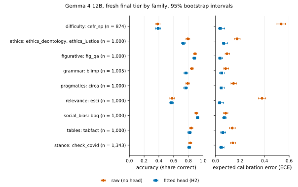

# Model card: gemma4-12b-q8

This card follows the outline of Mitchell et al. (2019), "Model Cards for Model Reporting". It
describes the judgly pack `gemma4-12b-q8`: the Gemma 4 12B model file, the prompt template and the two fitted
calibration heads (general and stance). judgly is a weekend hobby project; please read the numbers
below with that in mind. Every number on this page is copied from the committed snapshot in
[docs/results/gemma4-12b-q8/](../results/gemma4-12b-q8/) (`record.json`, `tables.md`, `selftest.txt`), where
the per-item dumps let anyone recompute them (the stance confusion counts come from
`record.json`: the dumps do not name the options). Brackets are 95% percentile bootstrap
intervals (1,000 resamples): of items on the test, dev and final-seen tiers, and of whole
groups of related items (a shared abstract, table, template, query or case) on the final,
final-flagged and bench tiers. The per-family intervals are separate resamples, so a family
that makes up a whole tier (the stance final tier) has slightly different brackets from the
tier's own row.

**In short.** On the fresh final tier of general questions (n = 7,879 questions from eight task
families that no head saw and that were not used during development; one smoke
run with a throwaway head scored 173 items drawn from the fresh tiers, 80 general and 93 stance), the general head brought ECE from 0.194 [0.186, 0.204]
to 0.020 [0.015, 0.031], and lowered accuracy from 0.760 to 0.737 (paired difference
-0.023 [-0.031, -0.016]). On stance (Check-COVID, n = 1,343 claim and evidence pairs) the
stance head brought ECE from 0.142 [0.123, 0.162] to 0.048 [0.034, 0.072], which is just below the bar of 0.05 (the interval reaches above it); accuracy went from
0.827 to 0.812 (paired difference -0.015 [-0.030, -0.001]).

## Contents

- [Model details](#model-details)
- [Intended use](#intended-use)
- [Out-of-scope uses](#out-of-scope-uses)
- [Fit data](#fit-data)
- [Evaluation data and tiers](#evaluation-data-and-tiers)
- [Metrics](#metrics)
- [Results: general format](#results-general-format)
- [Results: stance format](#results-stance-format)
- [Selective accuracy](#selective-accuracy)
- [Known weaknesses](#known-weaknesses)
- [Determinism checks](#determinism-checks)
- [Licences](#licences)
- [Citation](#citation)

## Model details

The language model is not part of judgly. It is downloaded from Hugging Face on first use and
checked against its SHA-256.

| field | value |
|---|---|
| base model | [google/gemma-4-12B-it](https://huggingface.co/google/gemma-4-12B-it) |
| GGUF repository | [ggml-org/gemma-4-12B-it-GGUF](https://huggingface.co/ggml-org/gemma-4-12B-it-GGUF) |
| revision | `e3e681731089efaa3f0917336944ac64752db8ba` |
| file | `gemma-4-12B-it-Q8_0.gguf` (12,669,646,976 bytes) |
| SHA-256 | `abfc3044b93795f6a446fc1a04468ac2d5fc5e9c92e237f09a5b3384c5a433e4` |
| licence | Apache-2.0 (Google); GGUF conversion by ggml-org |
| prompt template SHA-256 | `c7864e0f79bfb61441c9ed93a504a2e9ec87bc9dffe924026347b8dc9ee5b38e` |
| engine settings | `{"rotations": true, "content_free": false, "max_rotations": 4}` |
| llama.cpp commit | `6f41ac59e0a49a00483a316a22ada6b04edd2950` |
| judgly version of the runs | `v0.1.0` (release tag). The records say `judgly_dirty: true` (written from a working tree with uncommitted changes) and name the version, not a commit hash, so they do not pin the exact code state |
| hardware of the runs | Apple M3 Max, Metal |

The heads are H2 heads ([methods.md](../methods.md#the-heads)): a learned temperature, one bias
per letter slot and a small penalised correction to the model's own letter rows, fitted per
question type; for score questions there is no row correction (H1), and every level is weighted
equally in the fit. A head fits only this exact model file and template.

| head | file | SHA-256 | licence |
|---|---|---|---|
| general (every question without `format="stance"`) | `heads/h2.bin` | `bdf84fac9bb91fefac915e168d95dc5f42fdadae48e5590d70223e0b8e78d9ff` | Apache-2.0 |
| stance (`format="stance"`) | `heads/h2-stance.bin` | `ac30505af5d62bad368df67cd12e14eff5684103f71e3897bd9c4387e4e5faa5` | CC-BY-SA-4.0 |

## Intended use

- Typed decisions about a short text (pick an option, yes or no, a rating) where a probability
  per answer is more useful than generated text, for example routing, triage, labelling for
  later human review, or filtering with a confidence threshold.
- Research and hobby use on a Mac with Apple Silicon, in English.
- Use with a check on your own labelled cases: the calibration was measured on public benchmark
  families, and yours is another one ([calibration.md](../calibration.md)).

## Out-of-scope uses

- Decisions about people (health, credit, employment, legal, education, policing) without a
  human making the decision. The accuracy below is far from what such uses need.
- Medical, legal or scientific judgements treated as authoritative. The stance head is
  weakest on scientific abstracts (see [Known weaknesses](#known-weaknesses)).
- Languages other than English, and texts longer than half the context (they are truncated).
- Any other model file, quantisation or template with these heads.

## Fit data

The heads were fitted only on sources whose dataset card names a licence that allows it
([methods.md](../methods.md#data-and-tiers), [licences.md](../licences.md)). Items are the
training-split counts recorded in `record.json`. Each fit pool was split 70/15/15 into
training, validation and the in-distribution test split (general: 6,300 training items and
1,350 test items; stance: 14,783 training items and 3,145 test items).

**General head** (Apache-2.0):

| source | licence on the card | training items | citation |
|---|---|---|---|
| banking77 | cc-by-4.0 | 485 | Casanueva et al. 2020, Efficient Intent Detection with Dual Sentence Encoders. NLP4ConvAI workshop. |
| civil_comments | cc0-1.0 | 485 | Borkan et al. 2019, Nuanced Metrics for Measuring Unintended Bias with Real Data for Text Classification. WWW Companion. |
| civil_comments_score | cc0-1.0 | 485 | Borkan et al. 2019 (as civil_comments). |
| commonsense_qa | mit | 485 | Talmor et al. 2019, CommonsenseQA: A Question Answering Challenge Targeting Commonsense Knowledge. NAACL. |
| cosmos_qa | cc-by-4.0 | 485 | Huang et al. 2019, Cosmos QA: Machine Reading Comprehension with Contextual Commonsense Reasoning. EMNLP. |
| generated | apache-2.0 | 485 | judgly (this repository). |
| go_emotions | apache-2.0 | 485 | Demszky et al. 2020, GoEmotions: A Dataset of Fine-Grained Emotions. ACL. |
| helpsteer2 | cc-by-4.0 | 485 | Wang et al. 2024, HelpSteer2: Open-source dataset for training top-performing reward models. arXiv:2406.08673. |
| hh_rlhf | mit | 484 | Bai et al. 2022, Training a Helpful and Harmless Assistant with Reinforcement Learning from Human Feedback. arXiv:2204.05862. |
| ledgar | cc-by-4.0 | 484 | Tuggener et al. 2020, LEDGAR: A Large-Scale Multi-label Corpus for Text Classification of Legal Provisions in Contracts. LREC; Chalkidis et al. 2022, LexGLUE. ACL. |
| mmlu | mit | 484 | Hendrycks et al. 2021, Measuring Massive Multitask Language Understanding. ICLR. |
| qasc | cc-by-4.0 | 484 | Khot et al. 2020, QASC: A Dataset for Question Answering via Sentence Composition. AAAI. |
| strategyqa | mit | 484 | Geva et al. 2021, Did Aristotle Use a Laptop? A Question Answering Benchmark with Implicit Reasoning Strategies. TACL. |

**Stance head** (CC-BY-SA-4.0, because MNLI, VitaminC, FEVER, SNLI and SciNLI are share-alike):

| source | licence on the card | training items | citation |
|---|---|---|---|
| fever | cc-by-sa-3.0, gpl-3.0 | 2,800 | Thorne et al. 2018, FEVER: a Large-scale Dataset for Fact Extraction and VERification. NAACL; evidence release: Atanasova, Wright and Augenstein 2020, Generating Label Cohesive and Well-Formed Adversarial Claims. EMNLP. |
| mnli | cc-by-3.0, cc-by-sa-3.0, mit, other | 3,182 | Williams, Nangia and Bowman 2018, A Broad-Coverage Challenge Corpus for Sentence Understanding through Inference. NAACL. |
| scinli | apache-2.0 | 1,417 | Sadat and Caragea 2022, SciNLI: A Corpus for Natural Language Inference on Scientific Text. ACL. |
| snli | cc-by-sa-4.0 | 2,099 | Bowman et al. 2015, A large annotated corpus for learning natural language inference. EMNLP. |
| vitaminc | cc-by-sa-3.0 | 3,159 | Schuster, Fisch and Barzilay 2021, Get Your Vitamin C! Robust Fact Verification with Contrastive Evidence. NAACL. |
| wanli | cc-by-4.0 | 2,126 | Liu et al. 2022, WANLI: Worker and AI Collaboration for Natural Language Inference Dataset Creation. Findings of EMNLP. |

FEVER is fitted with its SUPPORTS and REFUTES claims and their gold evidence only; SciNLI with
its entailment and neutral pairs ([methods.md](../methods.md#data-and-tiers)).

## Evaluation data and tiers

Families are held out whole ([methods.md](../methods.md#data-and-tiers)), and the contamination
checker removes any evaluation text from the fit tier.

| tier | what it tests | general sources (items) | stance sources (items) |
|---|---|---|---|
| test | in-distribution: held-out items of the fit families | banking77 (104), civil_comments (104), civil_comments_score (104), commonsense_qa (104), cosmos_qa (104), generated (104), go_emotions (104), helpsteer2 (104), hh_rlhf (104), ledgar (104), mmlu (104), qasc (103), strategyqa (103) | fever (600), mnli (661), scinli (314), snli (458), vitaminc (661), wanli (451) |
| dev | held-out families, a check scored during development | anli_general (250), cb (250), copa (250), hellaswag (250), imdb (250), mrpc (250), piqa (250), qqp (250), rotten_tomatoes (250), rte (250), siqa (250), sst2 (250), stsb (250), swag (250), tweet_irony (250), tweet_sentiment (250), wic (250), winogrande (250) | anli (700), climate_fever (700), covidfact (700) |
| final | fresh held-out families, frozen before any head was scored on them: the reported numbers | bbq (1,000), blimp (1,005), cefr_sp (874), circa (1,000), esci (1,000), ethics_deontology (500), ethics_justice (500), fig_qa (1,000), tabfact (1,000) | check_covid (1,343) |
| final-flagged | fresh families with a recorded caveat, reported beside final, never pooled, judging no bar | politeness (1,000) | healthfc (749) |
| final-seen | secondary: an earlier held-out tier, families seen during development | ag_news (700), aqua_rat (500), boolq (700), casehold (700), dbpedia (700), fin_tweets (700), med_qa (700), medmcqa (700), mmlu_pro (700), newsgroups (700), pubmedqa (700), trec (700), truthful_qa (700), yahoo (700), yelp (700) | healthver (2,100) |
| bench | external benchmarks, also scored against their own gold | jevbench (231), typed_decisions (2,000) | none |

No head saw an item of the dev, final, final-flagged, final-seen or bench tiers. Several
evaluation sources are non-commercial or have unconfirmed licences; they were used only to
measure, never to fit. Their licences and citations are in
[reproduce.md](../reproduce.md#data-sources). The limits of the tiers as held-out sets are in
[methods.md](../methods.md#what-the-evaluation-can-and-cannot-show).

## Metrics

Accuracy of the top answer; log loss (the primary outcome, a proper scoring rule); the Brier
score; ECE over ten equal-width bins of the top probability; selective accuracy (accuracy and
share answered when only answers above a threshold are kept). "raw" is the letter
probabilities averaged over at most four option orders with no head; "h2" is the shipped head.
The bench tier is also scored as each benchmark defines it, against its own gold (Brier score
and KL divergence against the gold distribution, and for score questions the mean absolute
error of the expected level). Definitions are in [calibration.md](../calibration.md#the-numbers-reported)
and [methods.md](../methods.md#evaluation).

## Results: general format

| tier | items | condition | accuracy | log loss | Brier | ECE |
|---|---|---|---|---|---|---|
| test | 1,350 | raw | 0.724 [0.701, 0.750] | 1.740 [1.555, 1.929] | 0.472 [0.429, 0.512] | 0.196 [0.172, 0.218] |
| test | 1,350 | h2 | 0.760 [0.737, 0.782] | 0.661 [0.616, 0.705] | 0.334 [0.311, 0.354] | 0.054 [0.045, 0.075] |
| dev | 4,500 | raw | 0.772 [0.759, 0.783] | 1.687 [1.581, 1.808] | 0.414 [0.392, 0.436] | 0.187 [0.175, 0.199] |
| dev | 4,500 | h2 | 0.764 [0.752, 0.775] | 0.654 [0.624, 0.685] | 0.357 [0.342, 0.372] | 0.080 [0.070, 0.092] |
| final | 7,879 (6,803 groups) | raw | 0.760 [0.751, 0.770] | 1.553 [1.478, 1.636] | 0.431 [0.415, 0.448] | 0.194 [0.186, 0.204] |
| final | 7,879 (6,803 groups) | h2 | 0.737 [0.726, 0.746] | 0.631 [0.613, 0.651] | 0.348 [0.338, 0.359] | 0.020 [0.015, 0.031] |

Paired over the same fresh final-tier items (`docs/tools/final_tier_stats.py`, items resampled
within families), head minus raw was -0.023 [-0.031, -0.016] in accuracy and -0.922 [-0.979, -0.865]
in log loss. Averaged over the eight families instead of pooled, ECE was 0.204 [0.197, 0.214]
raw and 0.051 [0.049, 0.063] with the head.

Fresh final tier by family (the tier to quote):

| family | items | raw accuracy | h2 accuracy | raw ECE | h2 ECE |
|---|---|---|---|---|---|
| difficulty | 874 (874 groups) | 0.383 [0.350, 0.417] | 0.390 [0.357, 0.422] | 0.535 [0.501, 0.569] | 0.040 [0.023, 0.076] |
| ethics | 1,000 (1,000 groups) | 0.794 [0.768, 0.820] | 0.733 [0.706, 0.759] | 0.176 [0.153, 0.201] | 0.067 [0.057, 0.098] |
| figurative | 1,000 (1,000 groups) | 0.891 [0.870, 0.910] | 0.882 [0.861, 0.902] | 0.094 [0.078, 0.116] | 0.037 [0.025, 0.058] |
| grammar | 1,005 (1,005 groups) | 0.848 [0.826, 0.869] | 0.767 [0.741, 0.794] | 0.083 [0.067, 0.107] | 0.050 [0.032, 0.073] |
| pragmatics | 1,000 (863 groups) | 0.791 [0.766, 0.816] | 0.765 [0.738, 0.791] | 0.147 [0.126, 0.171] | 0.047 [0.037, 0.073] |
| relevance | 1,000 (1,000 groups) | 0.579 [0.548, 0.610] | 0.569 [0.539, 0.600] | 0.379 [0.348, 0.410] | 0.034 [0.022, 0.067] |
| social_bias | 1,000 (317 groups) | 0.909 [0.889, 0.929] | 0.927 [0.908, 0.944] | 0.082 [0.065, 0.101] | 0.073 [0.057, 0.088] |
| tables | 1,000 (744 groups) | 0.840 [0.816, 0.862] | 0.818 [0.793, 0.841] | 0.137 [0.116, 0.162] | 0.060 [0.042, 0.083] |



*Figure: fresh final tier by task family (both formats), accuracy and ECE, raw and with the
head, with 95% bootstrap intervals ([captions](../assets/results/CAPTIONS.md)).*

**Final-flagged (reported beside final, never pooled, judging no bar).** Stanford Politeness:
A relative of the fit family moderation (civil_comments_score rates online-discussion comments for toxicity on a 1-to-5 scale; this rates Wikipedia talk-page and StackExchange requests for politeness on a 1-to-3 scale), so it is not an unrelated family.

| tier | items | condition | accuracy | log loss | Brier | ECE |
|---|---|---|---|---|---|---|
| final-flagged | 1,000 (1,000 groups) | raw | 0.519 [0.490, 0.549] | 3.373 [3.120, 3.612] | 0.889 [0.833, 0.945] | 0.423 [0.392, 0.452] |
| final-flagged | 1,000 (1,000 groups) | h2 | 0.512 [0.481, 0.544] | 1.054 [1.007, 1.100] | 0.621 [0.592, 0.646] | 0.106 [0.080, 0.138] |

**Final-seen (secondary: families seen during development).** An earlier held-out tier.
Its families were read while judgly was developed, so these numbers are not a held-out result.

| tier | items | condition | accuracy | log loss | Brier | ECE |
|---|---|---|---|---|---|---|
| final-seen | 10,300 | raw | 0.714 [0.705, 0.723] | 1.643 [1.580, 1.708] | 0.460 [0.446, 0.474] | 0.180 [0.172, 0.189] |
| final-seen | 10,300 | h2 | 0.713 [0.703, 0.722] | 0.799 [0.779, 0.818] | 0.386 [0.377, 0.396] | 0.026 [0.021, 0.034] |

| family | items | raw accuracy | h2 accuracy | raw ECE | h2 ECE |
|---|---|---|---|---|---|
| biomedical | 2,100 | 0.723 [0.704, 0.742] | 0.716 [0.699, 0.735] | 0.170 [0.153, 0.188] | 0.029 [0.020, 0.049] |
| finance | 700 | 0.736 [0.700, 0.766] | 0.739 [0.707, 0.773] | 0.230 [0.201, 0.265] | 0.073 [0.058, 0.109] |
| knowledge_pro | 700 | 0.557 [0.521, 0.594] | 0.541 [0.504, 0.576] | 0.183 [0.154, 0.217] | 0.076 [0.057, 0.109] |
| legal | 700 | 0.279 [0.244, 0.311] | 0.254 [0.221, 0.289] | 0.441 [0.405, 0.479] | 0.151 [0.118, 0.187] |
| math | 500 | 0.408 [0.366, 0.452] | 0.456 [0.414, 0.498] | 0.224 [0.184, 0.264] | 0.069 [0.046, 0.115] |
| rating | 700 | 0.617 [0.579, 0.654] | 0.636 [0.600, 0.669] | 0.360 [0.324, 0.398] | 0.047 [0.034, 0.088] |
| topic | 3,500 | 0.835 [0.822, 0.847] | 0.834 [0.822, 0.847] | 0.113 [0.102, 0.125] | 0.036 [0.026, 0.047] |
| truthfulness | 700 | 0.789 [0.757, 0.819] | 0.790 [0.759, 0.820] | 0.119 [0.095, 0.145] | 0.041 [0.031, 0.069] |
| yesno | 700 | 0.893 [0.869, 0.914] | 0.887 [0.863, 0.911] | 0.089 [0.069, 0.112] | 0.028 [0.015, 0.052] |

**Bench (external benchmarks), scored against their own gold.** typed-decisions' gold is a
teacher model's output, so its numbers measure agreement with that teacher; the JevBench number
covers the 231 public items only and is not comparable with the JevBench leaderboard, which
also scores sealed items ([methods.md](../methods.md#data-and-tiers)).

| benchmark | items (cases) | condition | accuracy | Brier | KL | ECE | score MAE |
|---|---|---|---|---|---|---|---|
| jevbench | 231 (195) | raw | 0.835 [0.784, 0.884] | 0.274 [0.193, 0.363] | 0.893 [0.596, 1.229] | 0.133 [0.093, 0.185] | 0.354 [0.094, 0.739] |
| typed_decisions | 2,000 (400) | raw | 0.702 [0.680, 0.723] | 0.359 [0.342, 0.378] | 2.819 [2.703, 2.946] | 0.251 [0.232, 0.274] | 0.497 [0.466, 0.530] |
| jevbench | 231 (195) | h2 | 0.840 [0.789, 0.890] | 0.207 [0.159, 0.256] | 0.388 [0.308, 0.468] | 0.054 [0.043, 0.106] | 0.405 [0.246, 0.645] |
| typed_decisions | 2,000 (400) | h2 | 0.700 [0.677, 0.721] | 0.117 [0.109, 0.125] | 0.250 [0.234, 0.266] | 0.028 [0.019, 0.049] | 0.350 [0.328, 0.373] |

Dev tier by family:

| family | items | raw accuracy | h2 accuracy | raw ECE | h2 ECE |
|---|---|---|---|---|---|
| commonsense | 1,500 | 0.863 [0.844, 0.881] | 0.863 [0.846, 0.879] | 0.077 [0.065, 0.094] | 0.063 [0.052, 0.079] |
| inference | 750 | 0.679 [0.645, 0.712] | 0.671 [0.637, 0.705] | 0.293 [0.263, 0.329] | 0.175 [0.151, 0.209] |
| paraphrase | 500 | 0.756 [0.718, 0.794] | 0.740 [0.700, 0.778] | 0.214 [0.182, 0.255] | 0.132 [0.108, 0.177] |
| sentiment | 1,250 | 0.792 [0.770, 0.814] | 0.792 [0.770, 0.814] | 0.181 [0.163, 0.205] | 0.085 [0.068, 0.108] |
| similarity | 250 | 0.504 [0.440, 0.564] | 0.536 [0.476, 0.592] | 0.428 [0.370, 0.492] | 0.094 [0.061, 0.159] |
| word_sense | 250 | 0.700 [0.640, 0.756] | 0.580 [0.516, 0.640] | 0.292 [0.237, 0.351] | 0.325 [0.268, 0.383] |

Test tier (in-distribution) by family:

| family | items | raw accuracy | h2 accuracy | raw ECE | h2 ECE |
|---|---|---|---|---|---|
| contracts | 104 | 0.981 [0.952, 1.000] | 0.990 [0.971, 1.000] | 0.010 [0.002, 0.034] | 0.056 [0.035, 0.084] |
| emotion | 104 | 0.587 [0.490, 0.683] | 0.615 [0.519, 0.702] | 0.319 [0.234, 0.407] | 0.064 [0.061, 0.173] |
| generated | 104 | 0.808 [0.721, 0.875] | 0.808 [0.731, 0.885] | 0.090 [0.054, 0.156] | 0.107 [0.089, 0.170] |
| helpfulness | 104 | 0.481 [0.385, 0.567] | 0.433 [0.337, 0.519] | 0.456 [0.368, 0.550] | 0.082 [0.052, 0.193] |
| intent | 104 | 0.904 [0.837, 0.962] | 0.885 [0.817, 0.942] | 0.071 [0.040, 0.136] | 0.077 [0.060, 0.140] |
| knowledge | 414 | 0.732 [0.691, 0.775] | 0.763 [0.722, 0.804] | 0.174 [0.140, 0.215] | 0.067 [0.051, 0.110] |
| moderation | 208 | 0.601 [0.534, 0.673] | 0.750 [0.692, 0.803] | 0.325 [0.263, 0.385] | 0.082 [0.062, 0.121] |
| preference | 104 | 0.692 [0.606, 0.779] | 0.721 [0.644, 0.808] | 0.253 [0.185, 0.349] | 0.107 [0.058, 0.200] |
| reading | 104 | 0.837 [0.760, 0.904] | 0.875 [0.798, 0.933] | 0.102 [0.058, 0.171] | 0.087 [0.066, 0.149] |

## Results: stance format

| tier | items | condition | accuracy | log loss | Brier | ECE |
|---|---|---|---|---|---|---|
| test | 3,145 | raw | 0.721 [0.703, 0.735] | 2.786 [2.619, 2.976] | 0.521 [0.493, 0.553] | 0.247 [0.232, 0.263] |
| test | 3,145 | h2 | 0.786 [0.771, 0.800] | 0.550 [0.525, 0.580] | 0.305 [0.291, 0.322] | 0.021 [0.015, 0.036] |
| dev | 2,100 | raw | 0.654 [0.635, 0.674] | 3.607 [3.336, 3.867] | 0.646 [0.608, 0.683] | 0.306 [0.285, 0.326] |
| dev | 2,100 | h2 | 0.624 [0.605, 0.647] | 1.029 [0.974, 1.082] | 0.544 [0.517, 0.570] | 0.122 [0.106, 0.143] |
| final | 1,343 (315 groups) | raw | 0.827 [0.806, 0.848] | 1.603 [1.370, 1.855] | 0.310 [0.272, 0.348] | 0.142 [0.123, 0.162] |
| final | 1,343 (315 groups) | h2 | 0.812 [0.790, 0.836] | 0.509 [0.472, 0.550] | 0.287 [0.263, 0.313] | 0.048 [0.034, 0.072] |

Paired over the same fresh final-tier items, head minus raw was -0.015 [-0.030, -0.001] in
accuracy and -1.094 [-1.287, -0.909] in log loss. The final tier is one family (Check-COVID,
1,343 pairs on 315 abstracts).

Dev tier by family:

| family | items | raw accuracy | h2 accuracy | raw ECE | h2 ECE |
|---|---|---|---|---|---|
| dev_claims | 700 | 0.691 [0.657, 0.726] | 0.623 [0.587, 0.657] | 0.268 [0.238, 0.305] | 0.068 [0.045, 0.105] |
| dev_nli | 700 | 0.644 [0.610, 0.676] | 0.629 [0.590, 0.664] | 0.303 [0.274, 0.338] | 0.088 [0.070, 0.127] |
| dev_scientific | 700 | 0.627 [0.587, 0.663] | 0.621 [0.586, 0.657] | 0.349 [0.316, 0.390] | 0.228 [0.197, 0.264] |

Test tier (in-distribution) by family:

| family | items | raw accuracy | h2 accuracy | raw ECE | h2 ECE |
|---|---|---|---|---|---|
| fit_claims | 1,261 | 0.815 [0.794, 0.836] | 0.856 [0.837, 0.875] | 0.163 [0.144, 0.184] | 0.017 [0.013, 0.038] |
| fit_nli | 1,570 | 0.645 [0.624, 0.666] | 0.743 [0.719, 0.762] | 0.319 [0.299, 0.342] | 0.031 [0.021, 0.051] |
| fit_scientific | 314 | 0.717 [0.666, 0.768] | 0.723 [0.675, 0.774] | 0.230 [0.190, 0.286] | 0.044 [0.041, 0.104] |

Fresh final tier (Check-COVID) with the head, gold label (rows) by predicted label (columns):

| gold | contradicts | no_bearing | supports |
|---|---|---|---|
| contradicts | 415 | 21 | 15 |
| no_bearing | 95 | 269 | 78 |
| supports | 10 | 33 | 407 |

**Final-flagged (reported beside final, never pooled, judging no bar).** HealthFC:
The evidence sentences are the fact-checkers' own summary and often state the verdict ("we could not find any meaningful scientific evidence", verdict headings such as "Not checked"), so the no-bearing label (the verdict "insufficient evidence") can often be read off the wording, the flaw that excluded PubHealth; and 740 of the 749 claims are yes/no questions, not claims.

| tier | items | condition | accuracy | log loss | Brier | ECE |
|---|---|---|---|---|---|---|
| final-flagged | 749 (749 groups) | raw | 0.750 [0.722, 0.782] | 1.978 [1.665, 2.262] | 0.441 [0.388, 0.491] | 0.201 [0.174, 0.229] |
| final-flagged | 749 (749 groups) | h2 | 0.634 [0.597, 0.668] | 0.809 [0.762, 0.856] | 0.500 [0.467, 0.533] | 0.123 [0.093, 0.158] |

| gold | contradicts | no_bearing | supports |
|---|---|---|---|
| contradicts | 110 | 7 | 8 |
| no_bearing | 217 | 199 | 6 |
| supports | 16 | 20 | 166 |

**Final-seen (secondary: families seen during development).** HealthVer, an earlier held-out
stance tier. Its 2,100 pairs share 289 abstracts and carry no group, so these intervals resample pairs
as if independent and may be too narrow.

| tier | items | condition | accuracy | log loss | Brier | ECE |
|---|---|---|---|---|---|---|
| final-seen | 2,100 | raw | 0.632 [0.610, 0.652] | 3.630 [3.404, 3.870] | 0.678 [0.640, 0.716] | 0.320 [0.302, 0.342] |
| final-seen | 2,100 | h2 | 0.626 [0.605, 0.647] | 0.889 [0.851, 0.924] | 0.507 [0.485, 0.529] | 0.067 [0.051, 0.089] |

## Selective accuracy

Accuracy / share answered, with the head, when only answers whose top probability is above the
threshold are kept, and n, the number of answers kept (share times the tier's items in
`record.json`). Shares are rounded, so 0% can still hold a few answers; n/a means none
passed. Cells in italics rest on fewer than 50 answers and should not be read as
solid; the figures stop there for the same reason.

**General format:**

| tier | 0.50 | 0.60 | 0.70 | 0.80 | 0.90 | 0.95 | 0.99 |
|---|---|---|---|---|---|---|---|
| test | 0.87 / 77% (n = 1,041) | 0.90 / 64% (n = 860) | 0.93 / 54% (n = 727) | 0.97 / 45% (n = 609) | 0.99 / 36% (n = 489) | 1.00 / 27% (n = 369) | 1.00 / 7% (n = 100) |
| dev | 0.79 / 91% (n = 4,110) | 0.82 / 80% (n = 3,611) | 0.83 / 72% (n = 3,259) | 0.84 / 63% (n = 2,844) | 0.86 / 51% (n = 2,298) | 0.88 / 42% (n = 1,873) | 0.97 / 18% (n = 806) |
| final | 0.80 / 84% (n = 6,651) | 0.87 / 67% (n = 5,285) | 0.91 / 57% (n = 4,485) | 0.93 / 48% (n = 3,802) | 0.95 / 38% (n = 2,991) | 0.97 / 29% (n = 2,293) | 0.98 / 12% (n = 983) |
| final-flagged | 0.52 / 90% (n = 896) | 0.57 / 54% (n = 537) | 0.77 / 15% (n = 149) | *1.00 / 1% (n = 11)* | *n/a / 0% (n = 0)* | *n/a / 0% (n = 0)* | *n/a / 0% (n = 0)* |
| final-seen | 0.84 / 73% (n = 7,490) | 0.88 / 61% (n = 6,321) | 0.91 / 54% (n = 5,552) | 0.93 / 46% (n = 4,736) | 0.94 / 36% (n = 3,756) | 0.95 / 26% (n = 2,628) | 0.96 / 5% (n = 545) |
| bench | 0.78 / 81% (n = 1,807) | 0.84 / 63% (n = 1,407) | 0.90 / 46% (n = 1,032) | 0.93 / 33% (n = 734) | 0.96 / 21% (n = 473) | 0.96 / 15% (n = 336) | 0.98 / 6% (n = 145) |

**Stance format:**

| tier | 0.50 | 0.60 | 0.70 | 0.80 | 0.90 | 0.95 | 0.99 |
|---|---|---|---|---|---|---|---|
| test | 0.82 / 90% (n = 2,819) | 0.87 / 77% (n = 2,412) | 0.90 / 64% (n = 2,027) | 0.93 / 50% (n = 1,574) | 0.96 / 32% (n = 1,022) | 0.97 / 18% (n = 580) | *1.00 / 0% (n = 11)* |
| dev | 0.66 / 84% (n = 1,764) | 0.69 / 69% (n = 1,451) | 0.71 / 58% (n = 1,224) | 0.73 / 46% (n = 975) | 0.76 / 31% (n = 659) | 0.77 / 17% (n = 364) | *0.67 / 0% (n = 6)* |
| final | 0.84 / 90% (n = 1,214) | 0.87 / 78% (n = 1,045) | 0.90 / 64% (n = 865) | 0.92 / 50% (n = 668) | 0.95 / 32% (n = 427) | 0.96 / 16% (n = 219) | *0.80 / 0% (n = 5)* |
| final-flagged | 0.64 / 77% (n = 577) | 0.65 / 57% (n = 425) | 0.71 / 41% (n = 308) | 0.81 / 26% (n = 198) | 0.91 / 11% (n = 79) | *0.90 / 3% (n = 20)* | *n/a / 0% (n = 0)* |
| final-seen | 0.68 / 81% (n = 1,698) | 0.72 / 63% (n = 1,323) | 0.76 / 47% (n = 996) | 0.78 / 31% (n = 653) | 0.80 / 15% (n = 311) | 0.82 / 5% (n = 109) | *1.00 / 0% (n = 4)* |

## Known weaknesses

- **The general head costs accuracy on the fresh final tier.** Pooled, accuracy went from
  0.760 to 0.737 (paired difference -0.023 [-0.031, -0.016]). The largest drops were on grammar (0.848 to 0.767), ethics (0.794 to 0.733), pragmatics (0.791 to 0.765).
  A head is meant to change how far to trust the answers, not which answer is on top; on
  these families it also changed some top answers, more often for the worse.
- **Calibration varies by family.** Pooled final-tier ECE with the head was 0.020, but averaged
  over the eight families it was 0.051 [0.049, 0.063], with social_bias at 0.073 [0.057, 0.088] and ethics at 0.067 [0.057, 0.098].
- **Sentence difficulty** (CEFR-SP, a six-level score question): accuracy 0.383 raw and
  0.390 [0.357, 0.422] with the head, n = 874. The head fixes the
  calibration (ECE 0.535 to 0.040), not the accuracy. Rating-scale questions remain the
  weakest question type: sentence similarity (STS-B, dev) reached 0.536 with the head.
- **The stance head only just meets its final bar and misses its dev bar.** Final-tier ECE
  0.048 [0.034, 0.072] against the bar of 0.05 (the interval reaches above it); dev-tier ECE 0.122 [0.106, 0.143],
  above the dev bar of 0.08, worst on scientific abstracts (dev_scientific 0.228 [0.197, 0.264]).
  On the final tier its most common error is calling no-bearing evidence "contradicts" (95 of 442
  no-bearing pairs). The general head was not scored on stance questions.
- **HealthFC (final-flagged)**: the stance head lowered accuracy from 0.750 to
  0.634 [0.597, 0.668] (ECE 0.123, n = 749); its most common error there is
  calling no-bearing pairs "contradicts" (217 of 422). The tier carries a caveat (the evidence
  often states the verdict), so it judges no bar.
- **Politeness (final-flagged)**, a three-level rating: accuracy 0.519 raw and
  0.512 [0.481, 0.544] with the head, ECE 0.106 [0.080, 0.138], n = 1,000.
- **HealthVer (final-seen)**: stance head ECE 0.067 [0.051, 0.089], accuracy 0.632 raw and
  0.626 with the head, n = 2,100.
- **Legal reasoning** (CaseHOLD, final-seen, five options, so 0.2 by chance): 0.279 raw and
  0.254 [0.221, 0.289] with the head, n = 700.
- **Word sense** (WiC, dev tier): the head lowered accuracy from 0.700 [0.640, 0.756] to
  0.580 [0.516, 0.640], n = 250, with ECE 0.325.

## Determinism checks

`s1-selftest` ran before the runs; its output is
[selftest.txt](../results/gemma4-12b-q8/selftest.txt), copied in full:

```
INFO slots  " A" chosen  mean slot mass: plain 0.0000, leading space 0.9999
PASS T1  measured 0.000000  tolerance 0.000000  prompt integrity, mismatches and forged markers
PASS T2  measured 0.000003  tolerance 0.050000  rows against logits, max |d logit|
PASS T3  measured 0.008379  tolerance 0.020000  branch against recompute, max |d p| (max |d logp| 0.036811)
PASS T4  measured 0.010581  tolerance 0.020000  packed and shared against single, max |d p| (max |d logp| 0.072400)
PASS T5  measured 0.000205  tolerance 0.010000  isolation from sibling questions, max |d p|
SKIP T6  no --reference given; the acceptance check always gives one
PASS T7  measured 0.000000  tolerance 0.000100  gradient check H1 and H2, max relative error
PASS T8  measured 0.009567  tolerance 0.020000  cached features against live engine, max |d p|
PASS T9  measured 0.000000  tolerance 0.000000  rotation bookkeeping, violations
PASS T10  measured 0.000000  tolerance 0.020000  pruned against full sliding-window cache, max |d p|
PASS: 0 test(s) failed
```

The two branching checks that matter most for determinism passed with margin: T3 (branching
from the cached text against recomputing it) at 0.0084 and T4 (packed and shared batches against
single requests) at 0.0106, both against a tolerance of 0.02 in probability. T5 (isolation from
sibling questions) moved a question's probabilities by at most 0.0002. T6, the independent CPU
reference, was not run by judgly's pipeline, so differences between this machine and other
hardware are not checked here.

## Licences

- judgly's code and the template: Apache-2.0.
- General head (`heads/h2.bin`): Apache-2.0.
- Stance head (`heads/h2-stance.bin`): CC-BY-SA-4.0, because its fit data includes share-alike
  sources (MNLI, VitaminC, FEVER, SNLI, SciNLI).
- Model weights: not included; Apache-2.0 (Google); GGUF conversion by ggml-org.

## Citation

Please cite judgly with the metadata in [CITATION.cff](../../CITATION.cff), and also cite
llama.cpp, the base model (google/gemma-4-12B-it) and the datasets behind any number you quote
([reproduce.md](../reproduce.md#data-sources)). The card format is from:

- Mitchell, Wu, Zaldivar, Barnes, Vasserman, Hutchinson, Spitzer, Raji and Gebru 2019. Model
  Cards for Model Reporting. FAT* '19. arXiv:1810.03993.
